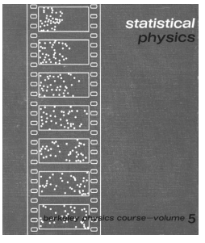
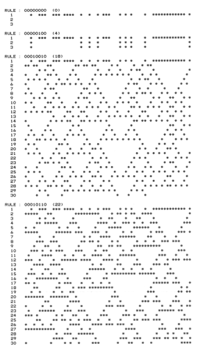

# 第一章 一种新科学的建立基础

### 基本观点的轮廓

三个世纪前，科学被一种戏剧性的新观点所颠覆，这种观点认为由数学方程式所表达的规律可以用来描述自然世界的法则。我写这本书的目的就是开创另一种颠覆——介绍一种全新的、其规律普遍得可以在任何一台计算机上表达出来的新科学。

我用了二十年中最好的时光建立所需的思维框架，但我还是被它的结果震惊了。因为我发现利用这一新科学，现存的科学体系无法表达的大量的基础性难题都能够取得进展。

如果说理论上的现存科学是可行的，那么其所研究的系统一定遵循着某种确切的规则。然而过去的时间里，整个严谨的科学界都在质疑以传统数学为根基的观点的可靠性。残酷的现实引导我发展出一种新科学，事实证明，没有理由认为我们在自然世界看到的一切都仅仅遵循着传统数学这一种规律。

更早以前，可能很难想象更加普遍的规律到底是怎样的。但如今，我们有了计算机，电脑程序可以有效地执行海量的命令。我们实际中用到的程序大多是基于十分复杂的命令，是专门设计成执行特定任务的。但是原则上讲，一个程序可以遵循任何特定命令。故我描述的这种新科学的发现的核心部分所需要的程序，都是用尽可能最简单的命令来完成的。

\(p1\)

或许有人会和我刚开始一样，认为如果程序的命令都是简单的，那么意味着其结果也一定同样很简单。因为我们每天建设东西的经验告诉我们，创造出复杂的东西一定很困难，需要繁复的计划和规则。但是我在十八年前的关键性发现就是，在程序的世界中，这种直觉简直毫无道理。

我做了一个某种程度上可以说是能想到的最简单的计算机实验：我提取了一系列很简单的程序，使其系统性地运行起来，看看会发生什么。出人意料的是，尽管规则很简单，程序结果却一点不简单。实际上，我所看到的最简单的程序却能运行出我见过的最复杂的结果。

我花了不止十年来接受这个结果，并意识到了这个结果的深远意义。回过头来看，没理由认为几个世纪前它没被发现过，但我越来越多地将它看作是理论科学史上来最重要的单一发现之一。除了开拓了一个新的广阔领域，它还意味着对自然界和其他领域工作过程的彻底反思。

或许最引人注目的是它产生了一个方法，这个方法能够解决长久以来被认为最大的奥秘：是什么使得自然界能够毫不费力地产生那么多让我们看起来无比复杂的事物？

毕竟，我们通常能在现实里看到的方形或者圆形，看上去都很简单。但其实自然界中最显著的特点之一就是横跨物理、生物、以及其他系统，我们面对着巨大的复杂性。事实是在历史上人类曾想当然地认为这种远超人类工作的复杂性是超自然的存在产生的。

\(p2\)

但我的发现——简单的程序能够产生复杂的结果，给出了不同的解释。从本质上讲，自然系统的运行就像典型的程序，它随之产生的行为往往是复杂的。而人类制作品中这种复杂性并不常见，原因在于我们会选择特定的程序，赋予其简单的行为以达到预期的目的。

人们可能会认为，现有的科学，已经过去几个世纪里成功解决了这些复杂性的问题。但实际上它们没有，他们在很大程度上明确地界定了自己的范围以避免与复杂性问题直接接触。他们描述行为的基本思想对数学方程而言工作得很好，比如行星运动之类的简单运动，但当行为复杂时总是不可避免地失败。在生物学中，像对自然选择这样的描述或多或少也是如此。通过对程序的思考，本书阐述的新科学会对复杂行为做出有意义的陈述。

几个世纪里，现有科学的重点都是试图破坏系统，查看其潜在的部分，并对这些部分进行尽可能详尽的分析。特别是物理学，这个方法获得了足够的成功，日常系统的基本部件被人所知。但是这些部件是如何共同产生作用，甚至包括一些很明显的特征，这对我们来说依然是个谜。在本书所阐述的新科学框架下，这个问题可能会得到解决。

\(p3\)

依照现有科学的传统，人们会认为问题的答案依赖于一系列细节，且各个体系类型如物理、生物等之间是不同的。但是在我所发现的简单程序世界里，一些基本行为的发生与其潜在细节是无关的。这就意味着，有相当共通的原理决定着它们的行为，而且不止是简单程序，也适用于自然界的其他系统。

在现有科学中，无论遇到什么样看起来复杂的现象，都会被理所当然地认为是它潜在自身的复杂机理导致的。但是我发现的简单程序造就复杂性却说明了那其实错了。而且在随后章节会展示，即使是显然简单的程序似乎捕获到了复杂的机制，这些机制总是过于复杂而没有简单的解释。

以新的思维最终解决长期以来的问题，这在科学史上并不罕见。我很惊讶许多现有科学的基本问题通过简单程序的方法得到了解决。比如在超过一个世纪的时间里，人们困惑于物理学中热力学行为的产生，而在对简单程序的发现中，我找到了很直接的解释。在生物学中，我的发现首次提供了明确理解生物体表现复杂性的方法。事实上，我甚至有越来越多的证据表明，用简单的程序来思考，就可以构建一个真正的物理学基础理论，从这个理论中，宇宙的空间、时间、量子力学以及所有其他已知的特征都会出现。

当数学被引入科学时，它首次提供了一个抽象的框架，在这个框架中，科学结论可以在没有直接提到物理现实的情况下得到。然而尽管几千年来数学一直在发展，但是数学本身只关注特定的抽象系统，如算术和几何。而本书所阐述的新科学引入了一种更通用的，基于任何规则类型的系统。

（p4）

有人可能认为这样的系统可能太多样化，无法对它进行有意义的一般化声明。但是这个让我建立起一个新科学统一框架的关键思想，就像任何系统的规则可以被当做是一个程序，它的任何行为也可以被看作是计算。

传统的直觉觉得要做复杂的计算需要潜在的复杂规则，但是计算机革命的事实很明显地告诉我们，一般的拥有固定规则的系统构建起来后可以执行任何可能的计算。

然而，通用性的极限通常被认为很高，只有精密特殊的系统比如典型的电子计算机才能达到。但是本书有出乎意料的发现，一些系统的规则简单到用一句话能说出来。这就表明，普遍性的现象在抽象系统和自然中比想象中的更加普遍和重要。

基于许多发现，我已经得出了一个全面的结论，我将其称为计算等价性原理（Principle of Computational Equivalence）：当看见一个不怎么简单的行为——本质上来自任何系统——它都可以被认为是与等价的计算复杂性对应的。这个基本的原理对科学思想产生了前所未有的影响。

一开始，它给出了为什么简单程序会有看起来十分复杂的行为的解释。像其他过程一样，我们的感知和分析过程可以被看作是计算。我们总会觉得这种计算会比那些简单程序表现出来的要复杂得多，但计算等价性原理表示并非如此。这种介于观察者和系统之间的等价使得作为观察者的我们认为观察到的系统行为是复杂的。

（p5）

一个人只需要对特定的系统上进行实验并观察，就会从原理上了解是如何运作的。但是大量的理论科学的成功都是围绕着发现数学公式而不是让人直接预测结果。实际上，这依赖于简化系统本身计算工作的能力。

计算等价性原理意味着这只适用于具有简单行为的特殊系统，而其他的一些系统的计算能力所能做的甚至和我们的数学家和计算机一样复杂。这意味着这种系统是计算不可约的（computationally irreducible），所以唯一能发现他们行为的方法是跟随它们的步子，和它们做同样努力的计算。

这意味着，理论科学存在根本的局限性。但也说明了一些不可约的事物可以通过时间的流逝来取得。这导致了对我们作为人类的解释——即使我们遵循了明确的基本规则，却仍然以一种有意义的方式彰显自由。

纵观历史，科学进步的一个最重要的特征是它展示了一种我们作为人类的并不特殊的方式。计算等价性原理从某种层次上来说也做到了。它意味着当涉及到计算、或者智能时，我们根本上不会比一系列简单程序或者一系列自然中的系统复杂多少。

但从计算等价性原理中也浮现出一种新的个体：在不同的系统中，从简单的程序到大脑到整个宇宙，这个原则都意味着存在最基本的等价，使得一些基本现象发生，使得基本的科学想法和方法能够起作用。本书阐述的新科学这种伟大力量正是由它引起的。

（p6）

### 与其他领域的关系

数学：

通常认为，数学关心的是一般的抽象系统的研究。但本书提出了大范围的基于简单程序的抽象系统，这是传统数学所从未考虑的。而且由于这些系统的构造比传统数学中的更简单，因此可以采取合适的方法对其进行进一步研究调查。

一些人发现的空前清晰的例子，只是在现代数学中已经知道的现象，但也找出一些有趣的新东西。最明显的就是一些系统行为的高复杂性，其潜在的规则比标准数学教科书上的规则简单得多。

这种复杂性的后果之一就是导致了对证明的基本限制——这是传统数学的核心。在十九世纪三十年代，哥德尔定理就给出了这些限制的标志。但在过去，它们似乎与大多数数学无关，因为这是实践性的。

本书中的发现在很大程度上只是反映了如今数学眼界的狭隘。确实，本书的核心可以看作是用新的思想和方法，在将要开拓的大量新领域上来对数学进行主要概括。

本书中我开发的框架，表明通过以根本上的计算视角来看待数学的运算过程，将可能解决现有的数学的一些基本重要问题。

（p7）

物理：

历史上看，传统的数学方法在物理学上起到了巨大的成功，而到目前几乎被假定任何严谨的物理学理论都必须基于数学公式。可尽管是用这些方法，物理学中的一些现象仍然难以说清。但是通过本书阐述的简单程序视角的思考方法，似乎最后能够获得一些戏剧性的进展。确实在本书的过程中，我们会看见一些极端简单的程序却能捕获到一些以前看起来完全神秘的物理现象的基本机理。

理论物理学的现有方法倾向于连续数字、计算的概念，也有时会是随机。而在本书中的大多数系统，围绕着确定规则下的简单的独立单元。从各方面来说，这个更为朴素的结构最终可能辨识出更多基本的新现象。

一般的物理模型都是理想化的，抓住一些特征，忽略其他的。过去最通用的就是抓住确定简单的数字关系，比如光滑曲面。但是在本书中的新模型，能够抓住更多复杂的只能在行为的图像中看到的特征。

在未来物理的胜利毫无疑问是找到一个宇宙的根本真理。尽管偶尔会乐观主义，传统的方法并没有能够垂手可得。但是以本书中的我发现的方法和直觉，我坚信有相当的可能性发现这个理论。

\(p8\)

生物学：

如今，大量的生物有机体的细节已经为人所知，但一般性的理论中却少有出现。古典生物领域倾向于以自然选择为进化的基石，这引出一个概念：对生命系统的研究分析应基于其进化的历史而不是抽象理论。其中一个原因就是传统的数学模型并不能接近我们在生物学中看到的复杂性。但是本书中发现的简单程序产生了高复杂性，而这些程序能够重现一些生物体的特性，比如一些通过基本机制，基因程序能够产生我们能看见的实际生物形式。这意味着可能会产生新的广泛的生物系统模型，并且可能模仿它们一些操作的本质，可用以医疗的目的。而且在此情况下，简单程序会有一般性的原理，这些原理能够运用于生物机体，使得建立新的抽象理论成为了可能。

社会科学：

从经济学到心理学，有一个普遍争议的假设：物理学的成功是毫无疑问的，其坚实的理论总是制定着一系列数字、方程以及经典数学。但我认为如果使用本书基于简单程序的新科学，将更有可能捕获到社会科学里现象的基本机理，无疑会快速出现许多使用我的想法应用于社科的要求。确实，本书中出现的新的直觉能够解释过去看起来相当神秘的现象，但本书的结论指出，在应用科学方法时会不可避免地遇到一些根本性的限制。这形成了新的问题，但在一般性理论成为可能的情况下，当人不可避免地对特定案例细节的过度依赖时，就需要时间去解决。

（p9）

计算机科学：

在计算机科学简短的历史中，它几乎只研究在特定机器上完成特定任务。但本书的核心观点是考虑任意计算机都会存在的一般科学问题。但我发现的可能和基于现有计算机科学的人所期望的有所不同。传统的计算机科学研究倾向于非常复杂的结构，而又产生相当简单的结果——为了满足其特定的目的。但本书会示范即使是简单的结构也能产生复杂的结果，而且以计算项目对此进行思考，可以产生一种关于计算本质的新的直觉。

一个结果就是应用计算理论的领域的戏剧性扩张，特别包括关于自然和数学的一系列基本问题。此外的结果就是对计算机科学的现有问题的新看法，特别是与一般类型的计算任务中需求的基本资源有关。

哲学：

无论在历史上哪个时代，都有对宇宙和我们在其中的角色的问题，这些问题似乎只能被哲学的观点所理解。但是通常科学的进展最终也能给出一个更明确的背景。而且我相信本书所阐述的新科学，会解决这些自古以来最根本性的问题。其中包括对知识界限的质疑，自由意志，人类的独特条件以及数学的必然性。这些在许多哲学史课程上提及过。但不可避免的是，人们仅仅被当前的直觉告知，它们是如何起作用的。但本书中的发现，能够引导根本性的新直觉。而且通过这种新直觉，可以看见许多长期存在的问题的解决方案，特别是那些与传统哲学观点所预期的有不同的问题。

（p10）

艺术：

大自然的鬼斧神工似乎很容易产生。在过去艺术的内容就是不断地模仿这些形式的美。但现在，在发现了简单程序捕获自然复杂行为的基本机理后，我们可以想象一下用这种程序来探索我们所看到的大自然中的一般形式。传统的科学直觉，以及早期的计算机艺术，都可能使得我们认为简单程序只能产生太简单的图片，不会被艺术家感兴趣。但通过本书我们可以清楚看到，极端简单的规则也常常产生一些有震撼美的图片——有时候会像自然中的事物，有时候却不像任何看到的东西。

技术：

尽管取得了巨大成功，但自然界中仍然有很多看起来比任何技术都能产生的还要复杂的事物。这本书中的发现，用规则呈现的简单程序可以捕获自然基本机理，这使得我们能去设想一种能够实现如自然一般复杂的全新技术。传统工程学的经验是，如果要完成出一个复杂的任务，需要构建一个基本规则同样复杂的系统。但本书中的发现否认了这一点，实际上只需要简单的潜在规则——就像直接实现在原子级别一样。本书主要关注基础科学问题，但是我怀疑只需要数十年时间，我所做的会戏剧性地改变技术的基础——以及我们基本的能力，利用这种能力可以将宇宙所提供一切来实现我们人类的目的。

（p11）

### 一些过去的创造

本书的目标足够宽广和基础，以至于会不可避免地有一些前人所做的工作实现了其中一小部分。但没有本书的方法与思想，会有基本的问题最终对每条主要途径产生不可逾越的阻碍。

人工智能：

当计算机发明时，很多人认为无需太多时间就能让计算机像人一样思考。于是20世纪60年代，人工智能以计算机实现人类思考为目标而诞生。但在一些副产品和几乎没有的基础进展后，发现实际遇到的困难比预期多。而从某种层面上看，最基本的问题一直是理解大脑中的看起来似乎很简单部件是如何形成复杂的思考的。最终本书开发的框架可能会建立一个有意义的基础。以本书中的理论和实践思想为基础，我猜想类人思考系统的创造会发生一个戏剧性的进展。

人工生命：

自从机器出现依赖，人们就想让它们能到模拟生命系统的程度。最活跃的是80年代到90年代，人工生命领域主要关注用计算机程序表现生物系统的各种各样特点。但往往被假定的是，程序必须很复杂。但实际上本书的发现认为，简单的程序就足够了。而且这种程序使得基本机理变得明了——可能更接近实际的生物系统。

突变理论：

传统的数学模型基于连续量，而在自然中，离散的变化经常发生。活跃在70年代的突变理论，指出即使是传统的数学模型，也会发生明显的简单离散变化。在本书中，我不会从连续性的假设出发，而且我研究的行为类型远比突变理论更加复杂。

（p12）

混沌理论：

混沌理论的领域基于一个发现，一个数学系统的表现对初始条件的细节非常敏感。最初是在19世纪注意到，在20世纪60、70年代计算机仿真崛起后变得突出。其主要意义是，它意味着如果任何初始条件的细节都是不确定的，那么预测系统最终的行为将是不可能的。但尽管一些人反对，这个事实本身并不代表行为一定会变得复杂。确实，它只是说如果是初始条件细节的复杂性，才会在系统表现大尺度上行为的复杂。但如果初始条件是简单的，也没有理由认为最终行为会同样的简单。在本书中，就有许多初始条件很简单但是很多系统产生的行为相当复杂。我认为这个现象是解释自然界复杂性的例证。

复杂性理论：

我在早期80年代的发现让我认为复杂性能够像一个基础独立现象一样研究，而且这逐渐变得受人欢迎。但是基于我早期发现的大多数科研工作都结束了，而更多地被其他的现有科学框架所包含，并且设法对任何一般的和基础性的问题取得微小进展。本书阐述的新科学的一个特点就是，它最终使得对一般现象的复杂性和其起源的基本理解的发展成为可能。

（p13）

计算复杂性理论：

自七十年代发展的计算复杂性理论试图描述计算型任务的困难程度。而其具体的结果往往基于有复杂结构的具体的程序，即使行为很简单。而本书阐述的新科学开发了更多一般类型的程序，可以为计算复杂性理论中长久以来的问题提供新的线索。

控制论：

在20世纪40年代有种说法是可以基于电器的模拟来理解生物系统。但本质上来说，唯一可用的分析方法是来自于传统数学，而典型的复杂的生物行为就很少成功获取。

动态系统理论：

作为约一个世纪以前发展的一个数学分支学科，动态系统理论领域关注于通过特定的数学方程来研究随着时间变化的系统，并用传统的几何和其他数学方法来描述其可能产生的行为形式。但在本书中所主张的是，实际上这些系统的行为本质上太过复杂而很难有效地用这种方法来捕获。

进化论：

达尔文的自然选择下的进化论通常被用来解释我们所看到的生物系统的复杂性，而实际上近几年这个理论不止用在生物学。但是一直没弄明白的是，为什么这个理论能够暗示产生了复杂性。确实我会在本书中说到，它在很多方面都反对复杂性。但是本书中发现的一个全新的完全不同的机制，我相信能够有效解释我们在生物界中看到的许多复杂例子。

\(p14\)

实验数学：

通过计算出的数据来探索数学系统的想法已有很长历史，随着计算机和Mathmatica（译注：作者开发的一款数学软件）的出现，更是逐渐广为流传。但毫无例外的是，它在过去只适合研究那些已经被别的数学方法研究过的问题和系统，这在数学的传统中非常普遍。而我在本书中的方法，是以计算实验作为基本方法来探索更多一般的系统，这在传统数学中是从未出现的，这也通常不能被现有的数学方法所理解。

分形几何学：

直到最近，只有规则平滑的形状才被科学和数学广泛讨论。但是自70年代崛起的分形几何学，强调了包含复杂碎片的嵌套形状的重要性，并且认为这些形状在自然中很常见。在本书中，我们会遇到一些能产生这类嵌套形状的系统。但我们能找到更多产生更复杂形状的系统，而且不是嵌套的结构。

一般系统理论：

在60年代特别受欢迎的一般系统理论，主要关注研究大型基元网络——通常是理想化的人类组织。但是没有本书中的各类方法，几乎不可能得出确切的结论。

纳米技术：

自90年代早期开始快速发展的纳米技术，其目标是实现原子尺度上的技术系统。但到目前为止，其关注领域已经收缩到熟悉的机械和其他设备。本书中展现的一系列的系统其简单结构，但表现复杂行为，其中一些在某些方面上十分适合直接在原子尺度上实现。

非线性动力学：

线性数学方程通常十分容易求解，并且广泛应用于科学。非线性领域关注分析更为复杂的方程。其最为成功的就是“孤子方程”，在这种方程通过谨慎操作可以得到类似线性的性质。但在本书中讨论的这类系统通常表现为复杂的行为，而且没有这样的简化属性。

（p15）

科学计算：

科学计算领域通常关心使用传统数学模型——通常用于各种流体和固体，并且试图在计算机上用数值近似实现。一般来说，很难从使用近似的效果中分离出复杂的现象。我在本书中提出的几种模型不使用近似的实现，却很容易就识别出更复杂的现象。

自组织：

在自然中经常能看见一些系统，期初是混乱无特点的，但接着不由自主地将自身变得有组织并产生了特定的结构。自组织中的松散领域通常关心理解这个现象。但大多数部分，他们都使用了传统数学模型，导致的结果是只能研究相当简单的结构。而有了本书中的观点，就可能理解这种巨大的复杂结构是如何形成的。

统计力学：

自一个世纪前发展来的物理学分支统计力学，关心理解由大量气体分子和其他部分组成的系统中的平均行为。对任何一个特定的实例，这种系统都会表现得复杂。但是着眼于大量实例的平均值，统计力学通常就能避免这种复杂性。为了与实际情况取得联系，它通常使用所谓的热力学第二定律，或是熵增加原理。但一个多世纪依赖，在理解这种原理的基础上，总会有难以理解的困难。如果使用本书的想法，我觉得会有一个框架可以解决这些问题。

（p16）

### 本书中个人的科学故事

我对于本书中讨论的这些科学问题的兴趣可以精确追溯到1972年夏天，那时我十二岁。我借了一本物理学教材的复印版（见下图），并对其封面的随机过程插画十分好奇。但书上给出的数学解释不太确定，我决定自己在计算机上模拟这个过程。

我当时接触的计算机和现代标准相比，是很原始的一台。结果，我别无选择只能去研发一个书中过程的简化版。开始我怀疑我构造的系统太简单，不能得到我想要的现象。但是大量的编程努力后，我使自己确信这些怀疑都错了。

而事实证明，我看到的是本书我考虑的主要系统——元胞自动机中的其中一种特殊情况。如果不是我想要尽可能真实地模拟，很可能在1974年我就发现了一些在本书中描述的主要现象。

然而，当时我决定把全部的力量投入最基础的科学领域：理论粒子物理。在后来的数年里，确实在粒子物理和宇宙学的一些领域里取得了显著的进展。但是后来我开始怀疑那些我遇到重要基础的问题和这个领域深奥的细节无关。

事实上我意识到，即使是在日常的现象中，都有许多我们无法回答的相关问题。比如说激流中复杂模式的根本起源是什么？雪花的精巧形状如何产生？是什么基本机理使得动植物以这种复杂的方式生长？

（p17）

令我惊讶的是，在这些问题上过去并没有做多少工作。一开始我认为使用一些复杂的数学技术可能取得进展，就像我在理论物理中使用的一样。但很快我明白了我所研究的现象，传统数学的结果，如果不是不可能，将会很难发现。

所以我能做什么？一个在物理工作上的副产品：我在1981年开发的一个大型软件系统，从某种方面上来说是Mathmatica的前身。至少在智力层面来说，工程中最复杂的部分是设计系统基于的符号语言。在开发语言的过程中，我相当清楚我提出的几个原始的操作是如何成功地覆盖大量又复杂的计算任务的。

所以我想也许我能在自然科学做一些类似的事情，也许有我能发现一些适当的原始操作可以捕获复杂的自然现象。当时我的想法还不够明确，但是我相信我暗中想象的那种方法，能够用来建成一些计算机程序，这些程序可以模拟多种多样我感兴趣的自然系统。

这些系统的独立部分已经有了确定的数学模型，但是有两个实际的问题挡在了将其作为模拟的基础上。首先，这些模型通常很复杂，现实计算机的资源很难把足够多的现象中的部分包含进去。其次，即使其中一个得到了现象，几乎不可能说出它到底是潜在模型的真实结果，还是计算机模拟的近似结果。

但我意识到我想要研究的现象中，并不需要使用一些精确的独立模型。其他方面，有证据表明，在许多情况下部分的细节并不重要，比如空气和水的同样复杂的流动模式。带着这个想法，我决定并不从详细的现实模型开始，而是从一些尽可能简单的模型开始——而且能够很容易在计算机上设为程序。

（p18）

一开始，我不知道这是怎么工作的，也不知道我需要多复杂的程序。确实，当我看到各种各样的简单程序时，它们总是产生比我想研究的系统简单得多。

但是在1981年的夏天，我做了一个我认为十分简单的计算机实验，来了解一些特定的程序的行为。我对这个实验并没有抱太大期望，但事实上结果却是惊人和戏剧化的，这使得我逐渐理解了它们，它们让我改变了对科学的看法，最后发展出了本书中所描述的新科学的知识结构。

下图演示了一个我最初实验的典型输出。这张图很原始，但是其包含的精确模式不像我曾看到的任何事物。但随后我确信——我意识到了我看到了一个明显的意外的现象：即使简单的程序也产生了复杂的行为。

但是这种基本的东西怎么可能之前没有被注意到过呢？我查阅了科学文献，和许多人交流，后来发现一个类似我研究的系统，在三十年前被命名为“元胞自动机”。但尽管方法接近，没有人尝试过我做的实验。

尽管如此，我依然怀疑我发现的这个基本现象是某个科学原理的结论。但是尽管我从许多领域如混沌理论、分形几何找到的一些思想帮助解释了一些明确的特性，但似乎没有任何一个完整的现象被研究过。

（p19）

我对元胞自动机的早期发现激起了科学界的大量活动。直到80世纪中期，许多物理学、生物学、计算机科学、数学等领域的应用被发现。确实，我发现的一些现象开始被作为一门叫做复杂系统理论的研究领域基础。

贯穿始终的是，我继续在对基础问题进行研究，直到1985年，我开始意识到我之前看到的东西只是对某个更为戏剧性和基础性的事物的线索。但要理解这个发现是困难的，这需要直觉上的巨大转变。

然而，我可以看见前方非凡的智力机会。我第一个想法是组织一个学术团体来利用。所以我开创了一个研究中心和一个期刊，列出了一系列需要攻克的难题，并努力传递我所定义方向的属性。

尽管在激烈地增长，特别是对于潜在的应用，但对打破传统直觉的方向和直觉方面似乎没有什么成功。随后我意识到，如果能有任何戏剧性的进展，我就是那个不得不去做的人。所以我决定去建立一个最好的工具和基础设施，然后尽可能高效地做我认为应该做的研究。

在最初的80年代，我最大的障碍就是各种相当低层次的工具进行计算机实验的实践困难。但在1986年我意识到我有一些想法，可以建立一个统一的系统来做技术计算。既然没有现存的，我决定自己建立。

然后就产生了Mathmatica。

在五年的时间里，建立的Mathmatica和其周围的公司吸引了我。但是在1991年——我不再是一个学者，而是一个成功公司的CEO——我又能够开始研究本书中的那些问题了。

装备Mathmatica后我开始一系列新的实验。其结果很壮观，在短短几个月里，我对简单程序所做的发现比过去十多年得出的更多。我的早期工作展示了一些意想不到的显著现象。但从新实验里，我开始看到了这些现象的全部力量和普遍性。

（p20）

随着我的方法和直觉的进步，我的发现也越来越多，在几年内我就开始将我对简单程序的探索带到了一个顶点，在这里我积累了大量事实信息，这是长久以来许多科学领域所羡慕的。

在进程早期的时候我就开始构建了几个通用性原则。随着时间推进，这些原则越是被确信，我就越感觉到其强大的通用性。

当我从80年代最开始的时候，我的目标仅仅是理解现象的复杂性。但是直到90年代中期，我构建的整个知识体系，它远比我当初设想的做得更多，并且事实上它提供了一个基础，可以考虑为一种根本性的新科学。

那对我来说是最兴奋的日子。到处都是我第一次探索的新领域，每一个都有其独有特点。但有了我开发的整个框架，我逐渐能够回答许多曾经提出的最明显的问题。

最初我主要关心的新问题并没有处于现有科学的中心，但我逐渐意识到我所构建的新科学应当能够提供一种解决现有领域的一些问题的根本性方法。

因此在大概1994年，我系统地调查了各个主要的传统科学领域。我开始对这些领域的基础问题产生了兴趣。通常我倾向于相信他们大多数传统的智慧，但当我在我新科学的环境下开始研究它们时，我不断发现相当一部分的传统智慧似乎并不正确。

经典的问题有一个核心问题，传统的方法或者直觉都不能成功地解决——这也是这个领域某种程度上所避免的。然而我一次次兴奋地发现在我的新科学的体系下，我开始取得巨大的进展——甚至是一些几个世纪都难以回答的问题。

（p21）

在我建立的框架下，我曾经发现的一些事物最终看起来都变得简单。但要解决它们则要包括大量的科学工作，因为仅仅采取几个技术步骤是不够的。在每个领域里，都有必要去进行有深度和广度的理解，从而能够确定重要的特征——然后基于新科学重新思考。

做这些当然需要在各个不同科学领域中有大量经验。但或许对我来说最重要的是这个进程有些像我在设计Mathmatica时无数次做的事情：从精确的技术开始，然后逐渐发现如何令人震惊的简单东西地去捕捉其基本特点。我重复做这个工作的事实给了我极大信心去尝试科学领域中其他相似的事物。

回想起来，我得出的结论往往很奇怪，而且每个结论都是从未得到过的。但对各个领域科学史的研究，我看到许多案例都是在缺失关键方法或直觉的情况下走入歧途的，而现在我的新科学中，这些关键方法和直觉出现了。

当我第一次在八十年代做出对元胞自动机的发现时，我怀疑我看到了某个重要的开端。但我并不知道它最终会有多重要。确实在过去二十多年里，我做了更多超过我设想的发现。而我花了许多精力构建的新科学，似乎是未来知识发展的重要和关键的方向。
