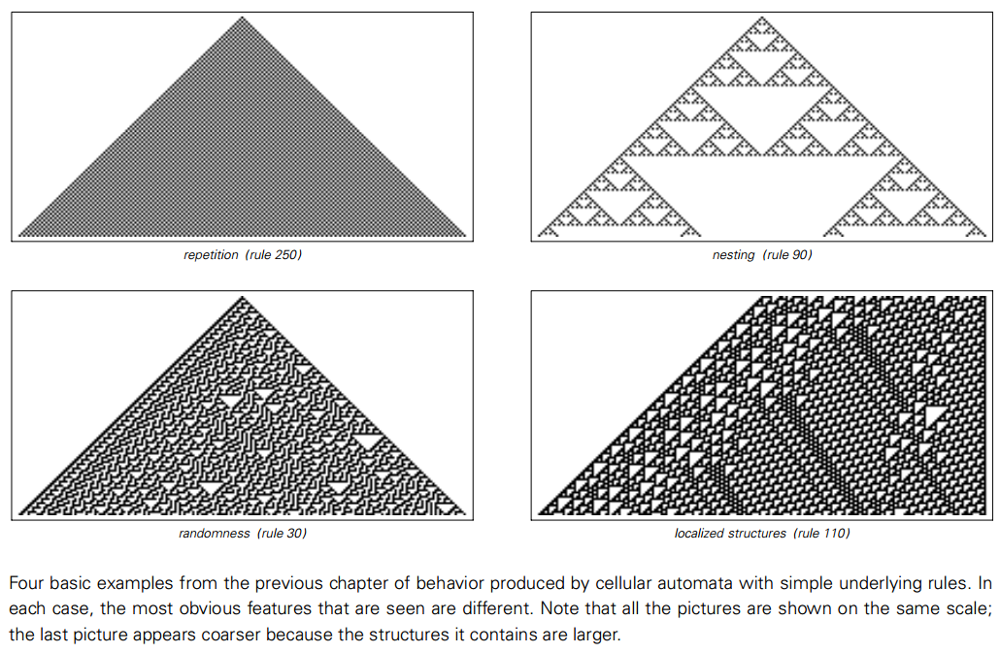
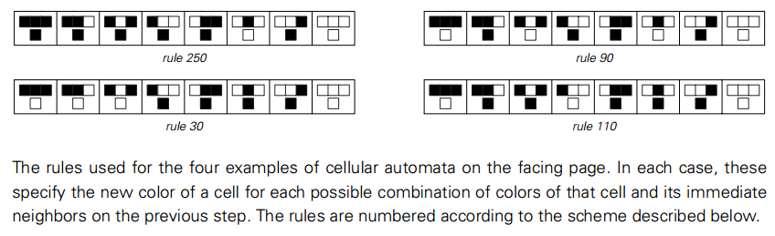
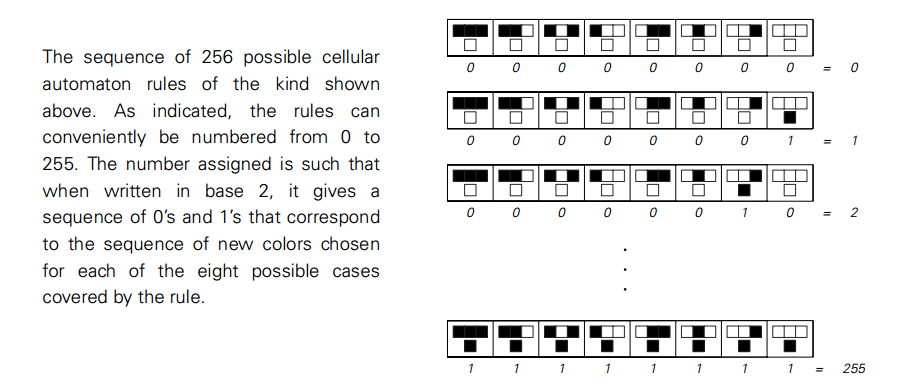
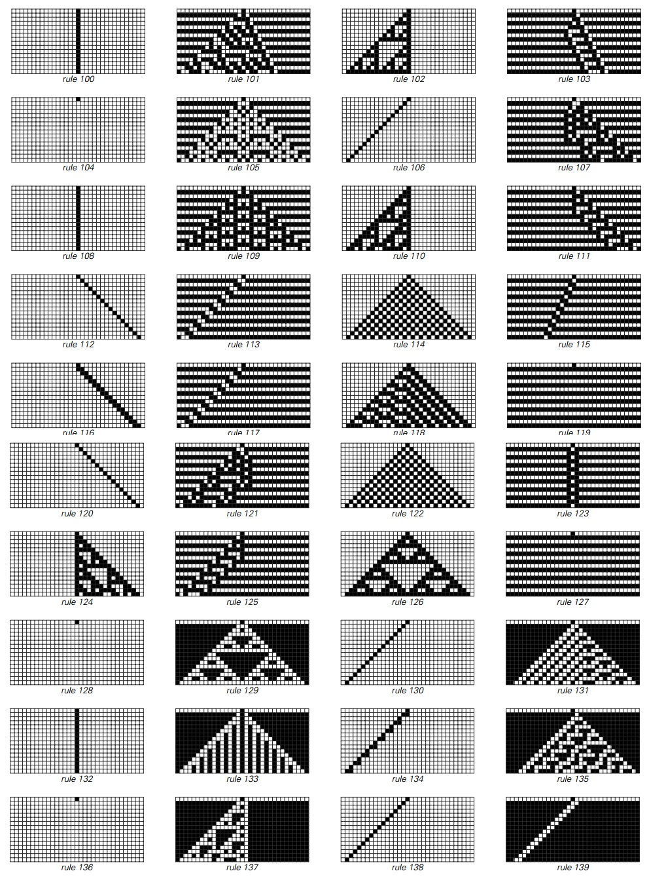
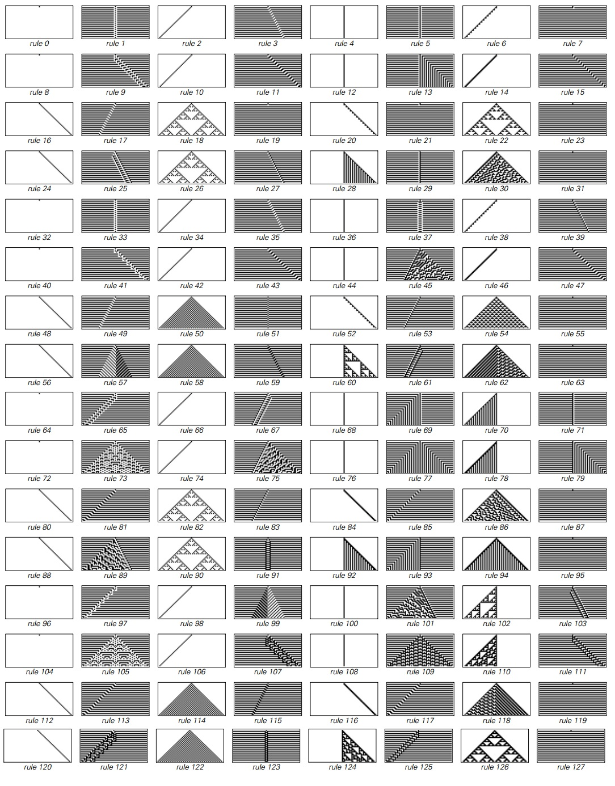
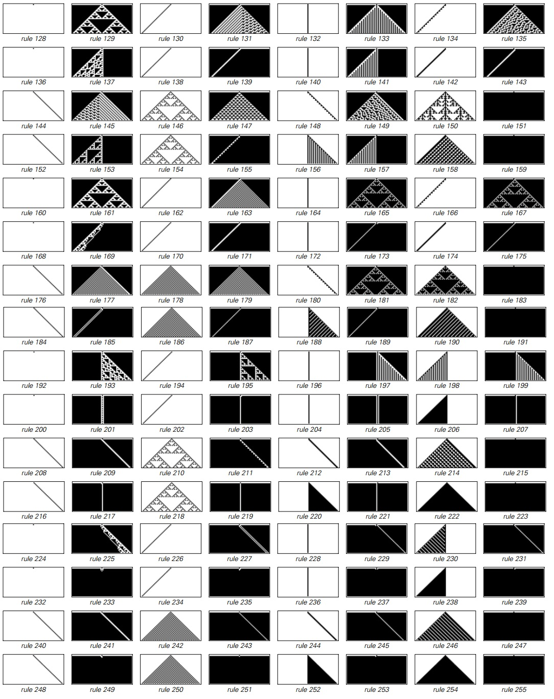
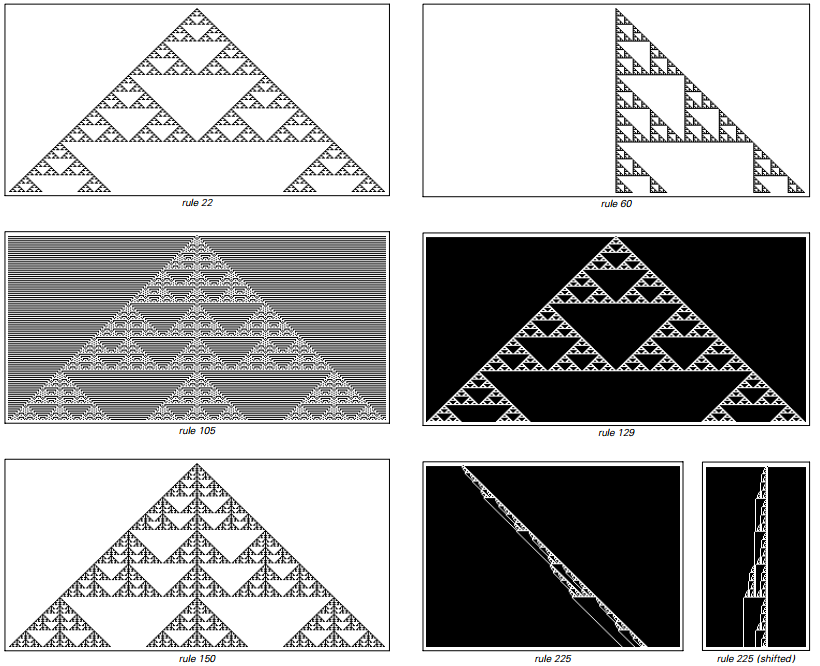
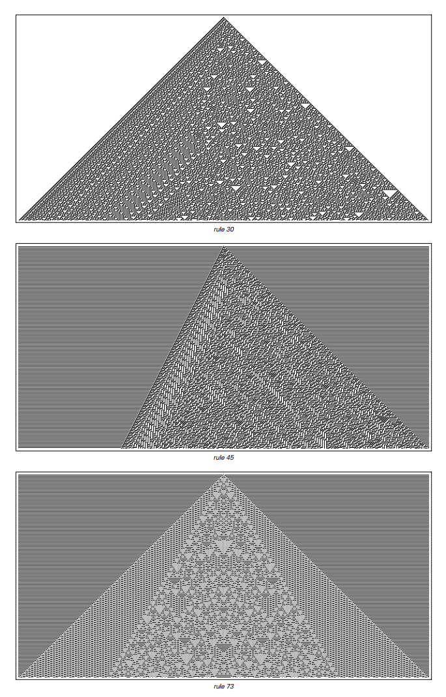
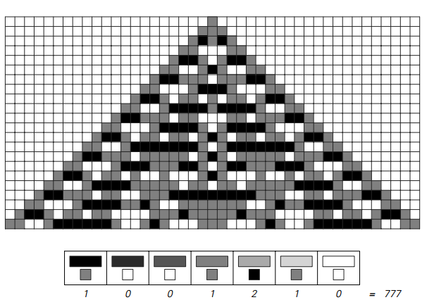
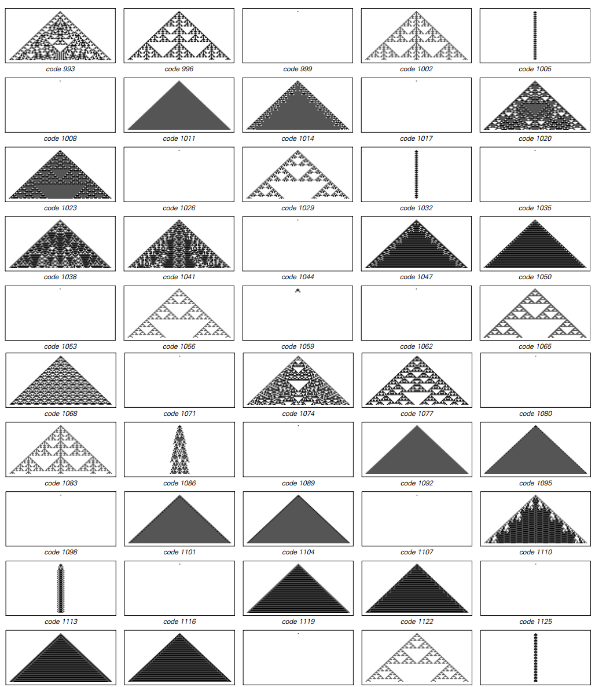

# 第三章 简单程序的世界

### 寻找共性

在上一章开头我们提出了：“简单模型能做什么”的问题。我们举出了一些细胞自动机模型的具体例子作为迈向答案的一步。

我们找到的基本行为类型被呈现在下一页的图片里。在第一张图片里只有简单的重复，只组成了一个很简单的图案。在第二张图片里出现了复杂的细节，但总的来说只出现了很规律的结构。

但是在第三张图片里找不到这样的规律性了，出现了随机的行为。最终在第四张图片里仍然出现了更复杂的行为----产生的复杂结构以复杂的方式相互作用。

在开始没有迹象表明简单的程序可以产生如此不同，如此复杂的行为。但看过这些例子之后，问题变成了“它们有多少代表性？”。只是细胞自动机在特定的规则下会产生这样的行为，还是事实上这种行为广泛存在于所有简单计算模型？

在这一章我的目的就是要通过广泛地考量很多不同的计算模型来回答这个问题。在某种程度上我的方法是像一个自然主义者那样工作-----探索和研究简单计算模型中存在的不同形式。

我开始考虑更一般的细胞自动机，接下来我开始思考一连串其他种类的细胞自动机----使用基本的结构与在前一章中由黑白细胞组成的阵列渐行渐远。

我的发现是：无论使用什么样的基本规则，呈现的结果和我们已经见过的细胞自动机的行为非常相似。

看来，这些基本计算模型产生的行都很有普遍性。在一定程度上最终是这个发现使我建造我在这本书中描述的这门条理清晰的新科学变成可能-------并且用它去阐释很多现象，独立于产生这些现象的系统的细节。

\(p52\)

### 更多的元胞自动机

下面的图片呈现了本书封面四个细胞自动机使用的规则。总体来说每种规则的结构是一样的，不同的是颜色的组合。（每个方框都可以选择两种图案）

结果就有256种不同的组合（2^8=256），编号0~255.

但是细胞自动机有了这么多规则会怎么表现呢？下一页显示了一些细节上的例子，再往下面两页呈现了全部的256种可能情况。

在一开始，可以看到压倒性的多样性。但是仔细观察，明确的主题出现了。

在一些最简单的例子中，细胞自动机中最后一步所有的细胞和第一步之后的细胞颜色是一样的。

举个例子，规则0和规则128，所有元胞都变为白色，规则255所有都变成黑色。还有规则7和127在黑色白色之间交替。

但是在前几页的大部分规则中，唯一共有的行为是一个由单独元胞或者小团体组成的模式。有时候这个模式保持稳定，就像规则4和123，但有时候，比如2和103，它往左或往右移动。

其实这里讨论的元胞自动机的基本结构意味着其任何移动的最大速度都必须是每步一个元胞。在许多规则下，都达到了最大速度——即使是规则3和103，平均速度也到了每步半个元胞。

在三分之二的元胞自动机中，这些模式保持了固定的尺寸。但在三分之一的例子中，这些模式一直在增长。对这种增长模式，最简单的类型是纯粹的重复，比如规则50和109。但是尽管重复模式都有常见的边缘，仍有大约14%的元胞自动机产生了复杂的模式。

最常见的是网状模式，比如下一页将要展示的。事实上尽管24个规则产生了网状模式，只发生了三种基本不同的形式。最简单的是最常见的，如规则22和60。但是正如下一页的图片展示的，其他网状的模式也有可能。（在规则225的例子中，整个模式的宽度并没有以一个固定的比率提升，而是与步数的平方根成比例。）

（p57）

生成网状或者分形图形的例子。规则22——就像26页的规则90——给出了一个分形维度Log\(2,3\)≈1.59的模式；规则159给出了一个分形维度Log\(2,1+√5\)≈1.69的模式。从规则225获得的模式宽度以步数的平方根递增。

重复和网状是许多元胞自动机的主题。但当我们看之前的章节，似乎也可能产生一个看上去随机的模式。在讨论的256个规则中，事实上有10种表现出随机性。下页将展出主要的三种基本模式。

（p58）

看上去产生了随机特性的元胞自动机的例子。展示了三百步的演变，均从单个黑色元胞开始。

（p59）

除了随机性，上一章最后一个例子，110号自动机，其行为由复杂的规律与不规律的区域混合。这个特别的元胞自动机本质上是独立于256个规则外的：四种情况都能看到，互换左右和黑白都是等价的。

还有更复杂的元胞自动机规则吗？

我们讨论的256个基本规则目前为止都是最简单的情况——也就是我最开始研究的。但如果我们将颜色扩充到三种而不是两种，元胞不再是非黑即白，还有一种灰色。可能的规则数目就会立即膨胀到——762597484987种——但如果只考虑用“极端\(totalistic\)”的情况，就容易管理了。

极端情况规则的想法是将每个新的颜色依赖于其近邻的平均颜色，而不是某个个体的颜色。下面的图片演示了其中一个例子是如何运作的。在三种可能的颜色下，共有2187种可能的极端规则，每一种都能由编码表示。下一页会给出一些代表性的规则。

有三种可能颜色下的极端元胞自动机。规则建立在每个元胞新的颜色是由其近邻的平均颜色决定的。0代表白色，1代表灰色，2代表黑色，最右的规则里每个元素都是0，平均是0，其左边一个规则代表平均颜色是1/3。新颜色的序列可以用一个三位数来表示，可以用这个编码来代表每一个极端规则。

（p60）

一系列有三种颜色的极端元胞自动机。尽管它们的基本规则很复杂，元胞自动机在这里展示的相比于两色元胞自动机，并没有太复杂的行为。注意这些序列的规则，改变白色背景的规则没有包含进来。所有模式的对称性是极端模式的基本结构。

（p61）
