# 第三章 简单程序的世界

### 寻找共性

在上一章开头我们提出了：“简单模型能做什么”的问题。我们举出了一些细胞自动机模型的具体例子作为迈向答案的一步。

我们找到的基本行为类型被呈现在下一页的图片里。在第一张图片里只有简单的重复，只组成了一个很简单的图案。在第二张图片里出现了复杂的细节，但总的来说只出现了很规律的结构。

但是在第三张图片里找不到这样的规律性了，出现了随机的行为。最终在第四张图片里仍然出现了更复杂的行为----产生的复杂结构以复杂的方式相互作用。

在开始没有迹象表明简单的程序可以产生如此不同，如此复杂的行为。但看过这些例子之后，问题变成了“它们有多少代表性？”。只是细胞自动机在特定的规则下会产生这样的行为，还是事实上这种行为广泛存在于所有简单计算模型？

在这一章我的目的就是要通过广泛地考量很多不同的计算模型来回答这个问题。在某种程度上我的方法是像一个自然主义者那样工作-----探索和研究简单计算模型中存在的不同形式。

我开始考虑更一般的细胞自动机，接下来我开始思考一连串其他种类的细胞自动机----使用基本的结构与在前一章中由黑白细胞组成的阵列渐行渐远。

我的发现是：无论使用什么样的基本规则，呈现的结果和我们已经见过的细胞自动机的行为非常相似。

看来，这些基本计算模型产生的行都很有普遍性。在一定程度上最终是这个发现使我建造我在这本书中描述的这门条理清晰的新科学变成可能-------并且用它去阐释很多现象，独立于产生这些现象的系统的细节。

\(p52\)

### 更多的元胞自动机

下面的图片呈现了本书封面四个细胞自动机使用的规则。总体来说每种规则的结构是一样的，不同的是颜色的组合。（每个方框都可以选择两种图案）

结果就有256种不同的组合（2^8=256），编号0~255.
 

但是细胞自动机有了这么多规则会怎么表现呢？下一页显示了一些细节上的例子，再往下面两页呈现了全部的256种可能情况。
 

在一开始，可以看到压倒性的多样性。但是仔细观察，明确的主题出现了。

在一些最简单的例子中，细胞自动机中最后一步所有的细胞和第一步之后的细胞颜色是一样的。

举个例子，规则0和规则128，所有元胞都变为白色，规则255所有都变成黑色。还有规则7和127在黑色白色之间交替。

但是在前几页的大部分规则中，唯一共有的行为是一个由单独元胞或者小团体组成的模式。有时候这个模式保持稳定，就像规则4和123，但有时候，比如2和103，它往左或往右移动。

其实这里讨论的元胞自动机的基本结构意味着其任何移动的最大速度都必须是每步一个元胞。在许多规则下，都达到了最大速度——即使是规则3和103，平均速度也到了每步半个元胞。

在三分之二的元胞自动机中，这些模式保持了固定的尺寸。但在三分之一的例子中，这些模式一直在增长。对这种增长模式，最简单的类型是纯粹的重复，比如规则50和109。但是尽管重复模式都有常见的边缘，仍有大约14%的元胞自动机产生了复杂的模式。

最常见的是嵌套模式，比如下一页将要展示的。事实上尽管24个规则产生了嵌套模式，只发生了三种基本不同的形式。最简单的是最常见的，如规则22和60。但是正如下一页的图片展示的，其他嵌套的模式也有可能。（在规则225的例子中，整个模式的宽度并没有以一个固定的比率提升，而是与步数的平方根成比例。）

（p57）

生成嵌套或者分形图形的例子。规则22——就像26页的规则90——给出了一个分形维度Log\(2,3\)≈1.59的模式；规则159给出了一个分形维度Log\(2,1+√5\)≈1.69的模式。从规则225获得的模式宽度以步数的平方根递增。\r 

重复和嵌套是许多元胞自动机的主题。但当我们看之前的章节，似乎也可能产生一个看上去随机的模式。在讨论的256个规则中，事实上有10种表现出随机性。下页将展出主要的三种基本模式。

（p58）

看上去产生了随机特性的元胞自动机的例子。展示了三百步的演变，均从单个黑色元胞开始。
 

（p59）

除了随机性，上一章最后一个例子，110号自动机，其行为由复杂的规律与不规律的区域混合。这个特别的元胞自动机本质上是独立于256个规则外的：四种情况都能看到，互换左右和黑白都是等价的。

还有更复杂的元胞自动机规则吗？

我们讨论的256个基本规则目前为止都是最简单的情况——也就是我最开始研究的。但如果我们将颜色扩充到三种而不是两种，元胞不再是非黑即白，还有一种灰色。可能的规则数目就会立即膨胀到——762597484987种——但如果只考虑用“极端\(totalistic\)”的情况，就容易管理了。

极端情况规则的想法是将每个新的颜色依赖于其近邻的平均颜色，而不是某个个体的颜色。下面的图片演示了其中一个例子是如何运作的。在三种可能的颜色下，共有2187种可能的极端规则，每一种都能由编码表示。下一页会给出一些代表性的规则。

有三种可能颜色下的极端元胞自动机。规则建立在每个元胞新的颜色是由其近邻的平均颜色决定的。0代表白色，1代表灰色，2代表黑色，最右的规则里每个元素都是0，平均是0，其左边一个规则代表平均颜色是1/3。新颜色的序列可以用一个三位数来表示，可以用这个编码来代表每一个极端规则。
 

（p60）

一系列有三种颜色的极端元胞自动机。尽管它们的基本规则很复杂，元胞自动机在这里展示的相比于两色元胞自动机，并没有太复杂的行为。注意这些序列的规则，改变白色背景的规则没有包含进来。所有模式的对称性是极端模式的基本结构。
 

（p61）

我们可能期望使用3种颜色而不是两种能够得到更为明显和复杂的行为。但事实上，我们在前一页看到的和我们之前的看到的基本元胞自动机有什么不同。有更复杂的规则似乎并没有使得行为更加复杂。

事实上，这是一次重要的通用现象的指示：至少在某个界限点之前，增加系统潜在规则的复杂性并没有使得行为更为复杂。比如说在元胞自动机的例子中，似乎所有产生复杂行为的基本要素已经在基本规则中存在了。

使用复杂的规则可能会便于再现特定自然系统中的细节，但是根本上它没有添加新的特性。其实，通过之前页的图就可以看出基本元胞自动机的主题。有一些能够达到确定大小的模式，然后不断重复，就像下面演示的，不断生长重复的形式，还有下一页的顶部的图，其他图产生了嵌套和分形的模式，在下一页底部。

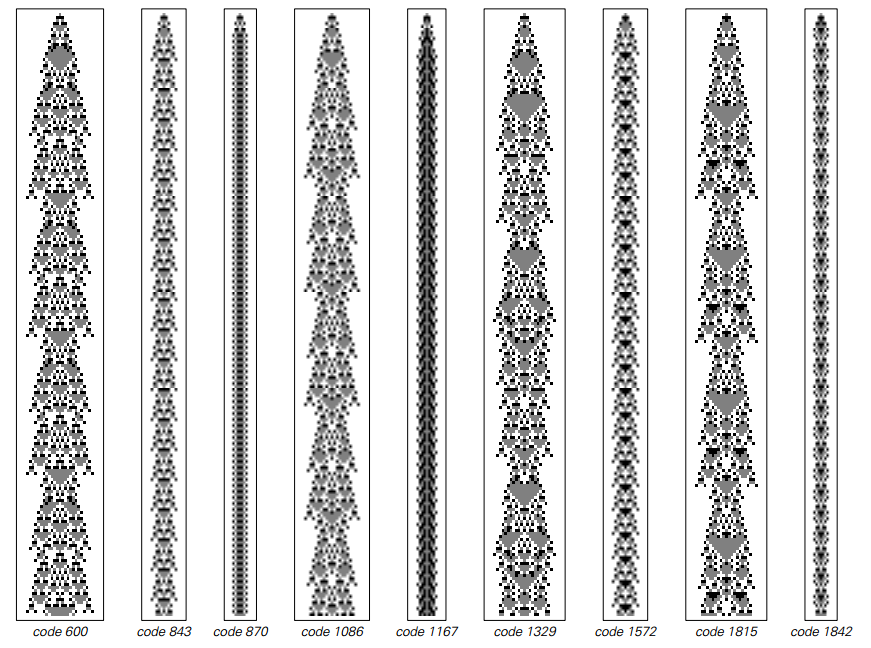
三色极端规则下产生的能够得到确定大小的模式，且不断重复。最大的重复周期是78步，由1329号规则得到。本页和下页图中的初始条件均为一个灰色元胞。
 

（p62）

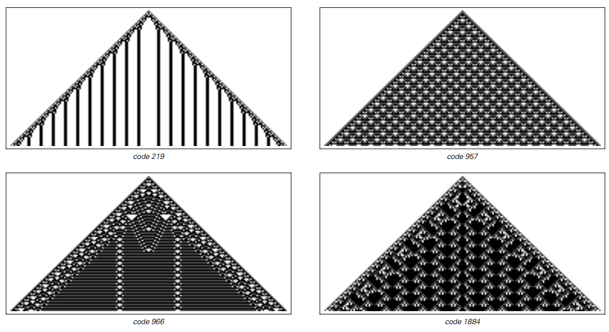
三色极端规则下不断增长但有基本的重复结构。
 
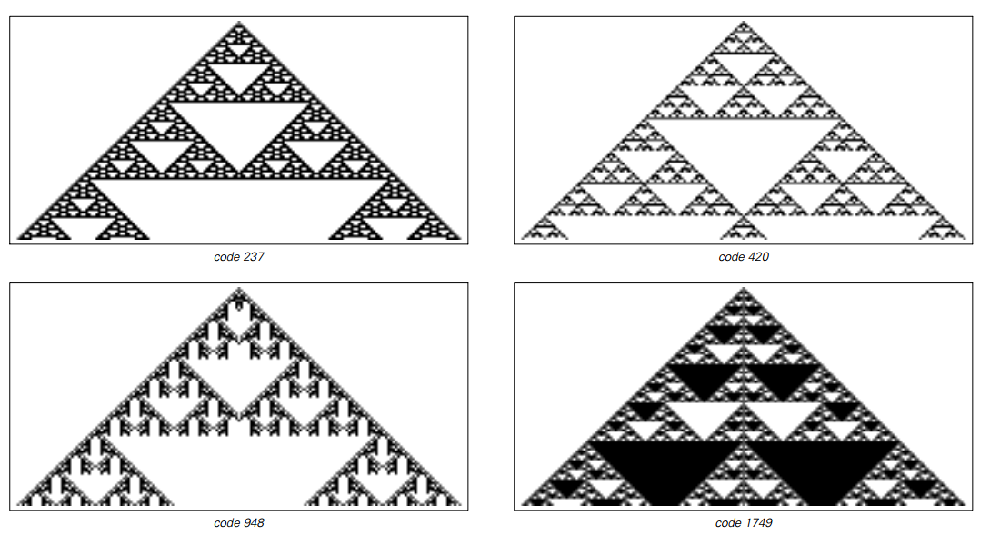
三色极端规则下产生嵌套嵌套模式，在大多数例子中，这些模式，有一个通用的与两色相同的模式，但是比如420号规则，产生了略微不同的结构。
 

（p63）

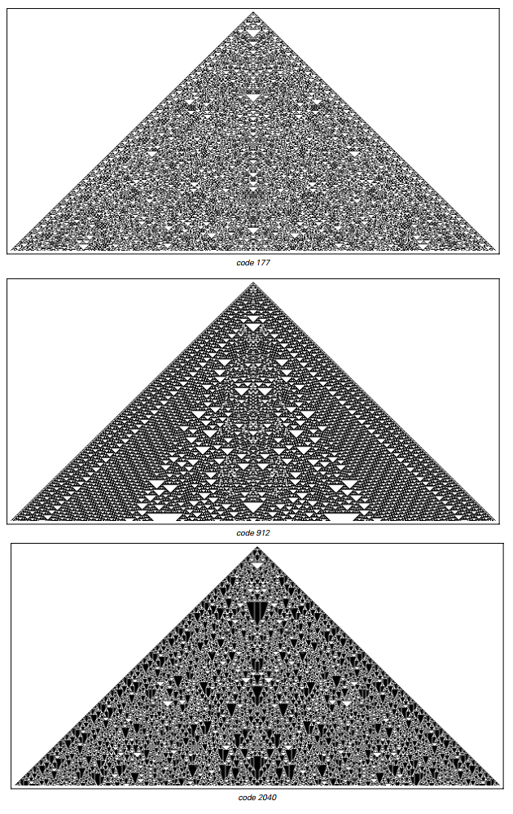
产生近似随机特性的三色极端规则的例子。这里各演示了三百步。
 
（p64）
在细节上，一些模式肯定比那些在基本规则中看到的更复杂。但在整体行为层面上，没有根本的区别。在嵌套模式的情况下，即使是特定结构也通常与基本规则相同。比如，237号和948号的结构是最常见的，其次是1749号。在基本规则中还未见过的新结构是420号，但这只是很少发生。

大约85%的极端规则的元胞自动机产生的行为都是很规律的。但是就跟基本元胞自动机一样，在某些规则上的行为看上去也是随机的。就像上一页给出的一些例子。

除了相当均匀的随机行为外，也有类似于基本规则110的情形，其中确定的结构以复杂的方式相互作用。下一页给出了一些例子。在第一个案例中，该模式在大约150步之后重复出现。然而，在另外两种情况下，不太清楚最终会发生什么。下面的页面将继续这些模式，执行3000步。但即使在这么多步之后，最终的行为将会是什么还不清楚。

看着这些图，第一次开始觉得很难相信它们是有很简单的元胞自动机规则产生的。事实上，即使一个人接受了这一点，仍然有一种倾向，认为某一个人看到的必然是元胞自动机的某些特殊特征的结果。

事实证明，复杂性在元胞自动机中很常见，很幸运的是我第一个决定研究的系统就是它。

但正如我们将要在本章余下内容所看到的一样，我们在前面发现的基本现象并不仅仅是发生在元胞自动机。尽管元胞自动机是很好的例子，但我们会发现，许多不同的系统中会表现出极其相似的行为。

（p65）

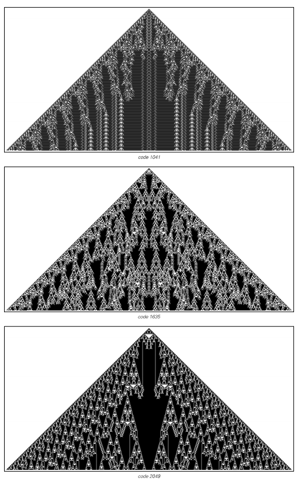
三色极端规则中有着规律与不规律混合的行为的例子。分割成的可识别结构与32页110号规则相似。
 
（p66）

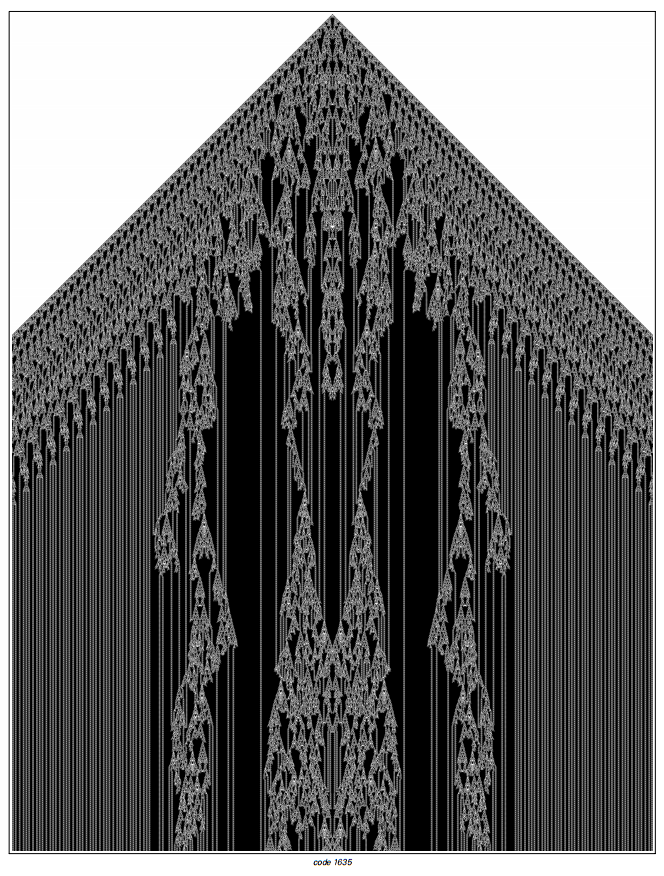
（p67）

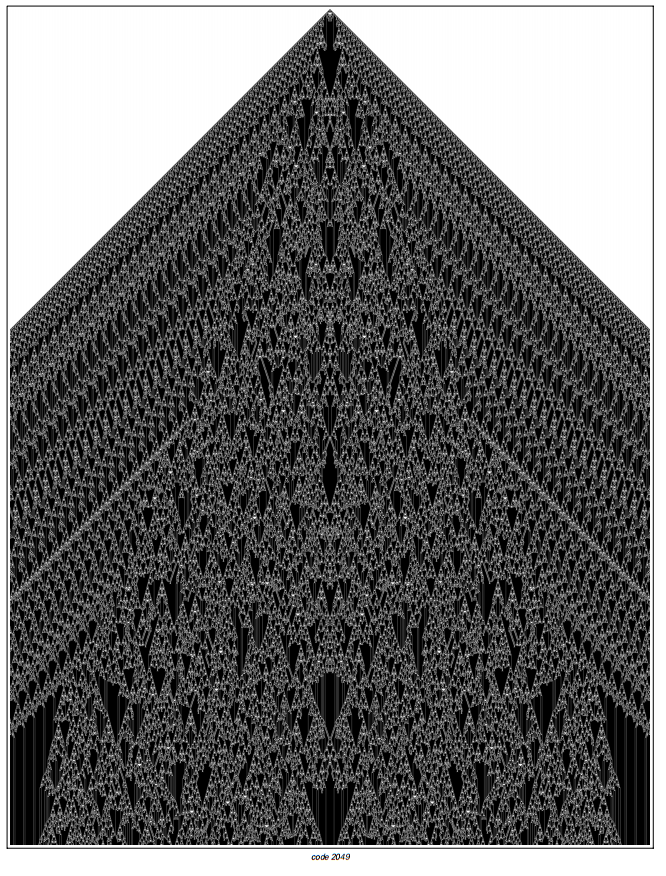
66页的两个元胞自动机执行3000步后的情况。尽管潜在规则很简陋，最终产生出的模式却很复杂。在这两种情况下，并不清楚最终结果会怎样——是结束随机性，还是产生简单的重复形式。
 

（p68）
下面的图演示了极端规则的元胞自动机的模式增长，在最初十分复杂，但是在一百步之后，四个中的三个的形式变得简单起来。
 

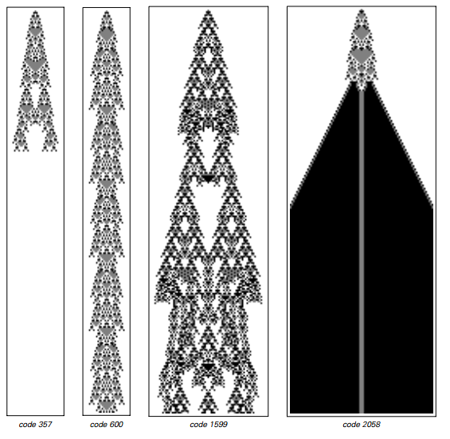

然而接下来的这个模式要复杂的多，下一页会演示，虽然几千步的简单增长都是不规律的，但是增长越来越缓慢。而且内部的模式开始消亡。尽管会有偶然爆发的增长，但是最终，8282步后，模式变为了简单的重复结构。
（p69）

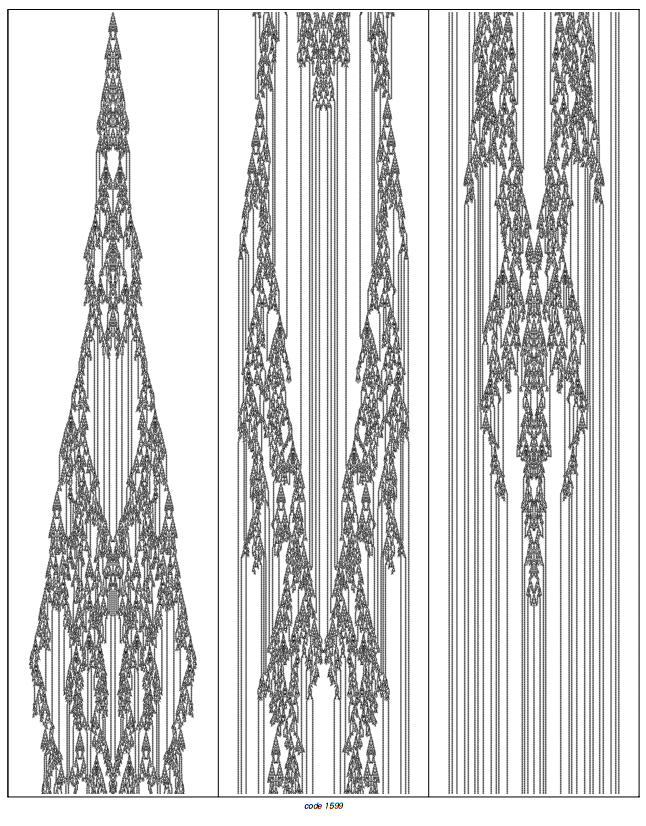

1599号三色元胞自动机九千步的进化。从最开始一个灰色元胞，每一列都有三千步，进化最终在8282步后变得清晰，其模式变成了31个简单重复结构。
 

（p70）
### 移动自动机
元胞自动机的一个基本特征就是所有元胞包含的颜色每一步都是并行更新的。

但这个特征在决定整个将发生的行为中有多重要呢？为了解决这个问题，在这一部分我考虑了一类系统，称之为“移动自动机”(mobile automata)

移动自动机和元胞自动机相似，除了不再是并行更新。它们有一个独立的“活跃元胞”在每一步进行更新，并且有一个规则来指定这个活跃元胞在下一步如何移动。

下面的图展示了一个移动自动机的例子，活跃元胞由一个黑色点表示。这个规则仅对活跃元胞应用，它关注活跃元胞所在位置以及其近邻的颜色，然后对当前元胞新的颜色做出指示，以及活跃元胞往左还是往右移动。

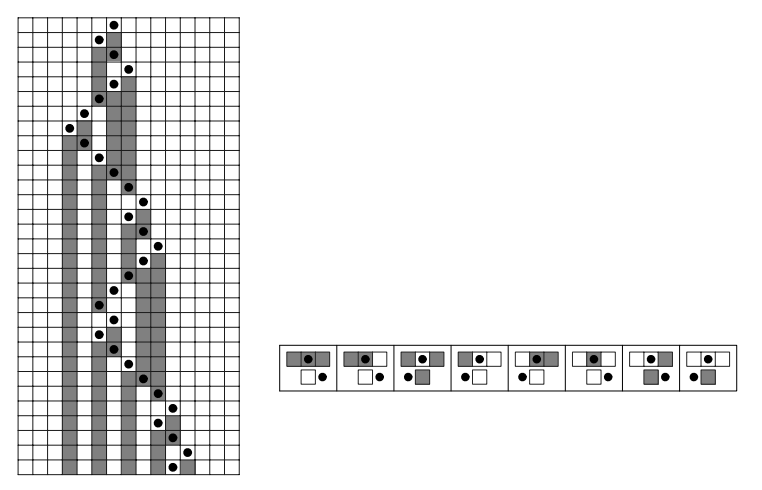

一个移动自动机的例子。就像元胞自动机，一个移动自动机由一行元胞组成，每一个有两种可能的颜色。但和元胞自动机不同的是，移动自动机在每一步有一个活跃元胞（黑色圆点）。移动自动机的规则指示了活跃元胞如何更新，以及该向左还是向右移动。在大量步数运行后的结果见下页。
 

对元胞自动机我们能枚举出可能的所有规则种数，一共有65536种。下一页顶部的图片演示了这些规则的典型行为。在(a)和(b)中，活跃元胞约束在一个小区域中，其行为是简单重复的。(c)和(f)是类似的，整个模式向右移动，在(e),(f)中，整个往左移动。
（p71）

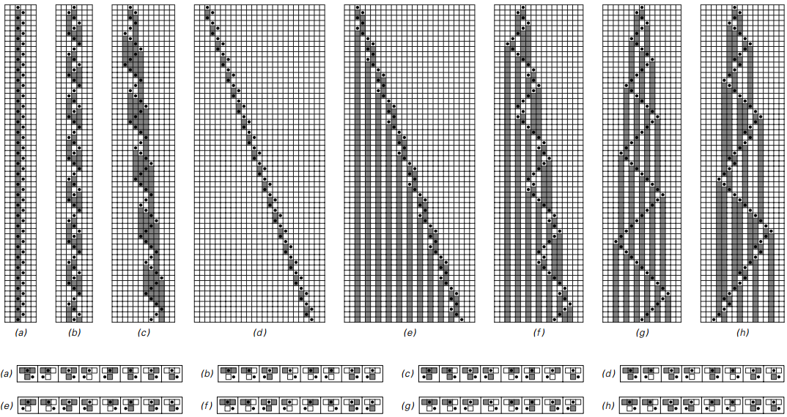

移动自动机的几个规则示例。在a和f中活跃元胞纯粹是重复的，在g和h中则不是，模式的宽度在t步的增长近似为√2t。
 

但在整个65536中的218种，我们能得到不同的行为。就像下面(g)和(h)所示。活跃元胞并不是严格重复的，而是前后扫的，每次扫得更宽。

虽然，整个模式的产生依旧很简单。而且事实上在下面的压缩表格中，它是纯粹重复的。

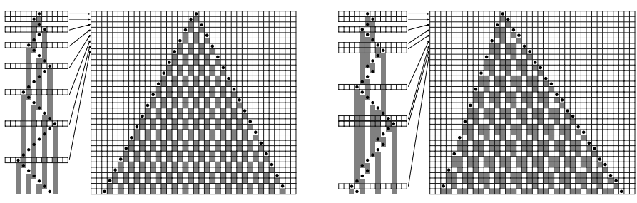
 g和h的压缩版，如果只显示最左或最右的活跃元胞得到的。
 

在65536种可能的元胞自动机中，目前为止没有一个显示出更复杂的行为。那么下面这种行为也会发生在其中吗？

我们可以扩展规则，不再是活跃元胞本身的颜色，也包括其近邻都在每一步更新经过这种扩展，一共得到4294967296种可能的规则。

如果对这些规则进行随机取样，我们能发现99%的都产生了简单重复的行为。但是在少数一千种规则中，我们能看到类似下面的行为：不是纯粹的重复，而是一种嵌套的结构。

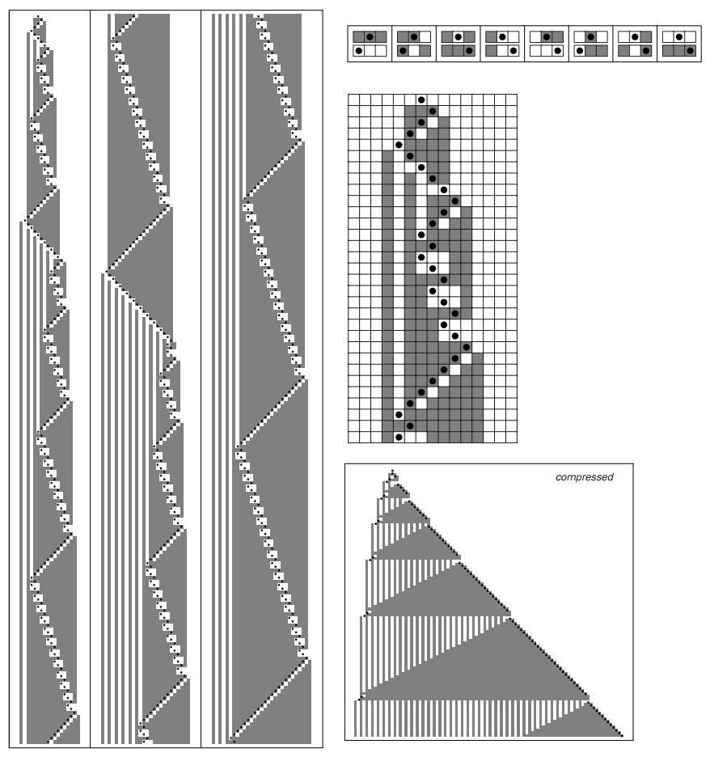
一种产生了嵌套模式的有着更加复杂规则的移动自动机。图中每一列演示了200步的进化。压缩形式的模式基于一共8000步。
 
（p73）

尽管如此，整个模式还是很规则。但我们会发现下面的规则在50000步后，其压缩模式展示出一种类似完全随机的现象，就像规则30。

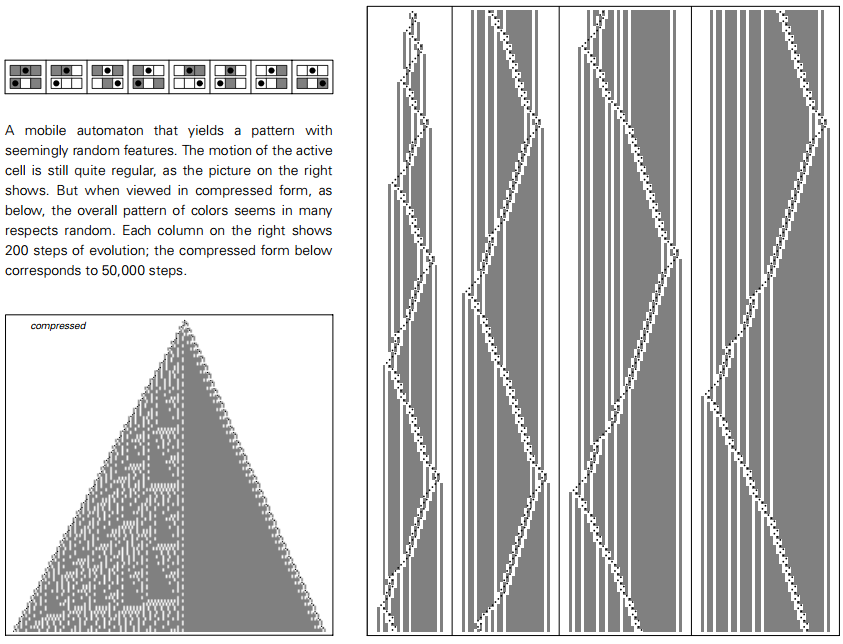
一种产生看上去随机特性的移动自动机。活跃元胞的移动是相当规律的，就像图中所示。整个模式的颜色看上去在很多方面都是随机的。每一列展示出200步的进化，压缩模式演示了50000步。
 

但即使上图中活跃元胞最后剩下的模式看上去是随机的，活跃元胞本身还是规律的。所以存在一种移动自动机其活跃元胞是随机的吗？一开始我觉得可能没有，但在数百万规则中寻找后，最终我发现了下页这个例子。

（p74）

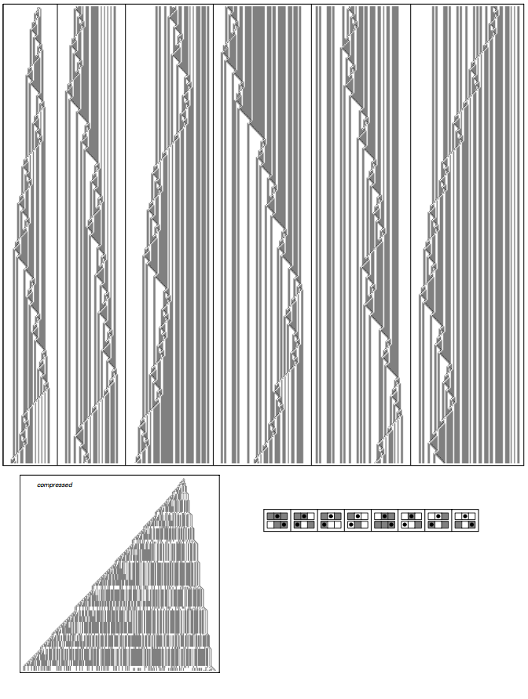
一种移动自动机，其活跃元胞的位置是一种近似随机的方式。每一列有400步，压缩模式显示了50000步。为了找到这种复杂行为的自动机找了数百万种。
 

（p75）

尽管实际上移动自动机每一步只更新一个元胞，但是其行为依然产生了相当的复杂性。但我们发现这种行为虽然在元胞自动机中十分常见，却在移动自动机中十分少见。

我们可以通过研究一类广义移动自动机来了解这种差异的起源，感觉上这种广义自动机介于一般的移动自动机和元胞自动机之间。

这种泛化的移动自动机的基本想法是允许不止一个元胞在每一步进行活动。潜在的规则是在特定的环境下，一个活跃元胞能够分裂成两个，或是完全消失。

例如下面的图片，每隔几步就会产生新的元胞。

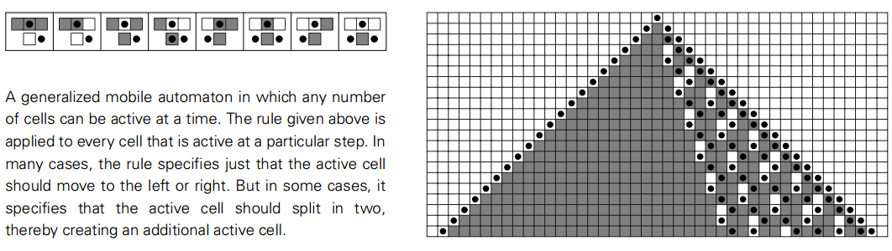

一种泛化的移动自动机，每一步有任意个活跃元胞。上面的规则应用到每个活跃元胞的特定一步。在许多情况下，规则明确规定活跃元胞应该向左或是向右。但是在一些情况下，它会分裂成两个，因此增加了活跃元胞数量。
 

如果我们随机选择泛化的移动自动机，大多数还是会产生简单行为，就像下一页演示的那样。但是在一小部分情况中，行为更为复杂了。一般活跃元胞是规律的，但有时不是。

看更多的例子，一个确定的主题浮现：复杂行为大多数情况不能发生，除非同时有大量的活跃元胞。事实上，这意味着整体的活动和复杂行为的可能性具有显著的相关性。这就是为什么复杂行为在元胞自动机中比移动自动机更为常见。

（p76）

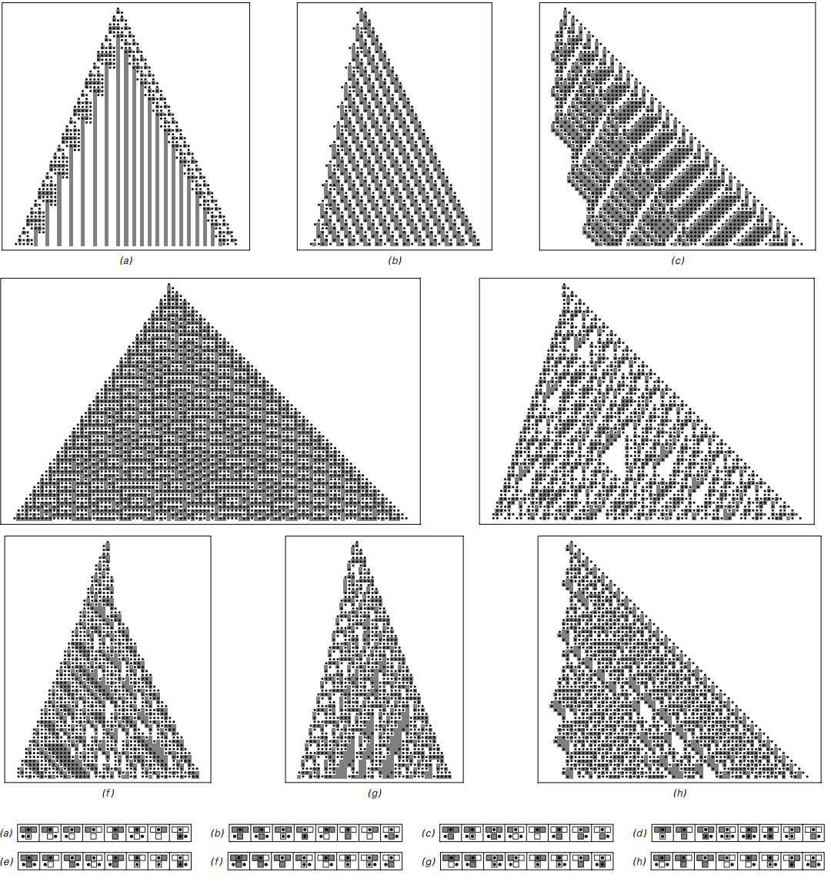

泛化移动自动机的例子。情况a中，只有有限个元胞活跃，但是在其他情况中活跃元胞不断扩散。d中，所有元胞都是活跃的，系统基本上就像元胞自动机。剩下的几种，有些复杂模式的元胞是活跃的。注意不像一般的移动自动机，这些复杂行为的例子是相对容易找到的。
 

（p77）
### 图灵机

在计算的历史上，曾构造的最早广为人知的理论程序基于一类被称作图灵机的系统。

图灵机和移动自动机类似，它们都由一条元胞组成，即“磁带”，有一个活跃元胞，即“磁头”。但是和移动自动机不一样的是，图灵机的头可以有许多种可能的状态，就像下图，有许多种可能的方向。

此外，图灵机的规则可取决于磁头的状态，以及磁头处元胞的颜色，但与近邻元胞的颜色无关。

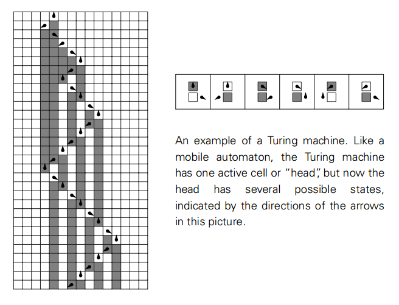

一个图灵机的例子，就像一个移动自动机，图灵机的活跃元胞是一个磁头，但是这个头有许多种可能的状态，就像这幅图中箭头指示的几个方向。
 

图灵机至今仍广泛用于理论计算科学中。但是在几乎所有的情况中，我们都能想象得到，构建出能完成特定的任务的例子，需要通过大量可能的状态以及可能的元胞颜色数量。

实际上，有一种非平凡的图灵机，有两种可能的状态以及两种可能的元胞颜色。下一页演示的4096号就是这类。虽然没有更复杂的情况，重复和嵌套的行为都能看到发生。

（p78）

一个有两种磁头状态的图灵机的例子，共有4096种可能规则。这里只能看到重复嵌套的模式，没有更复杂的情况发生。

 

有了我们在移动自动机的经历，我们可能期望存在图灵机能够有更复杂的行为。

三种状态的磁头下，大概有三百万种可能的图灵机。但这些中的部分行为似乎在细节上更为复杂，就像下一页的案例a和b，但最终都产生了重复嵌套的模式——至少是从所有元胞为白色开始。

四种状态下，更加复杂的行为立即变得可能。事实上，大概一百万规则里有五种都产生了近似随机模式的特征，就像下下页展示的那样。

如果允许磁头超过四种状态会发生什么？结果是几乎没有什么行为上的变化。表面上的随机变得更为寻常，但除此之外结果都是一样的。

我们再一次看到了似乎存在一个复杂行为的界限——在四种状态就达到了。就像元胞自动机里，添加更复杂的潜在规则，而最终不会产生更复杂的行为一样。

（p79）
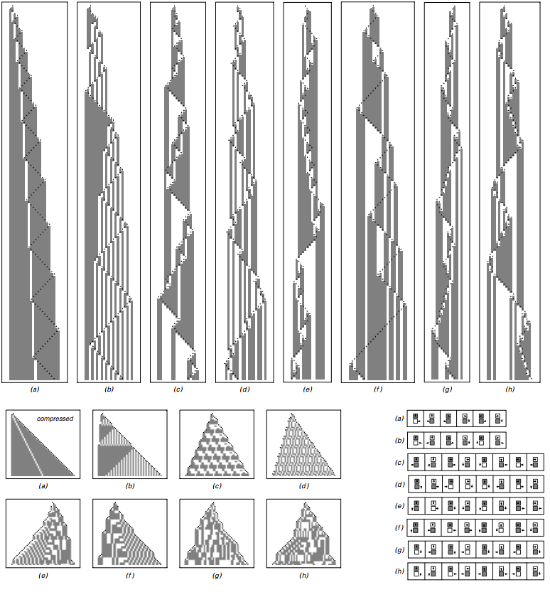
三种和四种状态下的图灵机。在三种可能状态时，至少在全白色元胞开始时，最终都只有重复和嵌套的模式。最上面的一组图演示了不同规则下150步的进化，均从同一个状态开始（箭头向上），所有元胞均为白色。最下面的一组图是压缩形式，每张图包含了50步磁头达到当前最左或最右的情况。

（p80）
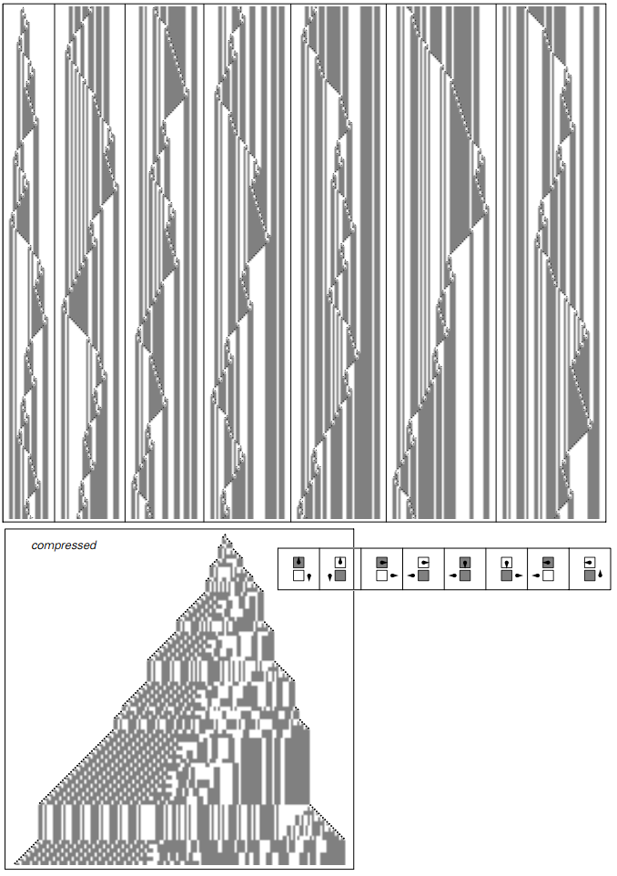

一个在各种意义上展示出随机行为的图灵机。这个图灵机有四种可能的磁头状态，每条磁带上的元胞有两种可能的颜色，以黑白表示。每一列有演示了250步的进化。下面的压缩形式一共演示了20000步。
 
（p81）

### 替换系统

元胞自动机、移动自动机和图灵机所共有的最重要的一个特征是在最底层由一系列固定的元胞组成。这意味着当无论这些元胞的颜色通过多大范围不同的规则更新，潜在的元胞数量和组织都保持不变。

然而，替换系统设置的元素的数量是可变的。一个典型的案例如下，它含有一系列的元素——每一个是白色或者黑色——每一步将之前的元素替代为新的元素块。

简单的例子中，规则表示着每个特定颜色的元素应该被固定的几个元素块所替代，并且独立于其近邻的颜色。

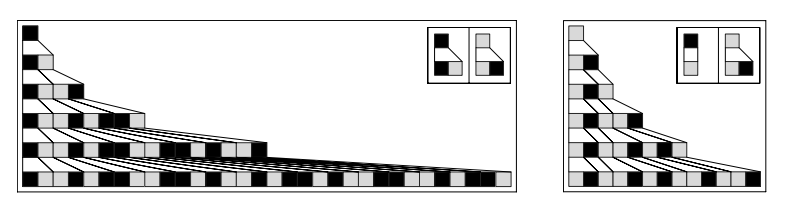

替换系统的例子。这个系统有两种可能的元素，每一步都被固定的新元素块所替代。第一次演示这个案例时，元素的总数在每一步翻倍，它遵循斐波那契数列，每一步的增长因子大概是(1+√5)/2≈1.618。这里演示的两种增长系统和下一页第三第四个例子相符合。

由于这类规则，元素总数增长地相当快，所以图片很快变得相当笨重。但至少对于这类规则，我们可以考虑每一步的替换元素的尺寸不再相同，而是用更小的尺寸。

在下一页，从开始的一个简单的元素用一个长条形表示，然后每一步替换规则指定这个长条如何被划分得更短。

（p82）
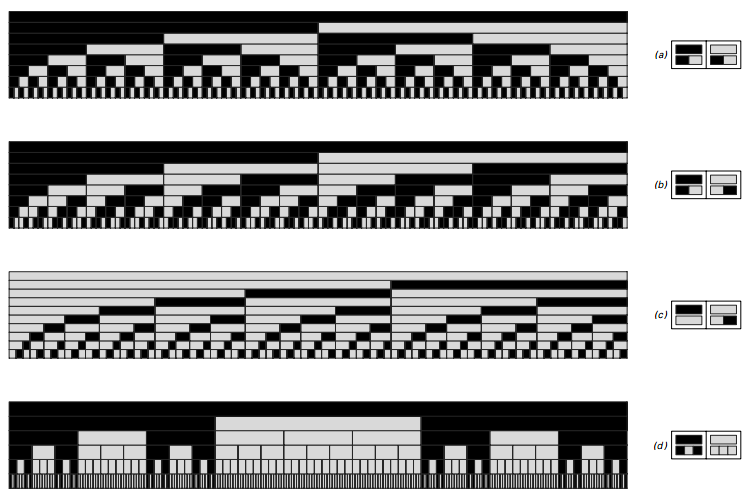
替换系统的例子，每一步的元素都被划分成新元素。在所有情况中，得到的整个模式能够看出一种非常规则的嵌套形式。规则b给出了所谓的Thue-Morse序列，我们会遇到很多次。c和斐波那契数列相关。d给出了一个康托尔集的版本。

下一页顶部的图演示了一些例子。我们能看到的就是模式产生的明显的规律性。如果仔细看，会发现每个模式由一系列相同嵌套的碎片组成。

最终结果并不意外。毕竟，替换系统的基本规则规定任何时候相同元素颜色出现时，都会以同样的方式被划分。

嵌套结构不用长条表示，而是用树枝的形式表示的话会更清晰。根据这个想法，从树干开始，应用替换系统，每一次决定每个树枝如何划分成更小的树枝。
（p83）

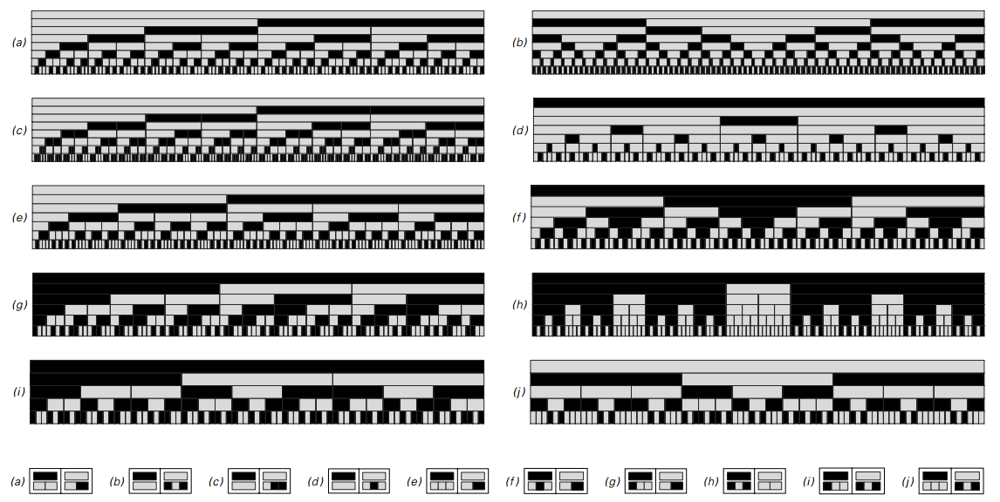
更多的替换系统的例子。每一个规则产生不同的序列元素，但最终都变成了简单的嵌套形式。

关键是因为规则只依赖于特定树枝的颜色，而不是临近树枝的颜色，从树枝生成的子树必须有相同的结构，就像下图所示。

前一页的替换系统的演进，但用树的形式演示。从最底部的树干开始，规则规定每一步的树干颜色应该以同样的方式划分成更小的树枝。结果是每棵树都由更小的相同结构的子树组成。在400页我们会用相似的系统讨论实际的树和树叶。

（p84）

要得到比嵌套模式更复杂的行为，我们要考虑让替换系统的规则不只依赖于单个元素的颜色，而至少包含一个其近邻的颜色。下面的图演示例子的规则，替代规则不仅依赖其本身颜色，也包括其右侧的元素颜色。

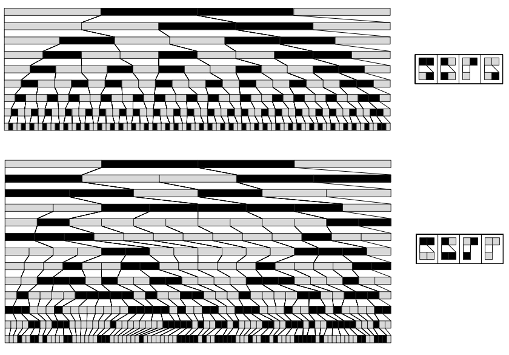
一个颜色依赖自身颜色和右近邻颜色的替代系统。这种规则不能简单地当做是对元素的划分，在图中没有明显的长条尺寸用来选择。我这里做的是在每一步简单地平均划分。注意每一步的最右元素都是不变的，因为没有规则说如何替代它。

在第一个例子中，获得的模式是嵌套结构。但是在第二个例子中，行为更加复杂了，没有明显的嵌套结构。

然而两个例子的一个共同特点是元素的总数从未减少。原因是我们指定的基本规则是每一个元素都至少会被一个新元素替代。

（p85）
