# 第四章 基于数字的系统

### 数字的概念

过去，许多科学最终都在试图找到用数字来描述自然系统的方法。

可在本书中，我几乎没有提到数字。然而，本章的目的是调查一系列基于数字的系统，将他们的行为与我们在其他系统中发现的行为相比较。

基于数字的系统在传统科学中如此受欢迎的主要原因在于，为处理这些数字而发展了大量的数学。事实上，有一些基于数字的系统，其行为几乎可以完全用微积分等数学方法进行分析。

当然不可避免的是，当这种完整的分析是可能的时候，最终的行为是相当简单的。

那么基于数字的系统实际上是否会产生复杂的行为呢？纵观科学和数学的绝大多数教科书，人们可能会得出结论，它们不能。但是，我们必须认识到，这些教科书中讨论的系统通常是专门选择适合于完全分析的系统，因此其行为必然非常简单。

事实上，正如我们在本章中将要看到的那样，如果忽略分析的需要，而只是看计算机实验的结果，那么很快就会发现，即使是基于数字的相当简单的系统也会导致高度复杂的行为。

（p115）

但是这种复杂性的起源是什么呢？这与我们在元胞自动机系统中看到的复杂性有什么关系？

有人可能会认为，用数学来研究系统的所有数学都可以很容易地回答这些问题。但事实上，传统的数学似乎导致了更多的困惑，而不是帮助。

一个基本的问题是，数字在传统数学中的处理方式与在计算机和计算机程序中处理的方式有很大不同。从某种意义上说，传统的数学是一个基本的理想化：它假定数字是基本的对象，其唯一的相关属性是它们的大小。但在计算机中，数字不是基本对象。相反，他们必须通过给出一个数字序列明确表示。

用数字表示数字的想法在日常生活中是很熟悉的：实际上，我们写数字的标准方式恰好与以10为基数的数字序列完全相同。基数10意味着每个数字有10个可能的选择：0到9，但正如页面底部的图片所示，可以同样使用其他基础。而在实际的计算机中，例如，基数2几乎总是被使用的。

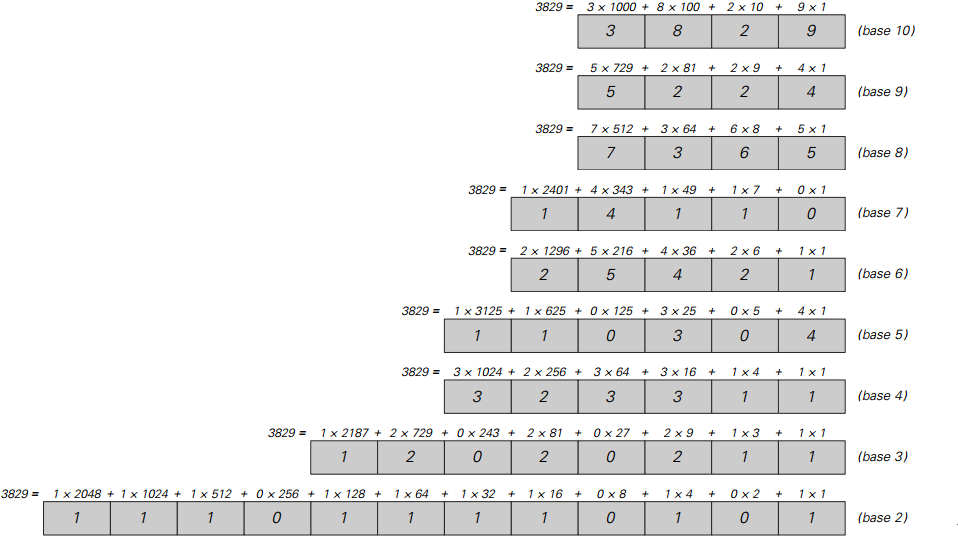
>数字3829在各个基底的表现。 最常见的情况是基数10，从右边连续的数字开始，对应于单位，数十，数百等等。 在基数10中，有10个可能的数字：0到9.在其他基数中，可能的数字有不同的数字。 在实际计算机中使用的基数2中，只有两个可能的数字：0和1.在这个基数中，从右边开始的连续数字具有系数1,2,4 = 2 * 2,8 = 2 * 2 * 2等.

（p116）

那么这意味着在计算机中，数字是由0和1的序列表示的，就像元胞自动机这样的系统中的白色和黑色元胞的序列。而数字操作则对应于更新0和1序列的方法。

在传统数学中，数字操作如何影响数字序列的细节通常被认为是无关紧要的。但是我们在本章中会发现，正是通过查看这些细节，我们才能更清楚地看到在基于数字的系统中复杂性如何发展。

在许多情况下，我们发现的行为看起来与前一章中看到的非常相似。事实上，最后，尽管传统数学提出了一些令人困惑的建议，但我们会发现，基于数字的系统的一般行为与我们已经讨论过的简单程序的一般行为非常相似。

### 基本算术

初等算术的操作是如此简单，以至于他们不可能导致任何复杂的行为。但是我们在这一部分会发现，事实上它们可以。

首先，考虑什么是最简单的可能的算术过程：从数字1开始，然后在逐步的每一步中逐渐加1。这个过程的结果是产生连续的数字1,2,3,4,5,6,7,8，这些数字的大小显然是一个非常简单的过程。

但是，如果一个人看起来不是这些整体大小，而是看起来是数字序列，那么所看到的就更加复杂了。事实上，正如下图所示，这些连续的数字序列（二进制形式——译者注）形成了一个显示错综复杂的嵌套结构的模式。

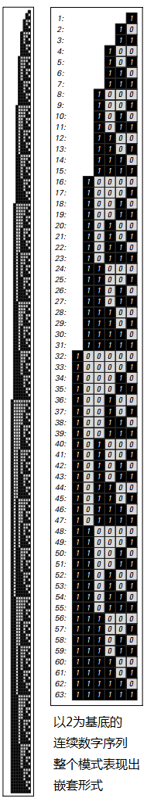

（p117）
下面的图片显示了如果在每一步添加1以外的数字会发生什么。 靠近右边缘的部分，每个图案都有所不同。 但总体而言，所有的模式具有完全相同的基本嵌套结构。

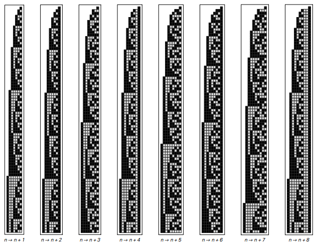

>以1开始，然后在每个步骤中连续添加常数获得的数字的基数2中的数字序列。 所有这些模式最终都有相同的整体嵌套形式。

但是，如果不是加法运算使用乘法运算，那么得到的结果可能会非常不同。 下一页页顶部的第一张图片显示了如果从1开始，然后在每一步继续乘以2会发生什么。

事实证明，如果用数字表示数字作为基数为2的数字序列，则乘以2的操作具有非常简单的效果：它只是将数字序列向左移动一位，在右边添加一个0数字。 结果，连续乘以2得到的整体模式具有非常简单的形式。

（p118）

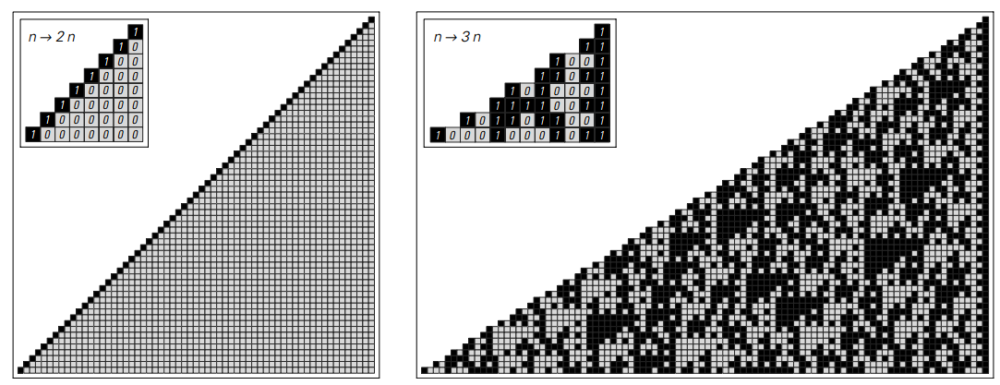
>从数字1开始，然后依次乘以因子2和因子3产生的模式。在每种情况下，在每个步骤中获得的数字的数字序列以基数2示出。乘以2仅仅对应于将基数2中的所有数字向左移动一个位置，使得在这种情况下产生的总体模式非常简单。但乘以3会产生更复杂的模式，如上图所示。请注意，在这些图片中，在每个步骤中获得的完整数字分别对应于2和3的连续整数幂。

但是如果在每一步的倍增因子是3而不是2，那么获得的图案是相当不同的，正如第二张图片。事实上，尽管所使用的唯一操作只是简单的乘法运算，但在这种情况下获得的最终模式非常复杂。

下一页的图片显示了系统演进的更多步骤。在一个小规模的，有一些明显的三角形和其他结构，但超出这些模式看起来基本上是随机的。

就像在元胞自动机这样的简单程序中一样，基于数字的简单系统似乎也会产生非常复杂且显然是随机的行为。

但是我们可以想象，我们在下一页的图片中看到的复杂性必定是由于我们正在按照数字序列来查看数字的结果 —— 而且如果我们只是看着数字他们的整体规模的条款。

然而，一些例子会证明事实并非如此。

要开始第一个例子，考虑如果在每一步乘以1.5，会发生什么情况。从1开始，这样得到的连续数是1，3/2=1.5，9/4=2.25，27/8=3.375，81/16=5.0625，243/32=7.59375，729/64=11.390625，……

（p119）

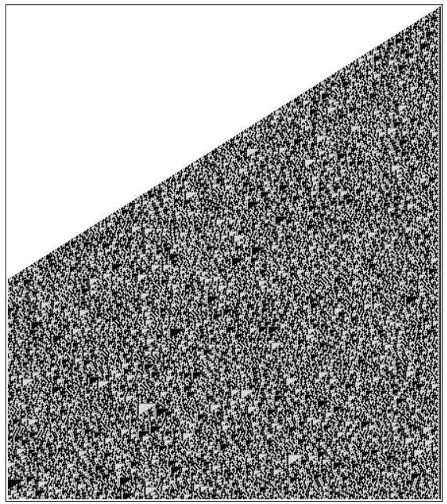

>3的500步平方，以2为基底显示。一些小规模的结构是可见的，但在更大规模的模式似乎是随机的所有实际目的。 请注意，这里显示的模式已被截断在左边的页面边缘，虽然实际上整个模式继续向左扩展，平均斜率Log [2,3]=1.58。

（p120）

下面的图片显示了这些数字的基数为2的数字序列。位于模式顶部的原始1的正下方和左侧的数字对应于每个连续数字的整数部分（例如3.375中的3 ），而位于右侧的数字对应于小数部分（例如3.375中的0.375）。

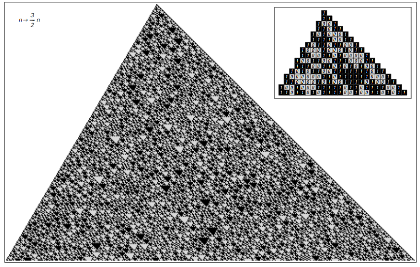
>以2为基底对3/2的连续平方。3/2的乘法可以被认为是乘以3乘以除以2得到的除法。但是除以2只是乘以2的相反，所以在基数2中它简单地将所有数字向右移动一个位置。 整体模式因此是面向页面上显示的模式的移位版本。

不明确地查看完整的数字模式，而是可以考虑找到每个连续数字的小数部分的大小。 这些尺寸绘制在下一页的顶部。 图片也显示出它们在数字水平上也表现出那种复杂性和明显的随机性。

（p121）

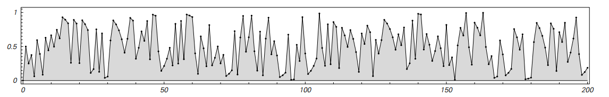
>3/2的连续幂的小数部分的大小。 这些大小是完全独立于什么基地是用来表示数字。 只有点是重要的; 它们之间的阴影和线条只是包含在内，以使绘图更易于阅读。

 刚刚给出的例子涉及具有小数部分的数字。 但事实证明，类似的现象也可以在只涉及整数的系统中找到。

作为第一个例子，考虑用上面乘以3/2的操作的细微变化：如果特定步骤中的数字是偶数（可以被2除尽），那么简单地乘以该数字，得到整数。 但是，如果数字是奇数，那么首先加1，以得到一个偶数，然后乘以3/2。

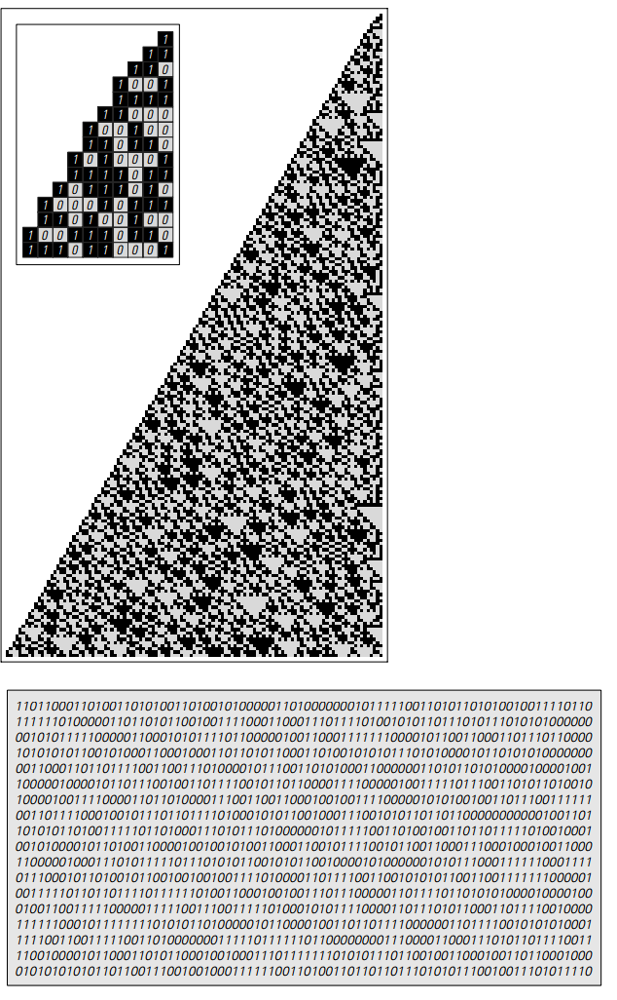
>从数字1开始的结果，然后应用以下规则：如果特定步骤中的数字是偶数，则乘以3/2; 否则，加1，然后乘以3/2。 这个过程产生一连串的整数，其基数为2的数字序列显示在右边。 上面显示了在每个步骤中获得的最右边的数字。 数字为偶数时为0，奇数时为1，如图所示，数字以表面上随机的方式交替。 事实证明，这里所描述的系统与研究第100页上所示的注册机器时产生的系统密切相关。
这个系统可以用规则表示为：n->If[EvenQ[n],3n/2,3(n+1)/2]，100页的规则是n->If[EvenQ[n],3n/2,(3n+1)/2]。在第一步之后，这些系统给出相同的数字序列，除了整体因子3。

（p122）

此过程始终保证给出一个整数。从1开始，得到的数字的顺序是1,3,6,9,15,24,36,54,81,123,186,279,420,630,945,1419,2130,3195,4794， ...

其中一些数字是偶数，而有些则是奇数。但正如页面底部的结果所示，这些数字的顺序是偶数，奇数似乎是完全随机的。

然而，尽管有这种随机性，获得的数字的总体规模仍然相当规律的增长。但通过稍微改变程序，就可以得到更规律的增长。

作为一个例子，考虑以下程序：如果在特定步骤中获得的数字是偶数，则将该数字乘以5/2;否则，加1，然后乘以1/2。

如果从1开始，那么这个过程在每一步简单地给出1。确实有很多起始数字，程序产生纯粹的重复行为。但正如下图所示，它也可以给出更复杂的行为。

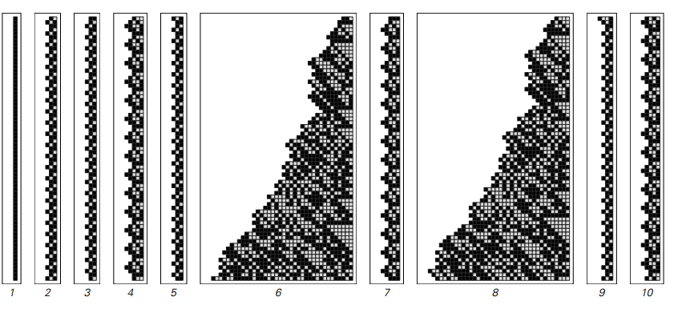
>应用规则 n->If[EvenQ[n],5n/2,(n+1)/2]，从不同的初始n开始。许多案例中，是纯粹的重复行为。但在一些例子中不是的。

从数字6开始，在连续步骤中获得的数字的大小表现出普遍增加的趋势，但是存在相当大的波动，并且这些波动似乎本质上是随机的。事实上，即使经过一百万步后，获得的数字有48,554（10位数字），仍然没有重复的迹象或任何其他显着的规律性。

（p123）

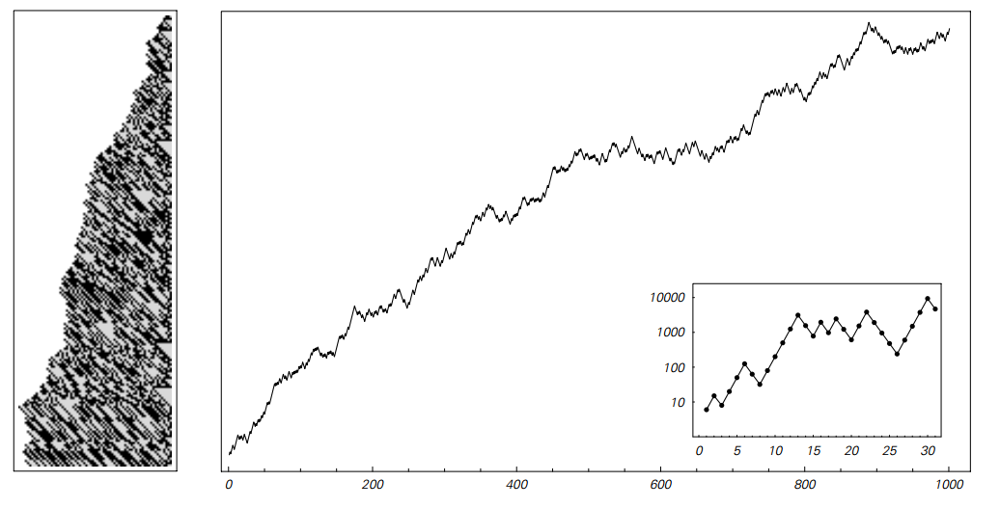
>结果遵循与前一页相同的规则，从数值6开始。在右边绘制的是第一千步获得的数字的整体大小。该图是以对数为单位的，所以每个点的高度本质上就是它所代表的数字的数字序列的长度，或左边的行的宽度。

所以，即使只考虑整数的整体大小，仍然有可能在基于数字的系统中变得非常复杂。

但是，虽然在这个层面上复杂性是显而易见的，但通常有必要进入更详细的层面，以便真正了解其发生的原因。事实上，我们在这一部分发现的是，如果我们看一下数字序列，那么就可以看到与像元胞自动机这样的系统产生的复杂模式非常相似的复杂模式。

然而像元胞自动机这样的系统的基本规则通常与基于数字的系统的规则不同。重点是元胞自动机的规则总是局部的：任何特定单元格的新颜色只取决于该单元格及其直接邻居的以前的颜色。但是在基于数字的系统中通常没有这样的地方。

从手上计算得知，即使像加法这样的操作也会导致任意向左传播的数字。事实上，最简单的算术运算具有这样的性质，即在其结果中的特定位置出现的数字可以取决于原来远离它的数字。

（p124）

但是，尽管基本规则中的基本差异如此，但基于数字的系统所产生的整体行为仍然非常类似于例如元胞自动机所看到的。 

因此，就像我们在前一章讨论的各种程序一样，基本规则的细节似乎也不会对可能发生的行为产生重要影响。 

事实上，尽管在其基本规则中缺少局部性，下面几页的图片显示，甚至有可能找到基于数字的系统，这些数字展示了我们在第32页的元胞自动机中看到的局部结构。

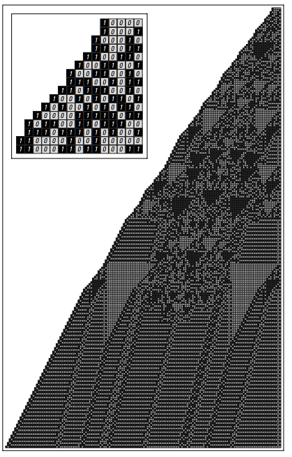

>按照以下规则定义的系统示例：在每个步骤中，取得在该步骤中获得的编号，并以相反的顺序编写其基数2位数，然后将结果编号添加到原始编号中。 对于许多可能的起始号码，获得的行为是非常简单的。 这张照片显示了当人们从数字16开始时会发生什么事情。经过180步后，结果证明所有存活的东西都是一些可以看作是局部结构的物体。

（p125）

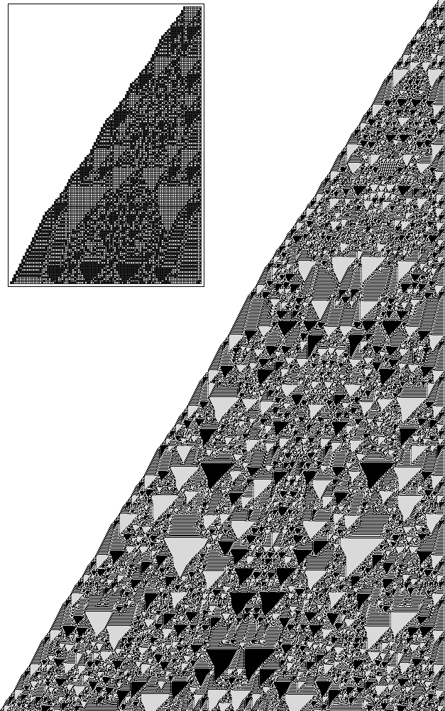

>与前一页相同规则的系统进化的一千步，但是现在从512开始。本地化的结构是可见的，但总体模式似乎从来没有采取过任何一种简单的重复形式。

（p126）

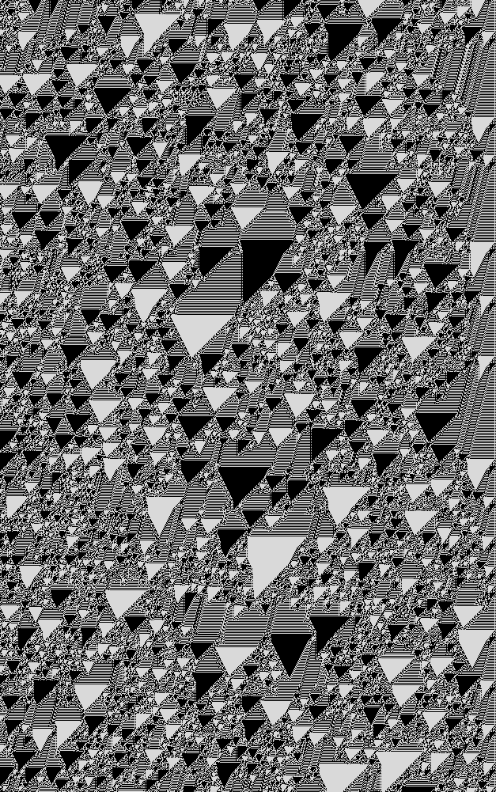

>从第一百万步开始，面向页面上的模式继续。 图片显示了图案的右边缘; 完整的图案延伸到左侧页面宽度的约700倍。

（p127）

### 递归序列

在前面的章节中，我们看到，通过应用基于简单算术的各种操作，可以获得相当复杂的行为。在本节中，我将展示的是，通过恰当的设置，加减只是某种意义上的唯一操作。

基本思想是考虑一系列数字，其中有一个明确的规则来获得序列中的下一个数字。将每个序列中的第一个数字称为f[1]第二个数字f[2]，以此类推，以便表示数字nth为f[n]。用这个符号，规则的作用是规定如何从序列中之前的数字计算出f[n]来的。

在最简单的情况下，f[n]只取决于它之前f[n-1]序列号。但是也可以建立规则，不仅要依赖于f[n-1]，还要依赖于序列中更早的数字f[n-2]。

下面的表格给出了一些具体规则的结果。在所有的情况下，这些结果都是非常简单的，包括序列的增加是一致的或是以一种纯粹重复的方式波动的。

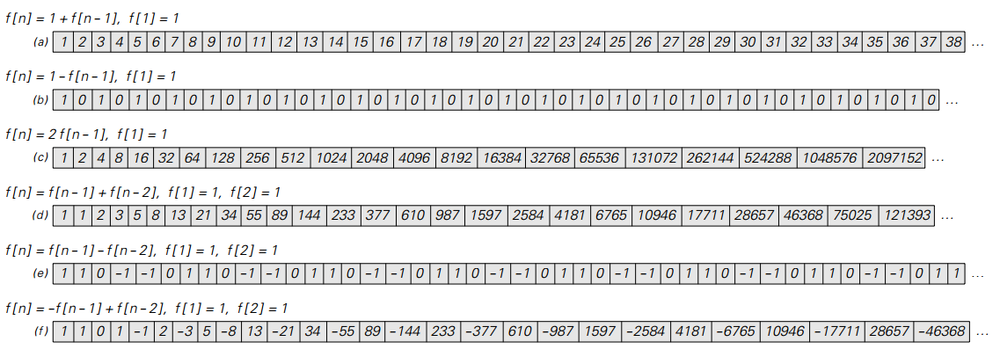
>一些简单的递归序列的例子。 每个序列中的第n个元素被表示为f[n]，规则指定如何从前面的元素确定这个元素。 按照这里显示的所有规则，连续的元素要么顺利地增加，要么以纯粹重复的方式波动。 序列（c）是二的幂; （d）是所谓的斐波那契数列，与黄金比例1.618有关。 这里显示的所有类型的规则都会导致序列f[n]用一个简单的形式的幂和来表示。

（p128）

但事实证明，使用稍微复杂的规则，可以获得更复杂的行为。
关键的想法是考虑规则，这些规则考虑的不仅是序列中的固定距离。
而这意味着，不仅仅取决于f[n-1]和f[n-2]这样的数量，而且f[n]的规则也可以取决于数量如f[n-f[n-1]]。

这里有一些微妙之处，因为从抽象的角度来说，没有什么能够保证n-f[n-1]必然是一个正数。
如果不是，那么通过应用规则获得的结果可能涉及无意义的数量，例如f[0]、f[-1]和f[-2]。

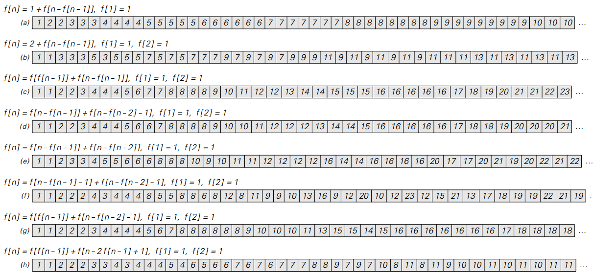
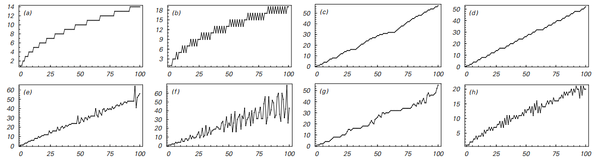
>由不依赖于固定距离的元素的规则生成的序列示例。
大多数这样的规则最终最终会涉及毫无意义的数量，
例如f[0]和f[1]，但是这里显示的特定规则都可以避免这个问题。

（p129）

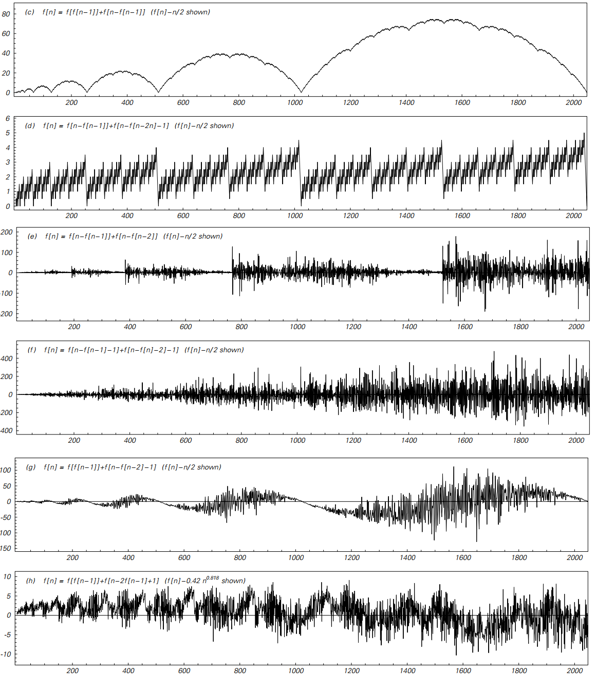
>整个前一页的序列增加波动。
在情况（c）和（d）中，波动具有规则的嵌套形式，并且直接与基地2位数字序列相关。
在其他情况下，波动更加复杂，并且在许多方面看起来是随机的。
这里显示的所有规则都以f[1]=f[2]=1开始。

（p130）

对于随机写下的绝大多数规则而言，确实会发生这样的问题。
但是有可能找到他们不知道的规则，前两页的图片展示了我发现的这些规则的一些例子。
在情况（a）和（b）中，行为相当简单。 但在其他情况下，情况要复杂得多。

总体增长稳步增长，但叠加在增幅上的是波动，正如前面一页上的图片所示。

在情况（c）和（d）中，这些波动具有非常规则的嵌套形式。
但在其他情况下，波动在许多方面似乎是随机的。
因此，例如在（f）的情况下，即使经过一百万步之后，正负波动的数量平均出现相等。

但从某种意义上说，前页里最令人惊讶的特征之一是它显示的波动非常剧烈。
有人可能会认为，从这里开始只会有一点变化。
毕竟，在和之间只有0.05％的变化。

但就像我们在前一节看到的那样，事实证明，它的大小似乎并不像其代表性的各个方面那么重要。
事实上，在（c）和（d）的情况下，例如，f [n]的波动和2的基数序列之间存在直接关系。

在情况（d）中，每个波动基本上只是基数2数字序列中出现的1的数目。
并且在情况（c）中，波动由在所有数字小于的数字序列中出现的1的总数决定。

前一页上显示的其他规则没有这种简单的关系。
但总的来说，人们怀疑所有这些规则都可以被认为是像简单的计算机程序那样将一些表示作为他们的输入。

我们在本节中发现的是，即使规则最终只涉及加减，但它们仍然对应于能够产生非常复杂行为的程序。

（译者注：经测试，f、e作为音频信号波形均表现为噪声）
（p131）

### 素数序列

在所有可能的数字序列中，1,2,3,4,5,6,7,8，...大多数可以被其他数字整除——例如6可以被2和3整除。
但是，对于每个数字都不是这样。
因此，例如5和7不能被任何其他数字整除（除了1之外）。
事实上，有两千多年的历史，有一系列所谓的素数不能被其他数字整除，前两个数字是2,3,5,7,11,13,17 ,19,23,29,31,37,...

下面的图片显示了一个简单的规则，通过这个规则可以获得这样的素数。
这个想法是从所有可能的数字开始。然后在第二行删除大于2的所有可被2整除的数字。
在第三行删除可被3整除的数字，依此类推。 随着时间的推移，剩下的数字越来越少。 
但有些数字总是保持不变，而这些数字正是素数。

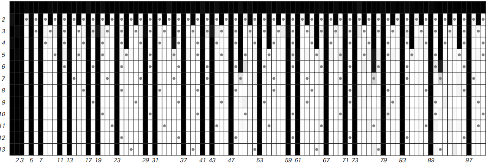
>图为产生素数的过滤过程。
首先在第一行开始，所有数字在1到100之间。
然后在第二行，删除大于2的数字，可以被2整除——如灰点所示。
在第三行中，删除大于3的数字，可以被3整除。
如果这个数字永远持续下去，那么一些数字总是保持不变，而这些数字正是素数。
这个过程基本上就是公元前200年已知的Eratosthenes之筛。

考虑到这条规则的简单性，人们可以想象它产生的素数序列也相应简单。
但正如本书其他许多例子一样，事实上并非如此。
事实上，页面上的图表显示了这个序列的各种特征，表明它在很多方面都是非常随机的。

（p132）

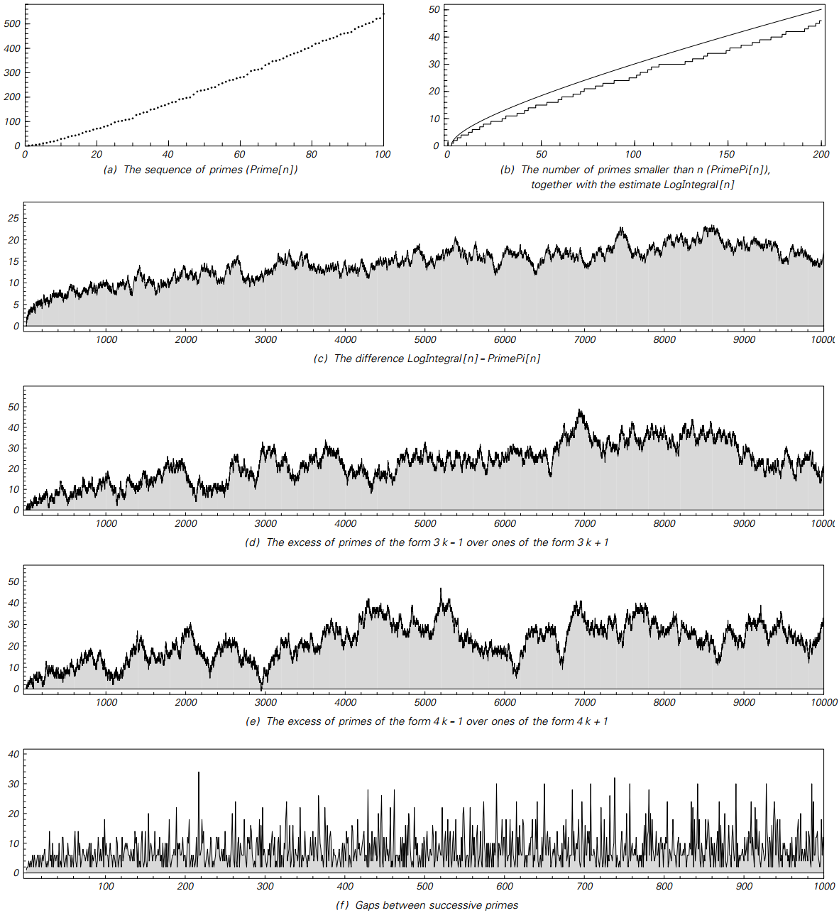
>素数序列的特征。 尽管在生成素数的前一页上的规则很简单，但是获得的素数的实际顺序在许多方面似乎是非常随机的。

（p133）

我在本书中已经展示的复杂性的例子几乎都是全新的。
但前几百个素数无疑在古代是知道的，而且它的分布至少有一定的复杂性。

然而，如果没有我在本书中发展的整个知识结构，这个观察的意义——例如它与自然现象的潜在联系——都没有被意识到。
尽管在数百年的历史中对于素数序列进行了大量的数学工作，但几乎毫无例外，它一直关注的不是复杂性的基本问题，而是试图寻找特定类型的规律。

事实证明，事实上很少发现规律性，并且通常已经建立的结果往往只支持序列具有许多随机性特征的想法。
所以，作为一个例子，从前一页的图片可以看出，（c），（d）和（e）总是在系统上保持在轴上方。
但事实上，经过相当大的努力，已经证明它们在某种意义上是更随机的——并且最终跨越轴线无限多次，并且确实上下移动任意距离。

在每个例子中都可以看到相当程度的复杂性。

如果我们从每个数字的整体大小来看，而不是根据它的数字序列或可能的因子集，就可以理解其中的一些复杂性。
但在大多数情况下——尽管经过数百年的数论工作，往往相当复杂。

事实上，唯一合理的结论似乎就像在本书的许多其他系统中一样，这样的数字序列表现出复杂性，
以某种方式出现作为序列生成规则的基本结果。

（p134）

>基于各种简单的数字属性的序列。数论的大量工作仅仅成功地建立了这些的一些性质。
例如，（d）永远不会达到零，曲线（c）只对形式为4^r(8s+7)的数字达到零。
序列（b）在所谓的完美数字处为零。
即使是完美的数字总是有一个已知的形式，但是否存在任何奇数完美数字是一个在两千多年内仍未解决的问题。
序列（e）从未达到零的说法被称为哥德巴赫猜想（Goldbach's Conjecture）。它是在1742年制作的，但没有找到任何证明或反例。

（p135）

### 数学常量

最后几节表明，可以根据可能出现极大复杂性的数字设置各种系统。
事实证明，初等数学中的一些众所周知的事实已经暗示了这种复杂性的可能性。

有争议的事实涉及数字中的数字序列，如（pi）。
一个非常粗略的近似值是3.14。
更精确的近似值是3.14159265358979323846264338327950288。

但是这个数字序列如何继续？

有人可能会认为，在某种程度上，它必须非常简单和规律。
对于值π的定义是简单定义为任何圆的周长与其直径的比值。

但事实证明，即使这个定义很简单，π的数字序列根本就不简单。
面向页面显示序列中的前4000个数字，通常情况下是基数10，基数为2.下图显示了序列中前20000个数字的图形表示。

以2为底数的前20,000位数字的图形表示。
每次数字为1时绘制的曲线上升，每次为0时下降。
复杂性非常明显。
如果曲线进一步继续下去，它会在轴上花费更多的时间，并且所看到的任何方面都没有提供任何证据表明数字序列是完全随机的。

（p136）

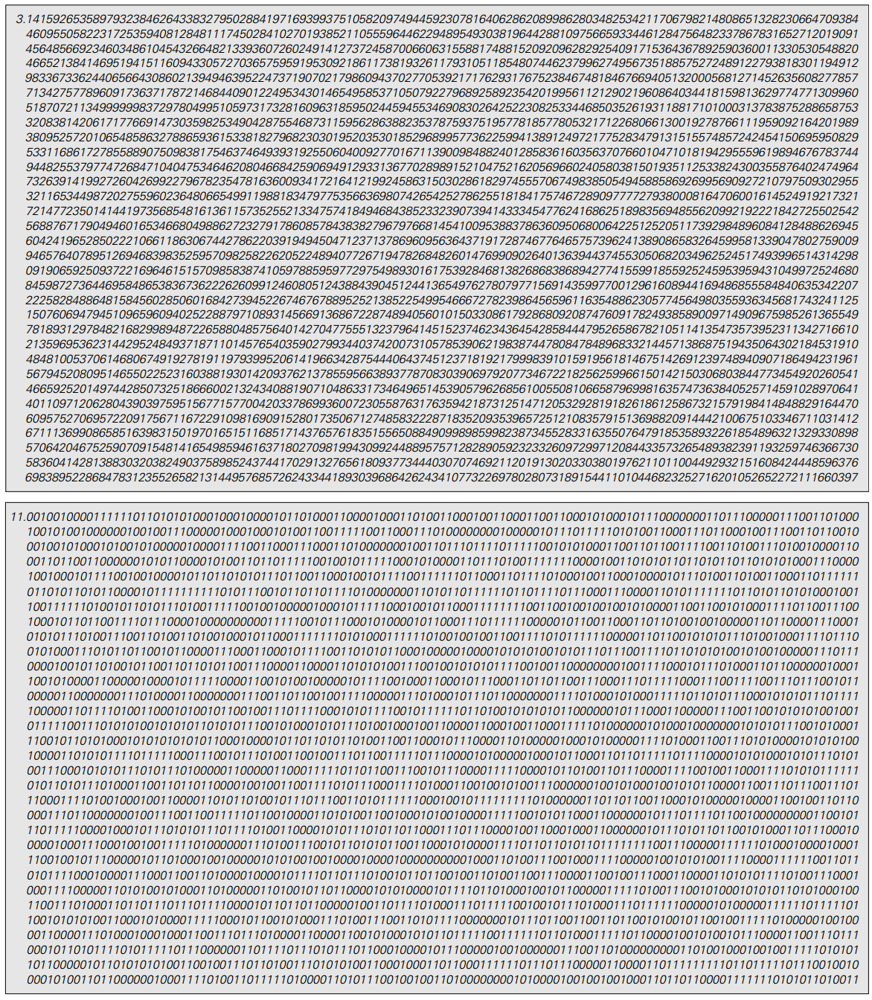

>π在基数10和2中的前4000个数字。尽管π的简单定义是圆的直径与圆的直径的比率，但其数字序列足够复杂，以至于实际上看起来是随机的。

（p137）

没有任何明显的规律。实际上，迄今为止计算的π的所有数字都超过了2000亿，仍然没有发现任何类型的重要规律性。
尽管其定义很简单，但实际上的数字序列完全是随机的。

但其他数字呢？π是一种特殊情况，还是说其他常见的数字常量都具有复杂的数字序列？
有些数字的数字序列的长度有限。因此，例如，基数10中的数字序列是0.375。
（严格来说，数字序列是0.3750000000 ...，但0不会影响数字的值，因此通常会被省略）

但是，很容易找到数字序列不会终止的数字。
因此，例如，基数10的确切值是0.3333333333333 ...，其中3是永远重复的。
同样，是0.142857142857142857142857142857 ...，现在数字块142857永远重复。
下表给出了通过分成整数对得到的几个有理数的数字序列。
在所有情况下，我们看到的是这些数字的数字序列具有简单的重复形式。
而事实证明，所有有理数的数字序列最终都会重复。

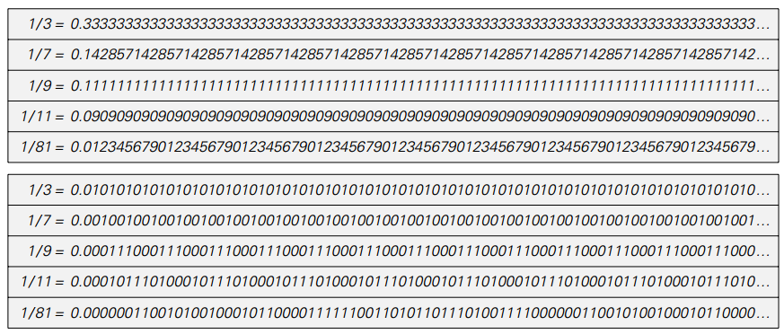

对于各种有理数的数字序列，以十进制（上）和二进制（下）两种方式给出。
对于形式为p / q的数字，序列总是以最多q - 1步骤的周期重复。

（p138）

通过查看执行工作流程的细节，我们可以理解为什么是这样的。
下面的图片显示了用于计算有理数p / q的基2位数序列的特定方法中的连续步骤

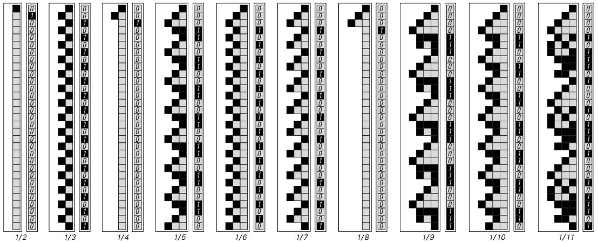

>计算各种有理数的连续步骤。
在每种情况下，右边的列显示数字中基数2的数字序列，而左边的数字框显示计算中每个步骤的余数。
(译注：从上往下看。如1/2的序列，r起初为1——左黑色方格，在除尽后为0——白色方格并且不再变化)

该方法基本上是标准的长除法，虽然在基数2中比在基数10的通常情况下要简单一些。
想法是有一个数字r，基本上跟踪分区中每个步骤的余数。
一开始设置r等于p。 然后在每一步中，比较2r和q的值。
如果2r小于q，则在该步骤生成的数字为0，并将r替换为2r。
否则，r被替换2r-q。 通过这个程序，r值总是小于q。
结果，获得的数字序列总是在每q-1个步骤中重复。

但事实证明，有理数是非常罕见的，具有这样简单的数字序列。
事实上，如果以平方根为例，这个故事就完全不同了

完美的平方根例如4=2*2和9=3*3，专门设置为具有整数的平方根。
但是当下一页顶部的表格显示时，其他平方根具有更复杂的数字序列。
事实上，就我们所知，除了完美平方根以外的所有整数都有平方根，其数字序列完全是随机的。

（p139）

>对于各种平方根的数字序列，以十进制（上）和二进制（下）两种方式给出。
尽管定义很简单，但所有这些序列似乎在实际上都可当做是随机的。

这个程序只比上面讨论的划分要复杂一点。
它涉及两个数字r和s，它们分别被初始设置为n和0。
在每一步中，它比较和s的值，如果r大于s，则将r和s分别替换为4(r-s-1)和2(s+2);否则替换为4r和2s。
然后，结果发现在二进制形式下的数字s完全对应于每个步骤产生一位新数字的√n。

如图所示，该程序的结果表现出相当大的复杂性。
事实上，就像我们在本书中讨论过的其他很多例子一样，生成平方根的过程是基于简单的规则，但是却产生了非常复杂的行为。

（p140）

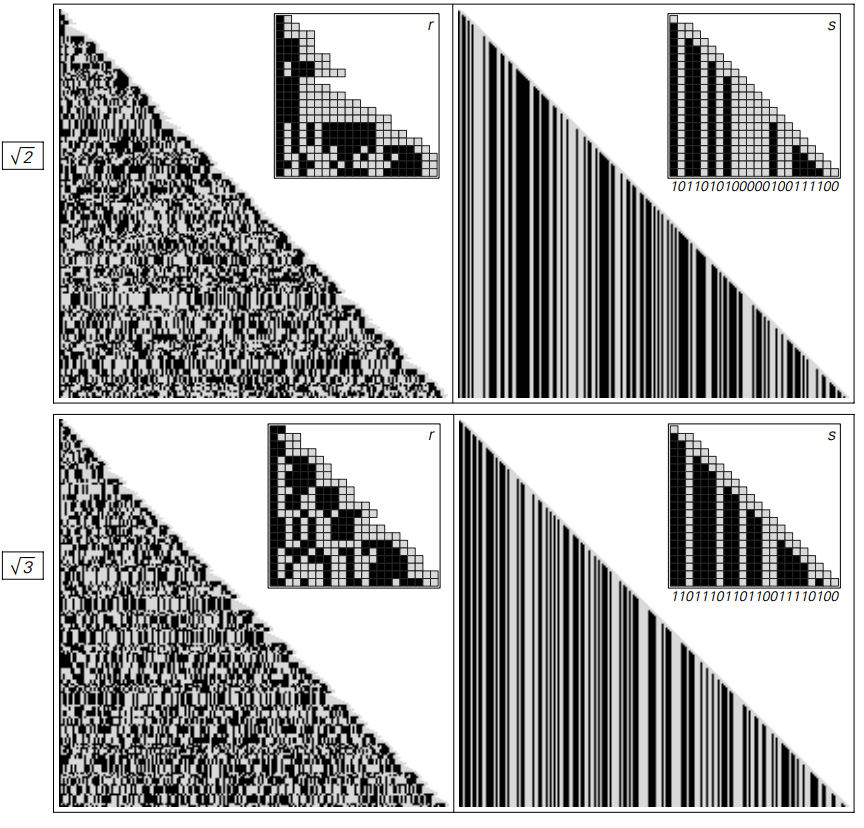

>一个产生平方根的过程。包括两个数字r和s。
为了找到√n，开始设置r=n，s=0，每一步运用规则：
{r,s}->If[r>s,{4(r-s-1),2(s+2)},{4r,2s}}]。
结果是基数2中的数字s与√n的数字结果完全一致。
请注意，如果n不在1和4之间，则在开始此过程之前，必须乘以或除以4的适当幂。

事实证明，平方根当然不是唯一有明显随机现象的数字序列。
作为一个例子，下一页的表格给出了一些立方根和第四根的数字序列，以及一些对数和指数。
据我们所知，几乎所有这些数字都有明显的随机数字序列。

（p141）

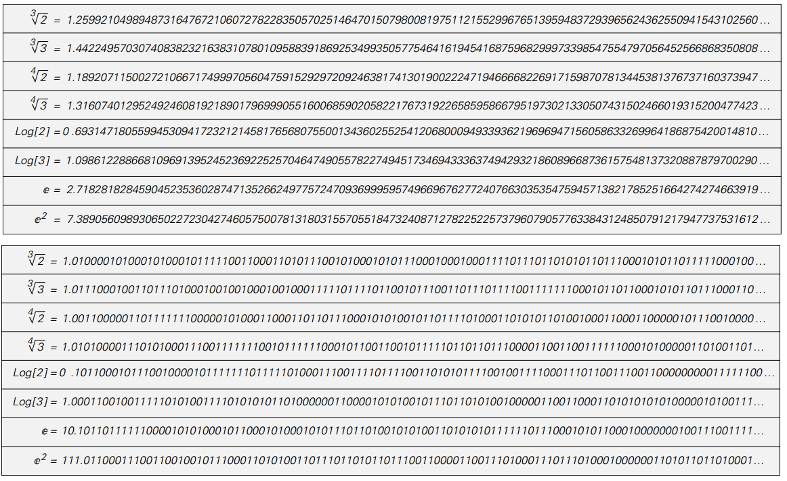

>数字序列的立方根，第四根，对数和指数，十进制的顶部给出，二进制底部给出。再一次，这些序列在实际目的上似乎是随机的。

事实上，有理数是唯一具有重复数字序列的数字。
至少在平方根，立方体根等等，已知没有嵌套数字序列出现。
使用例如第83页上的替换系统构造一个嵌套的数字序列是很简单的，
但重点是这样一个数字序列永远不会对应于通过数学根运算可获得的数字。

本章到目前为止，我们一直使用数字序列作为表示数字的方式。
但有人可能会想到，也许这种表示方式有点不正常，
如果我们只是选择另一种表示方式，那么通过简单的数学运算生成的数字就不再显得复杂了。

在某种意义上，任何数字的表示都可以被认为是指定了构建该数字的过程。
因此，例如，下一页顶部的图片显示π的基数10和基数2数字序列表示可如何用于构建数字π。

（p142）

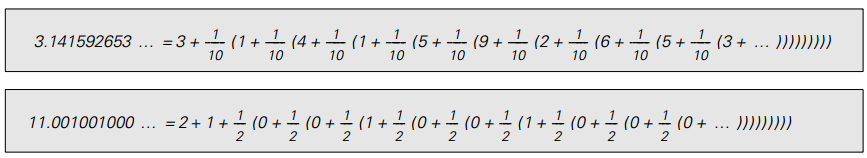

>用十进制和二进制分别构造π的过程

通过用其他操作替换上面出现的加法和乘法，可以得到数字的其他表示。
一个常见的例子是所谓的连续分数表示法，其中使用了加法和除法操作，如下所示。

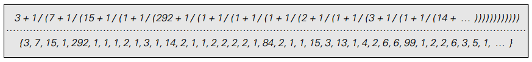

>π的连续分数表示法。在这个过程中π的值由连续的加法和除法组合构成，而不是加法和乘法。

下一页的表格给出了各种数字的连续分数表示。
在有理数的情况下，结果总是有限的。
但对于其他数字，它们会永远持续下去。
平方根产生纯粹重复的连续分数表示。
对于e≈2.718，它和它的所有表现形式也都表现出一定的规律性。
但是对于π和其立方体根，第四根等，连续分数表示似乎基本上是随机的。

其他数字表示呢？
在某种程度上，人们总是可以使用象√2+e^(√3)这样的符号表达来表示数字。
根据定义，几乎可以通过简单的数学运算获得的数字将与简单的表达式相对应。
但问题在于，没有说明从用来表示它的符号表达式计算数字的实际值有多困难。

（p143）

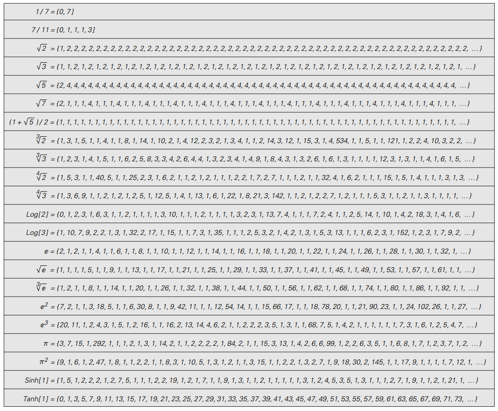

>一些数字的连续分数表示。平方根产生了重复数字的序列，但立方根产生了似乎随机的序列。

在考虑数字表示时，将自身局限于从表示中找出数字的价值对于所有数字来说基本相同的情况似乎是合适的。
如果有人这样做，那么典型的经验是，在任何特定的表示中，某类数字将具有简单的形式。
但其他数字，即使它们可能是简单的数学运算的结果，也往往具有看似随机的形式。

由此可以得出结论：由简单的数学运算产生的数字通常在某种内在意义上是复杂的，与用来观察它们的特定表示无关。

（p144）

### 数学函数

上一节表明，通过应用各种简单的数学函数获得的各个数字可能具有相当复杂的特征。
但是这些函数本身呢？

下面的图片显示通过绘制标准数学函数获得的曲线。
所有这些曲线都非常简单，基本上是重复的形式。
事实证明，几乎所有在Mathematica中定义的标准数学函数都会产生类似的简单曲线。

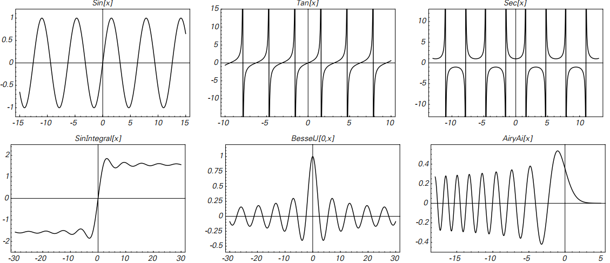

>一些标准数学函数的图。
第一行显示了三个三角函数。
最后一行显示了数学物理学和其他传统科学领域经常遇到的三个所谓的特殊函数。
在所有情况下，所显示的曲线都具有相当简单的重复形式

但是如果我们看一下这些标准函数的组合，获得更复杂的结果相当容易。
下一页上的图片显示发生了什么，例如，如果将各种正弦函数加在一起。
在第一张照片中，曲线得到了一个相当简单的重复结构。
在第二张图中，曲线更复杂，但仍然具有整体重复结构。
但是在第三张和第四张照片中，没有这样的重复结构，并且实际上曲线在很多方面都是随机的。

（p145）

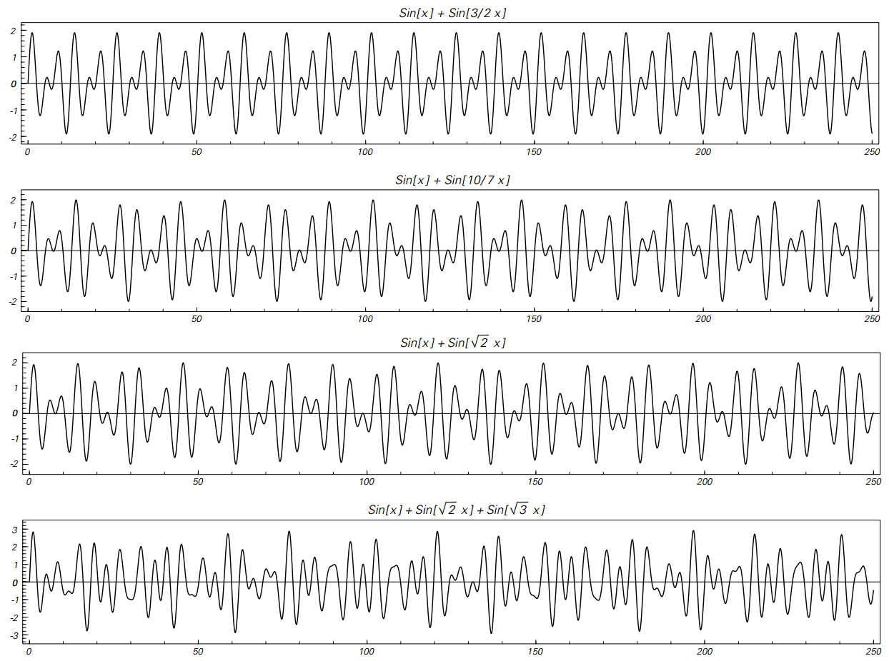

>将各种正弦函数相加得到的曲线。
在前两种情况下，曲线最终是重复的; 在后两种情况下，他们不是。
如果将其看作声音的波形，则这些曲线对应于和弦。
第一条曲线产生完美的五度音程，而第三条曲线产生减五度音程（或全音）。
（译注：音程为两个音级在音高上的相互关系。即两个音调的组合）

然而，在第三幅图中，曲线与轴线交叉的点以两个规则间隔的家族出现。
正如页面上的图片所示，对于任何曲线，例如这些交点的相对排列结果都与广义替代系统的输出有关，
其中每一步的规则都是从 (α-1)/(α+1) 的连续分数表示法得来。

（p146）

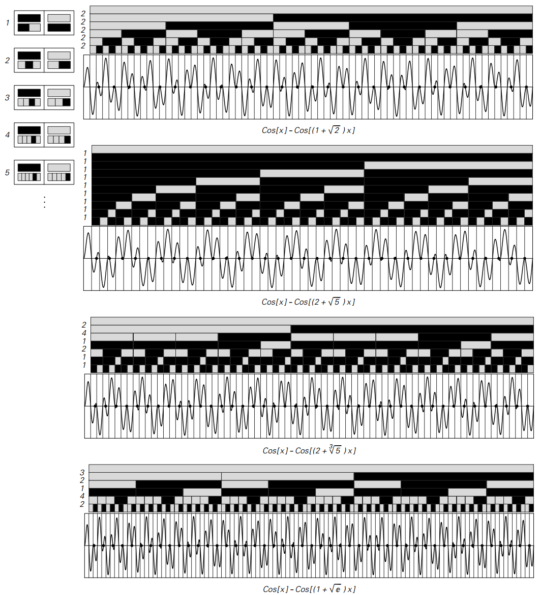

>通过加上或减去两个正弦或余弦函数获得的曲线变成具有可由广义置换系统再现的轴交叉的图案。
通常，当广义替换系统中的对应元素为黑色时，在一个区间内存在轴交叉，而元素为白色时不存在轴。
如果广义替代系统中的每个步骤都有一个规则，如左边所示的连续分数表示法中的一个术语所示。
在前两个示例中显示的是二次无理数，因此连续分数是重复的，并且获得的模式是纯粹嵌套的。
（第二个例子类似于第83页的斐波那契替换系统。）但是在最后两个例子中，没有这样的规律。
请注意，每个连续分数中的连续项与旁边的替代系统中的步骤一起显示在页面上。

（p147）

当α是一个平方根时，则如前一节所述，连续分数表示法是纯粹重复的，使生成的模式嵌套。
但是，当α不是平方根时，模式可能更复杂。
如果涉及两个以上的正弦函数，那么似乎不再与广义替换系统或连续分数有任何特别的联系。

在定义的所有各种数学函数中（如在Mathematica中的），
事实上在自然科学中也有一些（传统上不常见）产生复杂曲线，但似乎没有明确依赖于单个数字的表示。
其中很多与所谓的Riemann zeta函数有关，其中的一个版本如下图所示。

这个函数的基本定义非常简单。
但最终这个函数结果与质数的分布有关——它产生的曲线相当复杂。
事实上，尽管经过了数百年的数学努力，
但迄今为止甚至不可能建立例如所谓的黎曼假说，其实际上只是说曲线中的所有峰位于轴上方，并且所有的谷位于轴下方。

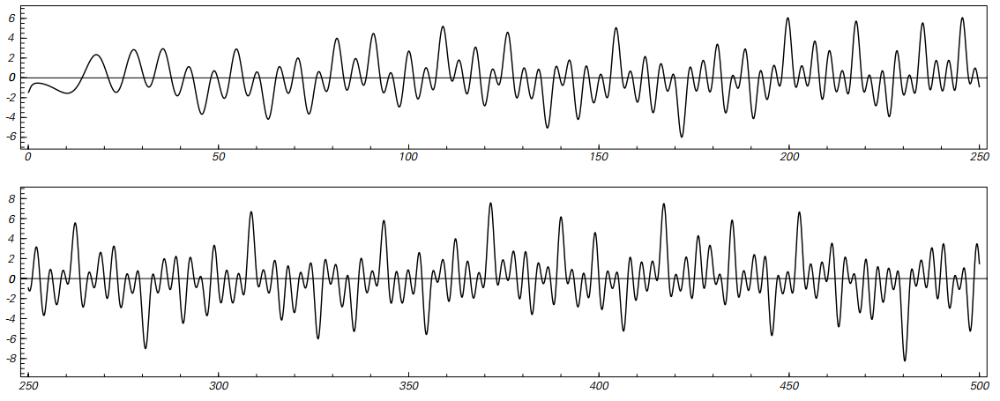

>与所谓的Riemann zeta函数相关的曲线。
zeta函数被定义为Zeta[s]=Sum[1/k^s,{k,∞}]。
这里显示的曲线是所谓的Riemann-Siegel Z函数，它本质上是Zeta[1/2+i*t]（虚数i）。
著名的黎曼假说实际上表明，在这条曲线中第一个之后的所有峰值都必须位于轴的上方。

（p148）

### 迭代映射和混沌现象

迭代映射的基本思想是取0到1之间的数字，然后按照固定规则或“映射”按照一系列步骤更新此数字。
我会考虑的许多映射可以用标准的数学函数来表示，但总的来说，
所需的一切就是映射采用0到1之间的任何可能的数字，并产生的也是0和1之间的某个确定数字。

接下来两页的图片显示了使用四种不同的映射选择获得的行为。

第一页上的例（a）和（b）显示了我们在本章的许多其他系统中看到的与数字序列和数字大小非常相似的复杂性。
情况（c）显示了数字序列的复杂性，但它产生的数字的大小很快趋向于0。
然而，情况（d）似乎基本上是微不足道的——在数字序列或数字大小中都没有显示复杂性。

在接下来的两页中的第一页中，所有示例都以数字1/2开始——它有一个简单的数字序列。
但接下来两页中第二页的例子却以数字π/ 4开始——它有一个看似随机的数字序列。

（a），（b）和（c）两个页面看起来非常相似，特别是在数字大小方面。
但情况（d）看起来完全不同。
对于第一页，它只是产生0。
但在第二页上，它产生的数字的大小以一种看似随机的方式不断变化。

如果我们看一下数字序列，那么为什么会发生这种情况是相当清楚的。
如图所示，在情况（d）中使用的所谓的移位映射仅用于在每个步骤将所有数字向左移动一位。
这意味着在系统演变的过程中，原始数字中进一步向右的数字将逐渐最终到达左侧——
因此，只要这些数字显示出随机性，就将导致生成的数字大小的随机性。

然而，认识到这一点非常重要，因为这个系统的发展实际上并没有产生任何随机性。
相反，只是插入到原始数字序列中的随机性显示在得到的结果中。

（p149）

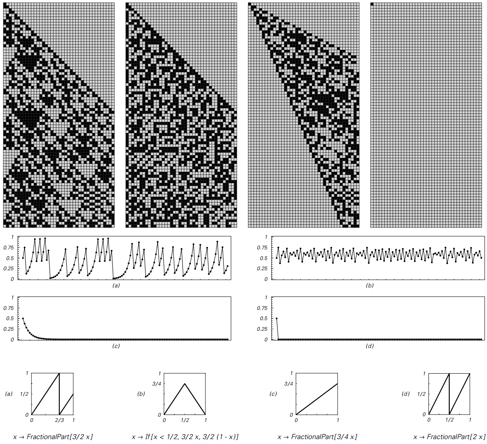
>从简单的初始条件开始的迭代映射的例子。
每一步都有一个介于0和1之间的数字，通过应用固定映射进行更新。
这里考虑的四种映射在上面都以公式和图表的形式给出。
页面顶部的图片显示通过迭代此映射获得的连续数字的基本2位数字序列，而页面中间的图片绘制这些数字的大小。
在所有情况下，初始条件由数字1/2组成——具有非常简单的数字序列。
尽管如此简单，但情况（a）和（b）在数字序列和产生的数字大小方面都显示出相当大的复杂性（比较第122页）。
在情况（c）中，数字序列很复杂，但数字的大小趋向于零。
最后，在（d）的情况下，数字序列和数字的大小都不是微不足道的。
请注意，在上面的图片中，每个水平数字行对应于一个数字，左边的数字对这个数字的大小的影响越来越大。

（p150）

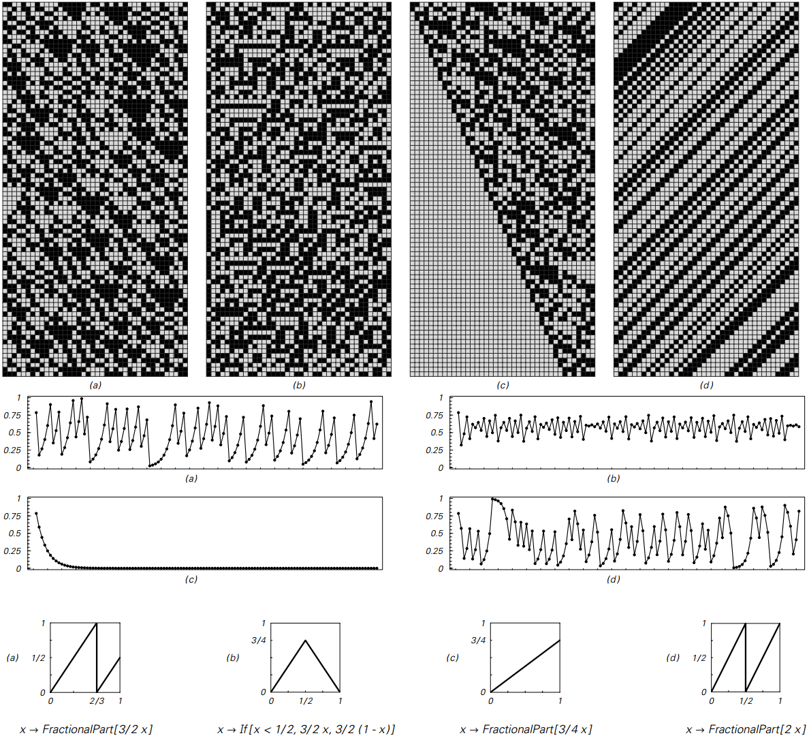

>与前一页同样的迭代映射，但现在初始条件是π/4——一个看似随意的数字序列。
经过相当少的步骤后，情况（a）和（b）产生的行为与面对页面上的简单初始条件几乎没有区别。
在情况（c）中，数字大小的指数衰减与之前相同。
但在（d）的情况下，行为要复杂得多。
事实上，如果仅仅考虑产生的数字的大小，那么就会看到与（a）和（b）情况相同的复杂性。
但是看数字序列，人们意识到这种复杂性实际上只是一个复杂性的直接转录，通过给出一个看似随机的数字序列的初始条件来引入。
情况（d）是所谓的位移映射——一个典型的系统示例，它表现出对通常称为混沌的初始条件的敏感依赖性。

（p151）

这与案例（a）和（b）中发生的情况非常不同。
因为在这些情况下，即使在前两页的第一页中也可以获得复杂且看似随机的结果——原始数字具有非常简单的数字序列。
关键是这些映射实际上本身就会产生复杂性和随机性; 当它们插入初始条件时，它们不会将其转录。

在本书中我开发的方法中，这种区分很容易理解。
但是用传统的数学方法，事情会变得很混乱。
在本章开头已经提到的主要问题是，在这种方法中，通常认为重要的数字的唯一属性是它们的大小。
这意味着任何基于讨论数字显式数字序列的问题——例如它们是简单的还是复杂的——往往看起来都是奇怪的。

事实上，从数量的角度来考虑数字，人们可能会想到，只要任何两个数字的大小足够接近，
就不可避免地导致结果在某种程度上也接近。
事实上，这就是例如传统数学中微积分形式主义的基础。

但是所谓的混沌现象的本质是，有一些系统对一个数字的大小进行极小的改变，但最终对产生的结果产生巨大的影响。
前面两页中作为情况（d）显示的转换图结果是这种情况的典型例子。

下一页顶部的图片显示，如果将这两个数字的大小相差仅十亿分之一，作为该系统的初始条件，会发生什么情况。
观察所产生的数字大小的情节，我们可以看到相当长的一段时间，这两种不同的初始条件导致无法区分的结果。
但在某种程度上他们产生分歧并且很快变得非常不同。

如果只看数字的大小，这似乎会相当神秘。
但只要看一下数字序列，它就会立即变得更加清晰。
正如在下一页显示的图片所示，用作初始条件的数字只有很小的数值才意味着它们的前几位数字是相同的。
有一段时间这些数字是重要的。
但是，由于系统的演变不断将数字向左移位，所以后面数字中存在的差异最终变得重要是不可避免的。

（p152）

!()[assets/p153.png]

<第150页和第151页上的情况（d）所示，对位移映射的初始条件进行小改动的效果。
第一张图显示了与第151页上相同的初始条件的结果。
第二张图显示了如果人们在这个初始条件下将数字的大小改变了十亿分之一。
左边的图表表明，在这两种情况下，通过系统演变获得的数字的大小是难以区分的。
但突然间结果出现分歧并变得完全不同。
看上面的数字序列显示了为什么发生这种情况。
重点是在初始条件下数字大小的小改变对应于右边数字的改变。
但是，系统的演变会逐渐将数字向左移位，以便最终不同的数字变得重要。
大量调查的混沌现象主要由这种效应组成。

初始条件的微小变化会导致结果发生较大变化的事实是一个有点有趣的现象。
但正如我将在第7章中详细讨论的那样，人们必须认识到，它本身无法解释为什么在任何特定情况下都会出现随机性或复杂性。
事实上，对于移位图，我们所看到的只是当给定的初始条件恰好是数字序列是随机的数字时才会出现随机性。

但在过去常常令人困惑的是，传统数学隐含地倾向于认为这种初始条件在某种意义上是不可避免的。
因为如果人们只是从数量的角度来考虑数字，人们就不应该区分足够接近的数字。
这意味着在选择像位移映射这样的系统的初始条件时，人们不应该将确切的数字1/2与尺寸足够接近1/2的数字区分开来。

（p153）

但事实证明，如果一个人随机抽取一个数字，但只限于其大小在一定范围内的约束条件，
那么数字得到的数字序列本质上是随机的。
如果使用这个数字作为换档映射的初始条件，那么结果也会相应随机，就像上一页中的结果一样。

在过去，这个事实有时被用来表明变换图以某种方式从根本上产生了随机性。
但正如我上面所讨论的那样，这样一个系统实际可以产生的唯一随机性是通过其初始条件的细节而明确加入的随机性。
这意味着任何声称系统产生随机性的主张都必须是关于通常为其提供初始条件细节的主张。

我想原则上可能是大自然会有效地遵循与传统数学相同的理想化，
并最终会根据它们的大小纯粹地选取数字。
如果是这样的话，那么这意味着像变换图这样的系统的初始条件自然会具有几乎总是随机的数字序列。

但是这种推理最终永远不会太有用。
因为它说的是我们看到的随机性来自已经存在的随机性——它并不能解释随机性来自哪里。
事实上，正如我将在第7章中讨论的那样——如果只看像变换图那样的系统，那么实际上就不会产生任何新的随机性。

但本书的一个重要发现是，像第150页和第151页上的（a）和（b）这样的系统可以表现出许多方面随机的行为，
即使它们的初始条件是非常简单的，没有任何随机性。

（p154）

然而，像（a）和（b）这样的系统即使从简单的初始条件也可以固有地产生随机性并不意味着它们也不显示对初始条件的敏感依赖性。
事实上，下面的图片说明，即使在这种情况下，数字序列的变化也会逐渐放大——就像在移位图（d）中一样。

!()[assets/p155.png]

>在本节中讨论的四个迭代映射的初始条件的小变化产生的数字序列的差异。
（a）（b）和（d）的情况表现出对初始条件的敏感依赖，
因为远离右侧的无意义数字的变化最终会影响所有数字。
情况（c）不显示对初始条件的敏感度，但总是发展为0，与其初始条件无关。

但是我将在第7章中讨论的关键点是，
在（a）和（b）这样的系统中敏感地依赖于初始条件决不意味着它是我们看到的随机性和复杂性的原因。
事实上，从数字序列的角度来看位移映射，这表明我们认为，这种现象本身对我们可以合理地考虑随机性的产生原因是没有贡献的。

