### 元胞自动机

我们在本书中讨论过的元胞自动机都是纯粹的一维的，所以在每一步都只涉及一行单元。
但也可以考虑涉及整个网格单元的二维元胞自动机，每个单元格的颜色根据网格上所有四个方向上的邻居而定，如下图所示。

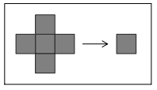

>典型二维元胞自动机的规则形式。 在本节讨论的情况下，每个单元格都是黑色或白色。
通常我会考虑所谓的总体规则，其中中心单元的新颜色仅取决于其四个邻居以前颜色的平均值，以及它自己以前的颜色。

（p170）

下面的图片显示了一个特别简单的规则会发生什么，如果在上一步中有四个邻居中的任何一个黑色，那么特定的单元格会变黑。

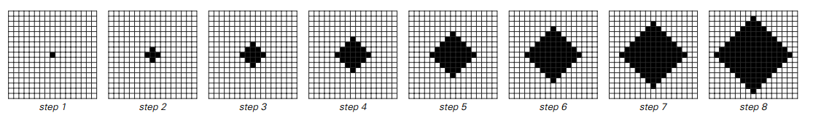

>二维元胞自动机的演化过程中的连续步骤，其规则指定如果在前一步骤中某个特定单元的任何邻居都为黑色，
则该特定单元应该变为黑色。（在第173页描述的编号方案中，这个规则是代码1022.）

从一个单一的黑色单元开始，这条规则只产生一个均匀扩展的菱形黑色单元区域。
但通过稍微改变规则，可以获得更复杂的增长模式。
下面的图片显示了发生了什么，例如，如果在上一步中只有一个或全部四个邻居是黑色的，
则每个单元格变黑，但其他方式保持与之前相同的颜色。

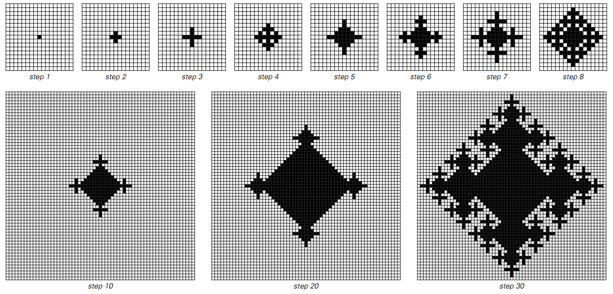

>>二维元胞自动机的进化步骤，其规则指定如果在上一步中，其中一个或全部四个邻居中的一个或全部四个都是黑色的，
则该特定单元格应变黑，但应保持相同的颜色。从一个单一的黑色单元开始，这个规则产生了一个复杂的，
如果非常规则的增长模式。（在第173页的编号方案中，该规则是代码942.）

（p171）

在这种情况下产生的图案不再具有简单的几何形状，而是经常呈现复杂的结构，有点让人想起雪花。
尽管如此错综复杂，但模式依然显示出很大的规律性。
事实上，如果从连续的步骤中获取模式并将它们堆叠在一起以形成三维对象，如下图所示，那么此对象具有非常规则的嵌套结构。

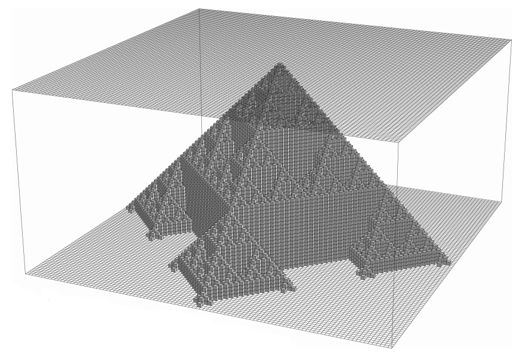

>通过堆叠上一页底部的二维图案形成的三维物体。
这些图片是我经常为一维元胞自动机生成的二维图片的二维元胞自动机的类比。

但其他规则呢？
下面几页展示了遵循二维元胞自动机生成的具有一系列不同规则的模式。
在每种模式中，往往都相当复杂。
但是这种复杂性与我们在一维元胞自动机中已经看到的复杂性非常相似。
事实上，前一页显示，如果通过每个二维模式来观察一维片段的演变，
那么得到的结果与我们在普通的一维细胞自动机中看到的结果惊人地相似。

（p172）

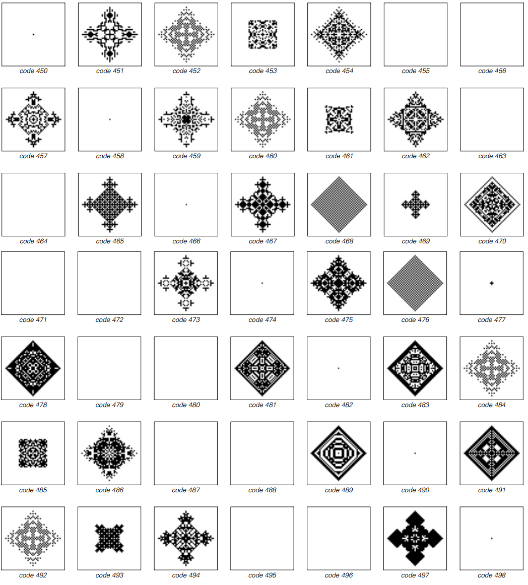

>由一系列二维元胞自动机规则生成的模式。
模式是从一个黑色方块开始，然后运行22个步骤。
在每种情况下，代码编号的基数为2的数字序列指定如下规则。
最后一位数字指定如果在前一步骤中所有邻居都是白色的，则中心单元应该是什么颜色，并且它也是白色。
倒数第二位指定如果所有邻居都是白色会发生什么，但中心单元本身是黑色的。
然后每个较早的数字指定如果越来越多的邻居是黑色会发生什么。
（比较第60页。）

（p173）

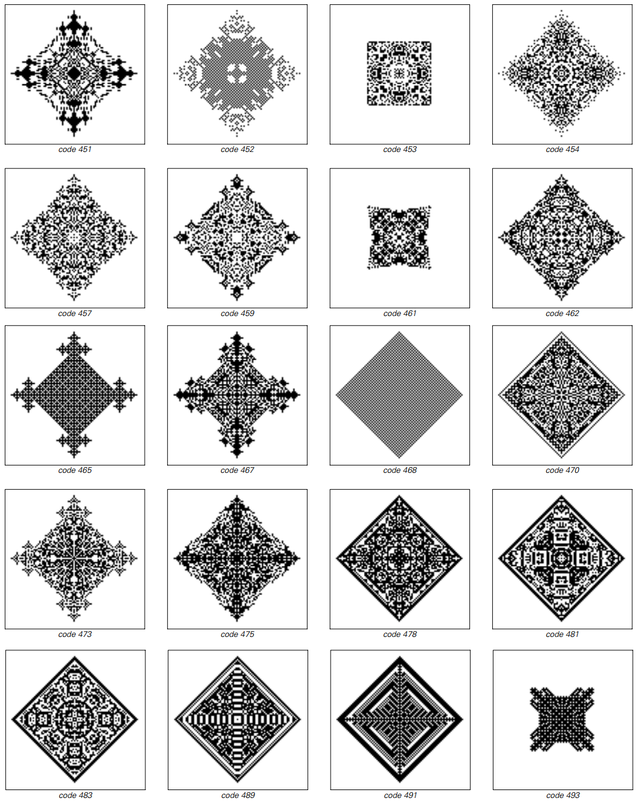

>由前一页的二维元胞自动机产生的模式，但现在经过两倍的步骤。

（p174）

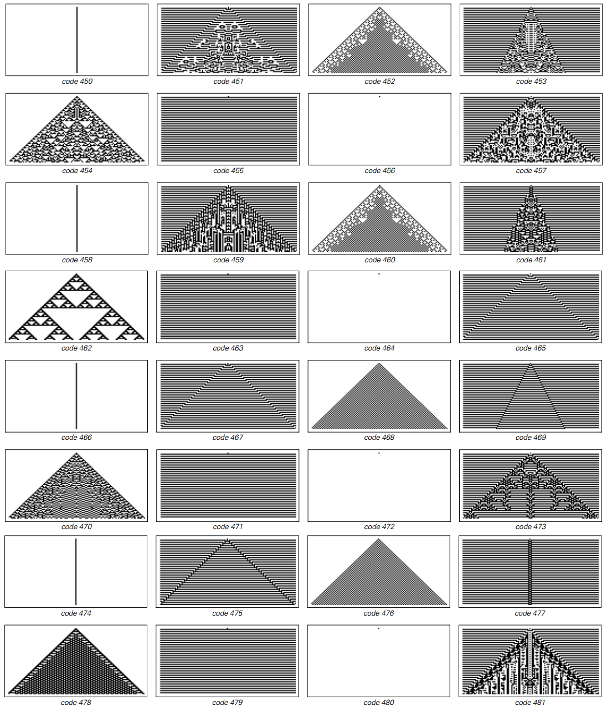

>通过前面两页中的一些二维元胞自动机进行一维切片的演化。
每张图片显示位于穿过每个二维图案中间的一维线上的细胞的颜色。
结果与我们在前面的章节中看到的纯粹的一维元胞自动机非常相似。

（p174）

但是看这样的切片并不能揭示二维图案的整体形状。
事实上，对于最后几页中显示的所有二维元胞自动机，这些形状总是非常规则的。

但是仍然有可能找到产生较少规则形状的二维细胞自动机。
作为第一个例子，正面页面上的图片显示了一条规则，该规则产生的图案表面看起来具有随机的不规则性，至少在小范围内。

然而，在这种特殊情况下，事实证明，在更大的范围内，表面会沿着相当平滑的曲线。
事实上，正如第178页上的图片所示，甚至可以找到元胞自动机，这些自动机的总体形状非常接近正圆。

但是，并非所有的二维元胞自动机只能产生简单的整体形状。
例如，第179-181页的图片显示了一条规则，但没有。
这个规则实际上很简单：它只是指出，只要其八个邻居中的三个（包括对角线）是黑色的，
一个特定的单元格就会变黑，否则它应该保持与以前相同的颜色。

为了通过这个规则获得任何增长，必须从至少三个黑色单元开始。
页面顶部的图片显示了各种数量的黑色单元会发生什么情况。
在某些情况下，产生的图案相当简单——通常只需几步即可停止生长。
但在其他情况下，产生了更复杂的模式，这些模式通常显然会持续增长。

第181页上的图片显示了从一排十一个黑色单元开始，然后演变几百个步骤而产生的行为。
获得的形状似乎不断变化，没有简单的整体形式被生产出来。

因此，似乎不仅在二维元胞自动机模式的黑白单元的详细布置中，而且在模式的整体形状中都会有很大的复杂性。

（p176）

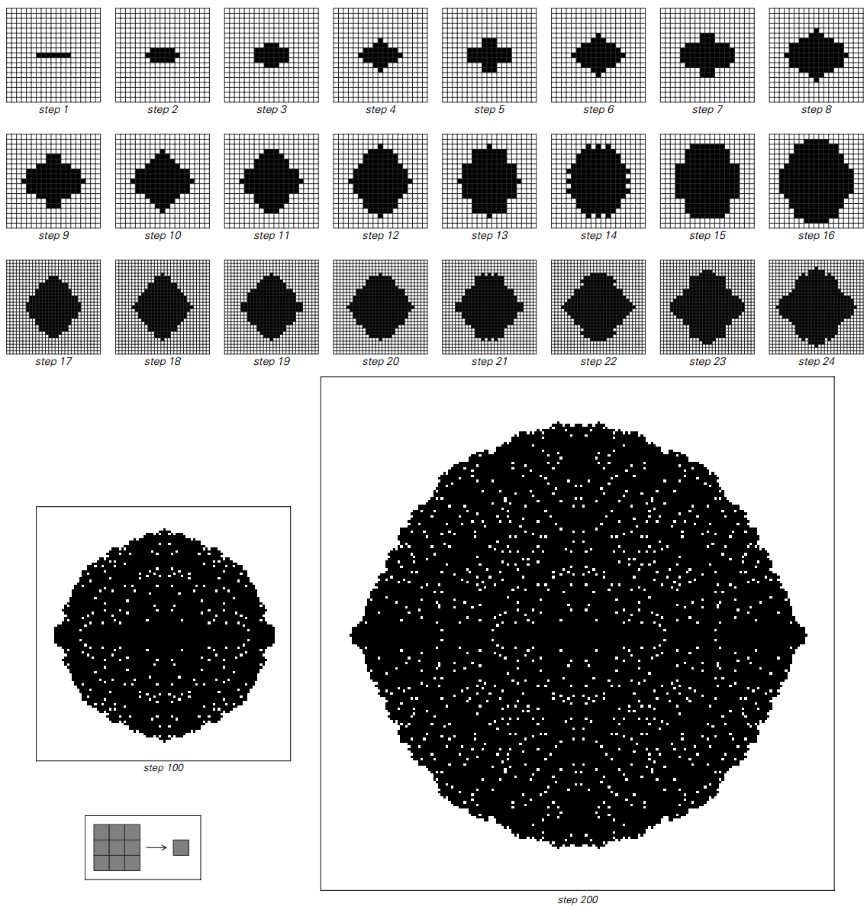

>产生具有粗糙表面图案的二维元胞自动机。
此处使用的规则包括对角线邻居，因此每个单元总共包含8个邻居，如左侧图标中所示。
该规则指定如果其中8个邻居中的3个或5个在之前的步骤中为黑色，则中心单元应该变黑，否则应该保持与之前相同的颜色。
所示情况的初始条件由一排7个黑色单元组成。
在图片中使用的方案的8个邻居的扩展中，规则的代码号为175850。

（p177）

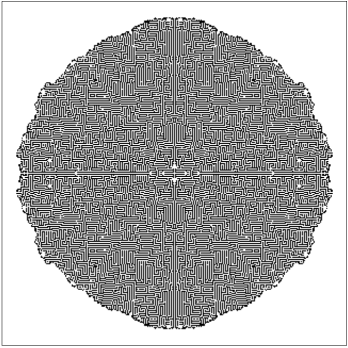

>元胞自动机产生一个形状非常接近圆形的图案。
所使用的规则与前一页中的规则类型相同，但现在只有具有3个黑色邻居的中心单元才变为黑色。
如果它有1,2或4个黑色邻居，则保持与之前相同的颜色，并且如果它有5个或更多的黑色邻居，则在下一步（代码号746）变为白色。
初始条件由一排7个黑色单元组成，就像上一页中的图片一样。
此处显示的模式是系统演进过程中400步骤的结果。
经过t步后，近似圆的半径约为 0.37t。

（p178）

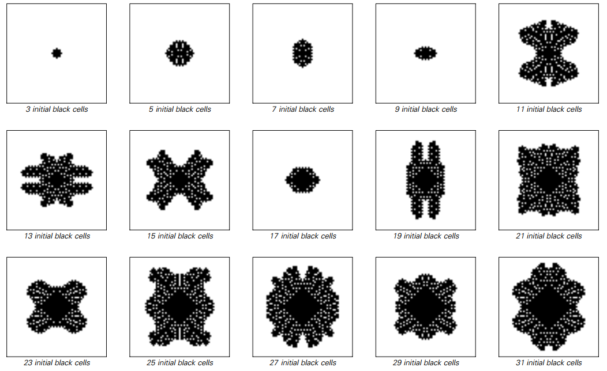

>根据简单的二维细胞自动机规则进行演化产生的图案，从不同长度的黑色细胞行开始。
所使用的规则指定如果特定单元格的八个邻居中的三个（包括对角线邻居）为黑色（代码174826），
则该单元格应该变黑。 根据这个规则，图片中的图案是通过60个进化步骤获得的。
上述较小的模式在经过这些步骤后都停止增长，但其他许多模式显然会一直持续增长。

那么三维细胞自动机呢？
将二维规则的设置概括为三维情况很简单。
但特别是在印刷的页面上，以易于同化的方式显示三维细胞自动机的演变是相当困难的。

然而，页182和183显示了三维细胞自动机的一些例子。
就像在二维情况下一样，可以看到一些特定的新现象。
但总的来看，所产生的基本行为似乎与一维和二维相同。
尤其是，复杂性的基本现象似乎并不以任何关键的方式依赖于所看到的系统的维度。

（p179）

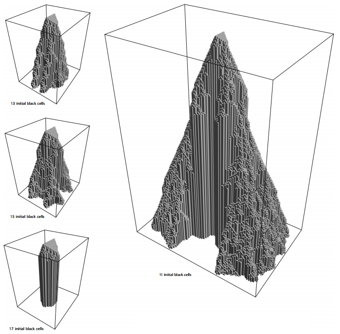

>三维物体通过堆叠连续的二维图案形成，在前一页的元胞自动机的进化过程中产生。
右边的大图显示了200步的演变。

（p180）

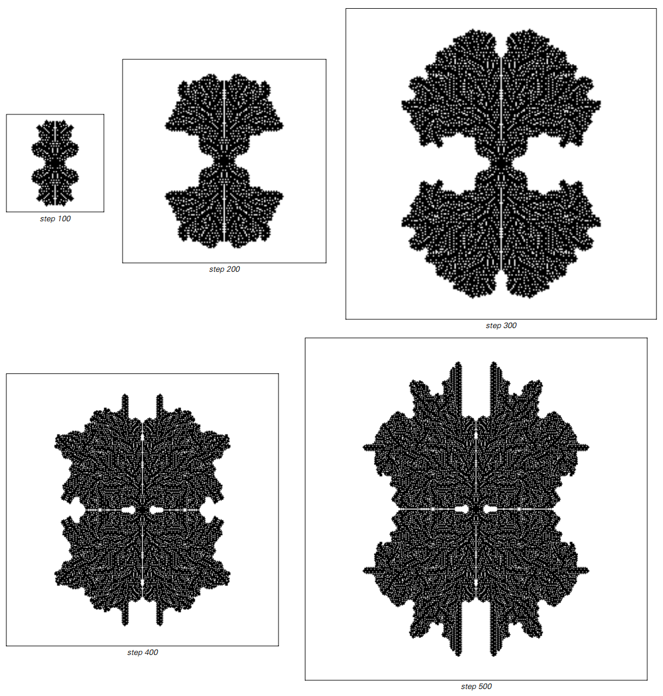

>下一页元胞自动机的演变的阶段，从一个由11行黑色单元格组成的初始条件开始。

（p181）

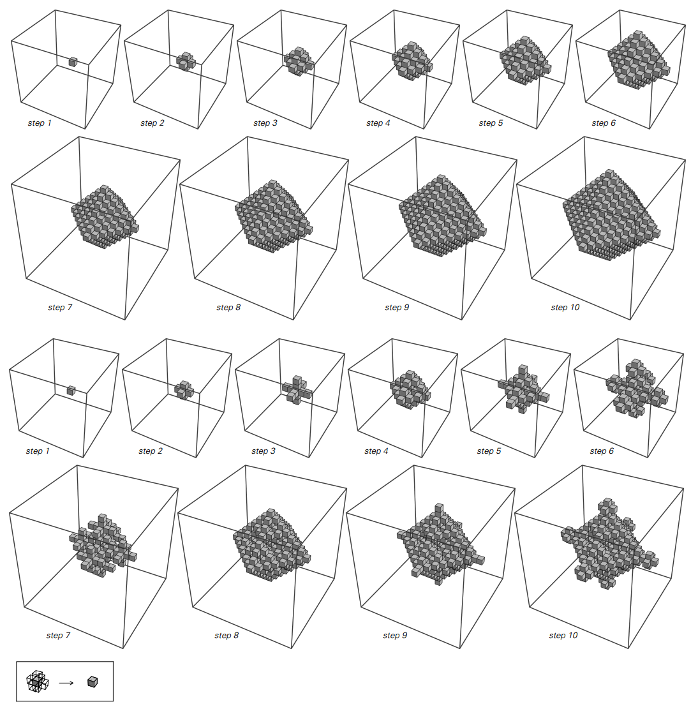

>三维细胞自动机的例子。
在最上面的一组图片中，该规则规定，只要在共享面部的六个邻居中的任何一个在之前的步骤中黑色，该单元就会变黑。
在底部的图片中，规则指定了一个单元格只有在其前六个步骤中只有六个邻居中的一个是黑色时才会变黑。
在这两种情况下，初始条件都包含一个黑色单元。
在顶部图片中，获得的极限形状是正八面体。
在底部的图片中，它是一个类似于第171页上的二维图案的嵌套图案。

（p182）

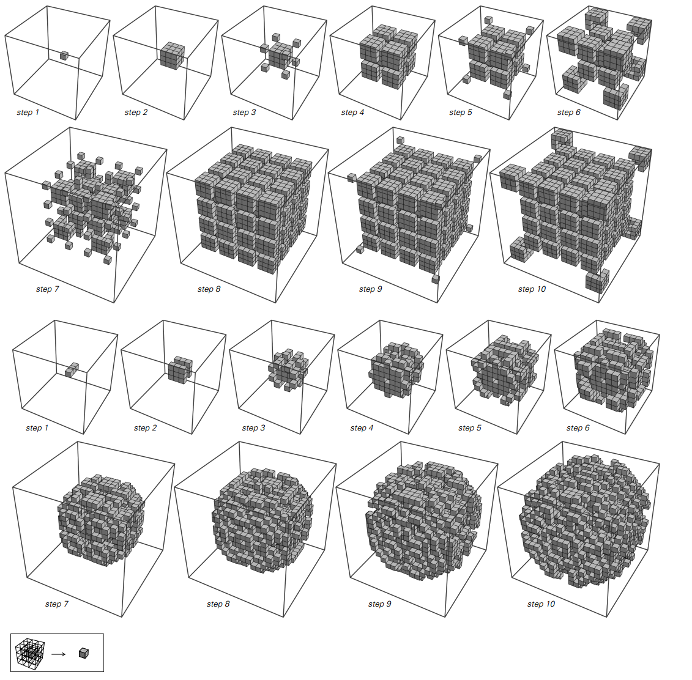

>三维细胞自动机的其他例子，但现在的规则依赖于所有26个邻居共享一个特定单元的脸部或角落。
在顶部的图片中，规则指定当其前26个步骤中其中一个26个邻居中的一个黑色时，该单元格应该变黑。
在底部的图片中，规则指定了一个单元格只有在其前26个步骤中的26个邻居中有两个是黑色时才会变黑。
在顶部图片中，初始条件包含一个黑色单元; 在底部的图片中，它包含三行黑色单元格。

