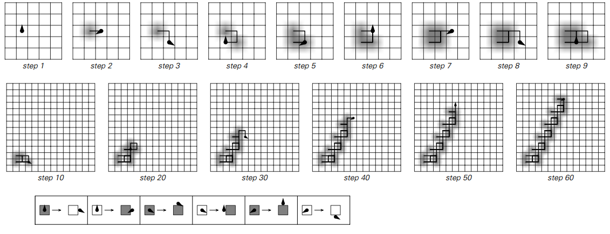
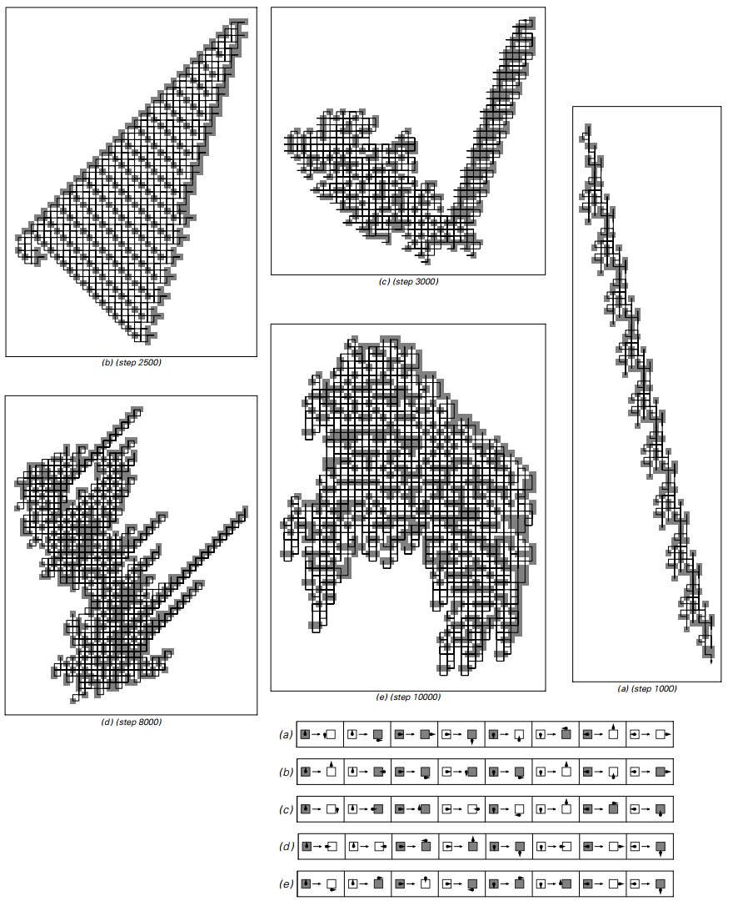
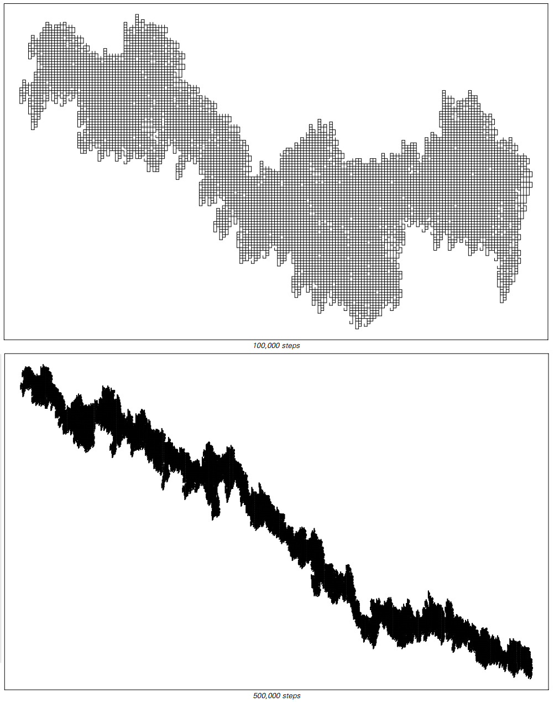

### 图灵机

很像细胞自动机，将图灵机推广到两个维度很简单。
基本思想——如下图所示——是允许图灵机的头部在二维网格上移动，而不是在一维磁带上前后移动。

>一个头部有三种可能状态的二维图灵机的例子。
黑点表示每一步头部的头部位置，该点上箭头的三种可能方向与头部的三种可能状态相对应。
该规则规定了头部在每个步骤应该移动的四个可能方向中的哪一个。
请注意，表示头部状态的箭头的方向与网格上的方向没有直接关系，或者头部将在下一步移动的方向。

当我们在本书的早些时候看过一维图灵机时，我们发现它们有可能表现出复杂的行为，但是这种行为相当罕见。

在走向两个维度时，我们可能认为复杂的行为会立即变得更加普遍。
但事实上，我们发现情况与一个维度非常相似。

对于具有两种或三种可能状态的图灵机，通常似乎只发生重复和嵌套行为。
有了四个状态，更复杂的行为是可能的，但它仍然是非常罕见的。

面向页面显示了具有四种状态的二维图灵机的一些示例。
简单的行为绝大多数是最常见的。
但是在一百万个随机选择的规则中，通常会有一些显示复杂行为。
第186页显示了一个例子，其行为似乎在很多方面完全是随机的。

（p184）

>由具有四种可能状态的头部的二维图灵机产生的图案的示例。
在每种情况下，所有的单元格都是最初的白色，并且左侧给出的规则之一适用于指定的步骤数量。
请注意，在后面所示的情况下，头部经常多次访问网格上的相同位置。

（p185）

>二维图灵机的头部从上一页的规则（e）中找出的路径。
在这条道路上有许多表面上随机的波动，尽管总的来说它往往会向右边增长。

（p186）

