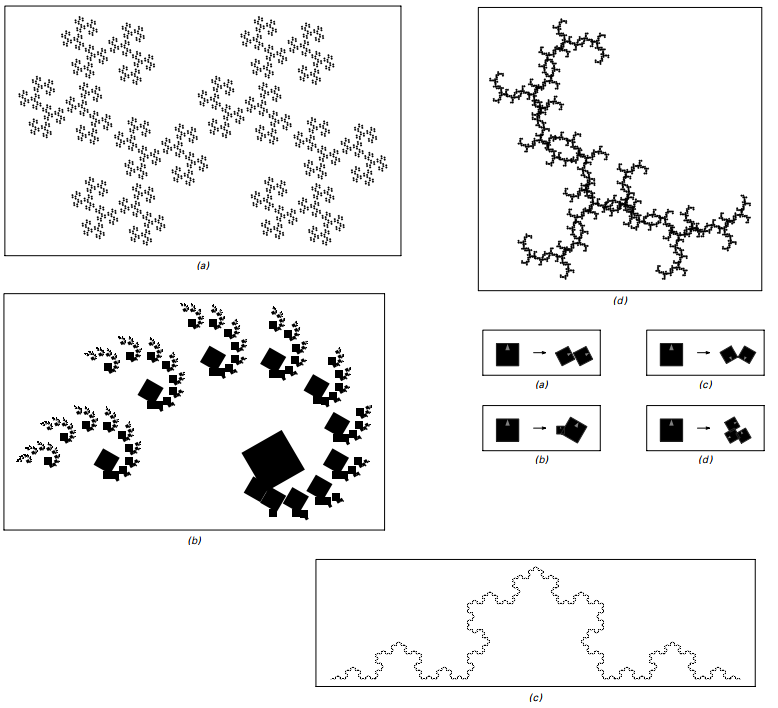
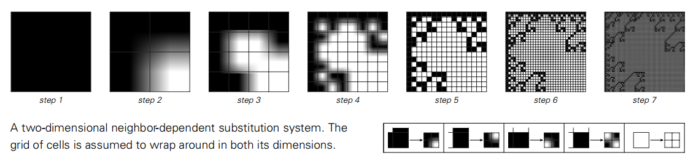
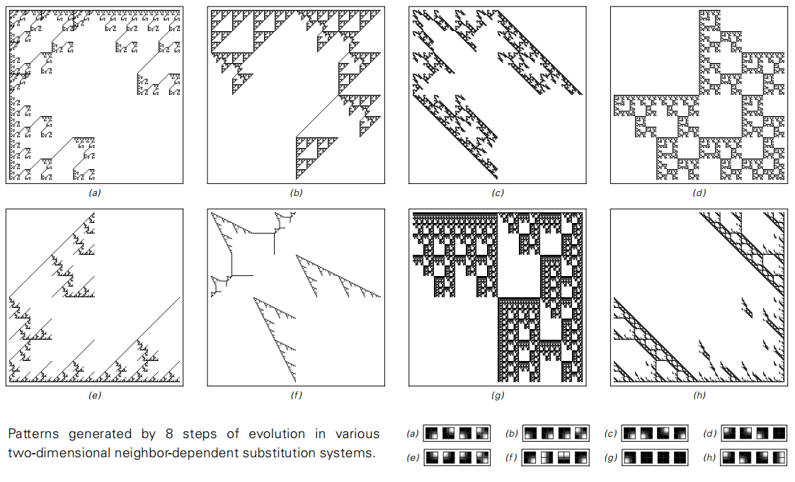

### 替换系统与分形

我们在第82页讨论的那种一维替代系统可以被认为是通过将它们包含的每个元素逐步细分成几个更小的元素来工作的。

人们可以构建以基本相同的方式工作的二维替代系统，如下图所示：

>根据左图所示的规则，在每个步骤中将每个方格替换为四个较小方格的二维替换系统。
生成的模式具有嵌套形式。

下一页给出了一些二维替代系统的例子。
产生的图案肯定是非常复杂的。
但是，它们的总体形式却有着很大的规律性。
事实上，就像第83页的一维替代系统产生的模式一样，这里显示的所有模式最终都有一个简单的嵌套结构。

为什么这样的嵌套会发生？
基本的原因是，在每一步中，替代系统的规则只是用几个较小的黑色方块代替每个黑色方块。
然后在后续步骤中，每个这些新的黑色方块依次以完全相同的方式被替换，以便它最终演变为产生整个图案的相同副本。

（p187）

>来自各种二维替代系统的模式。
在每种情况下，所显示的是根据右边的规则进行五步演变后获得的模式，从单个黑色方块开始。

（p188）

但事实上，这个基本过程并不依赖于任何形式的刚性网格中的方格。
下面的图片展示了如果仅使用简单的几何规则将每个黑色方块替换为两个较小的黑色方块，会发生什么情况。
结果再一次证明了一个复杂而高度规则的嵌套模式。

>通过从单个黑色方块开始，然后在每个步骤中根据左侧所示的简单几何规则用两个更小的黑色单元取代每个黑色单元而获得的图案。
请注意，在将规则应用于特定正方形时，必须考虑该正方形的方向。 
获得的最终模式具有复杂的嵌套结构。

在网格上排列黑色方块的替代系统中，可以确定不同的方块不会重叠。
但是如果只有一个用于替换每个黑色方块的几何规则，那么所产生的方块可能会重叠，如下一页中的图片所示。
然而至少在这个例子中，最终获得的整体模式仍然具有纯粹的嵌套结构。

通过重复应用几何规则来构建图案的一般想法是所谓的分形几何的核心。
并且面向页面上的图片显示了以这种方式生成的分形图案的更多示例。

（p189）

所使用的几何规则的细节在每种情况下都不相同。
但是所有规则的共同之处在于它们涉及用两个或更多更小的黑色方块替换一个黑色方块。
通过这种设置，所产生的所有模式必须具有完全规则的嵌套结构最终是不可避免的。

那么如何获得更复杂结构的模式呢？
正如我们在第85页的一维替代系统中看到的那样，基本答案是不同元素之间某种形式的相互作用——
以便在给定步骤替换特定元素不仅取决于该元素本身的特性，而且还取决于其他相邻元素的特征。

但是面对页面上显示的几何替换规则存在一个问题。
因为元素最终会在飞机的任何地方出现，所以很难界定一个明显的邻居概念。
其结果是，在传统的分形几何中，不考虑元素之间相互作用的思想，因此所有生成的模式都具有纯粹的嵌套形式。

（p190）

>通过重复应用12个步骤所示的几何规则产生的分形图案的例子。
每个模式的细节是不同的，但在所有情况下，模式都有嵌套的整体结构。
这种嵌套结构的存在是一个规则的不可避免的结果，即在特定位置更换元件且不以任何方式依赖于其他元件。

然而，如果在网格上设置元素，那么允许给定元素的替换依赖于它的邻居，就如下一页顶部的图片。
如果一个人这样做，你会立即得到各种复杂的模式，这些模式通常不只是纯粹的嵌套，如下一页中部的图片。

在第3章中，我们讨论了通常的一维置换系统，其中每一个元素在每个步骤中被替换，
以及顺序替换系统，其中在每个步骤中只替换一个单元块。
我们所做的是找出在给定步骤中应该替换哪些元素是从左到右扫描整个元素序列。

（p191）

>一个二维邻域依赖置换系统。假设网格的两个维度都围绕着网格。

>不同的二维邻域依赖置换系统，进行8步后生成的模式。

那么，如何将其推广到更高的维度？
在二维网格上，人们当然可以想象向后、向前或螺旋向外蜿蜒，以扫描所有的元素。
但是一旦定义了元素的任何特定顺序，它们就可以被布置，这实际上减少了一个处理一维系统的能力。

事实上，似乎没有立即将顺序代换系统推广到两个或多个维度的方法。
然而，在第9章中，我们将看到，在更复杂的思想中，实际上可以在任意数量的维度上建立替代系统，
其中元素被顺序扫描，但是使用任何顺序，结果在某种意义上总是相同的。

（p192）

