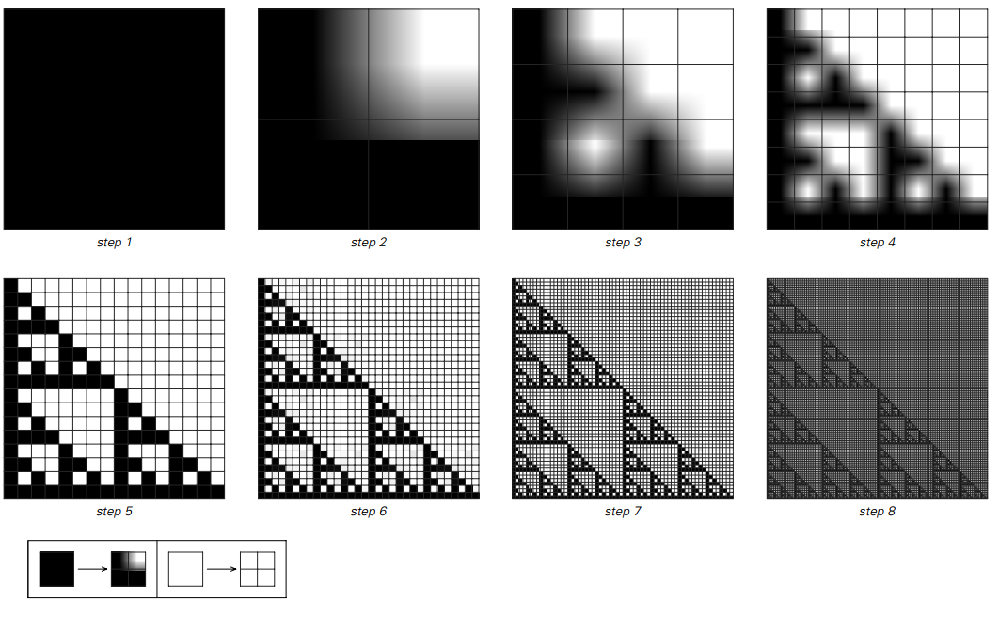
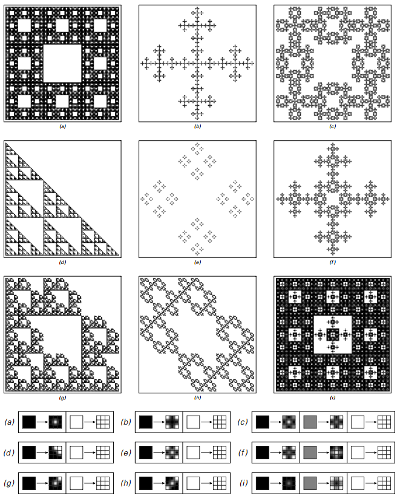
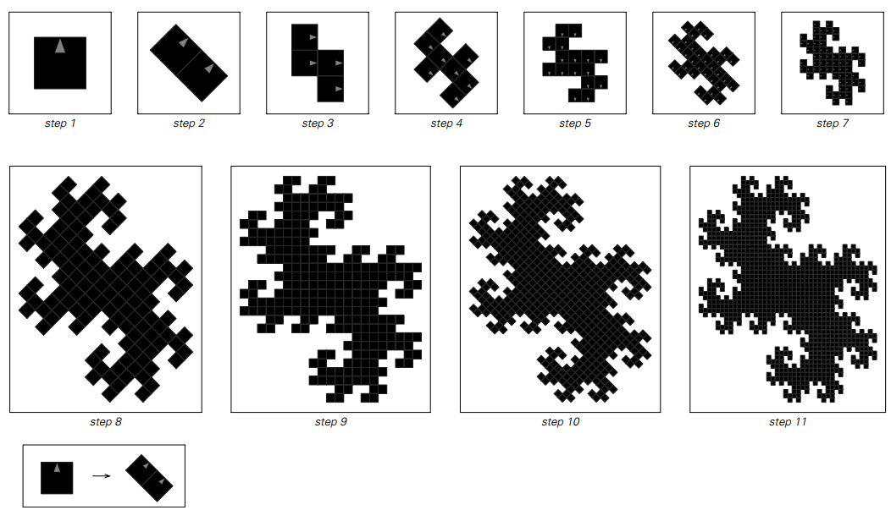

### 替换系统与分形

我们在第82页讨论的那种一维替代系统可以被认为是通过将它们包含的每个元素逐步细分成几个更小的元素来工作的。

人们可以构建以基本相同的方式工作的二维替代系统，如下图所示：

>根据左图所示的规则，在每个步骤中将每个方格替换为四个较小方格的二维替换系统。
生成的模式具有嵌套形式。

下一页给出了一些二维替代系统的例子。
产生的图案肯定是非常复杂的。
但是，它们的总体形式却有着很大的规律性。
事实上，就像第83页的一维替代系统产生的模式一样，这里显示的所有模式最终都有一个简单的嵌套结构。

为什么这样的嵌套会发生？
基本的原因是，在每一步中，替代系统的规则只是用几个较小的黑色方块代替每个黑色方块。
然后在后续步骤中，每个这些新的黑色方块依次以完全相同的方式被替换，以便它最终演变为产生整个图案的相同副本。

（p187）

>来自各种二维替代系统的模式。
在每种情况下，所显示的是根据右边的规则进行五步演变后获得的模式，从单个黑色方块开始。

（p188）

但事实上，这个基本过程并不依赖于任何形式的刚性网格中的方格。
下面的图片展示了如果仅使用简单的几何规则将每个黑色方块替换为两个较小的黑色方块，会发生什么情况。
结果再一次证明了一个复杂而高度规则的嵌套模式。

>通过从单个黑色方块开始，然后在每个步骤中根据左侧所示的简单几何规则用两个更小的黑色单元取代每个黑色单元而获得的图案。
请注意，在将规则应用于特定正方形时，必须考虑该正方形的方向。 
获得的最终模式具有复杂的嵌套结构。

在网格上排列黑色方块的替代系统中，可以确定不同的方块不会重叠。
但是如果只有一个用于替换每个黑色方块的几何规则，那么所产生的方块可能会重叠，如下一页中的图片所示。
然而至少在这个例子中，最终获得的整体模式仍然具有纯粹的嵌套结构。

通过重复应用几何规则来构建图案的一般想法是所谓的分形几何的核心。
并且面向页面上的图片显示了以这种方式生成的分形图案的更多示例。

（p189）

所使用的几何规则的细节在每种情况下都不相同。
但是所有规则的共同之处在于它们涉及用两个或更多更小的黑色方块替换一个黑色方块。
通过这种设置，所产生的所有模式必须具有完全规则的嵌套结构最终是不可避免的。

那么如何获得更复杂结构的模式呢？
正如我们在第85页的一维替代系统中看到的那样，基本答案是不同元素之间某种形式的相互作用——
以便在给定步骤替换特定元素不仅取决于该元素本身的特性，而且还取决于其他相邻元素的特征。

但是面对页面上显示的几何替换规则存在一个问题。
因为元素最终会在飞机的任何地方出现，所以很难界定一个明显的邻居概念。
其结果是，在传统的分形几何中，不考虑元素之间相互作用的思想，因此所有生成的模式都具有纯粹的嵌套形式。

（p190）

