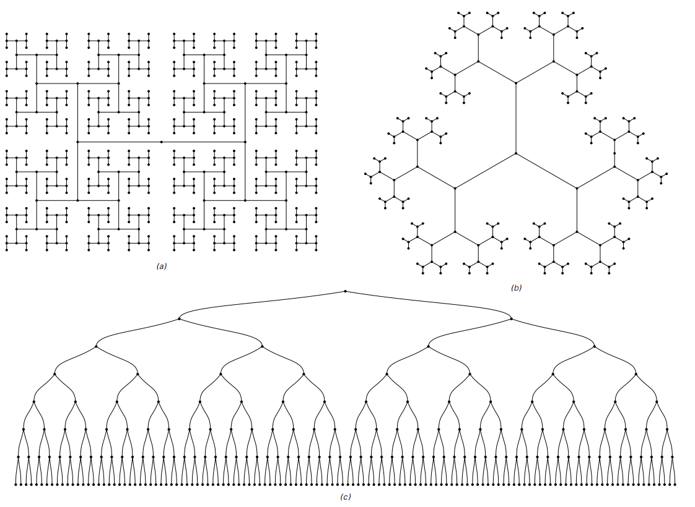
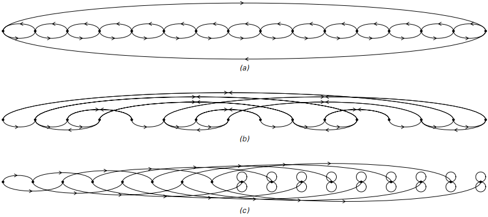
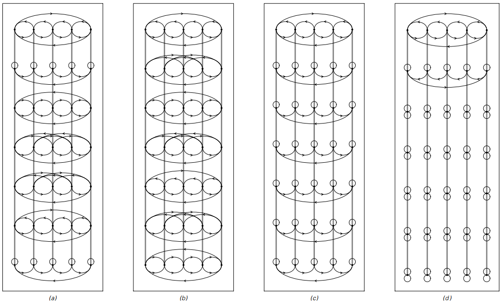
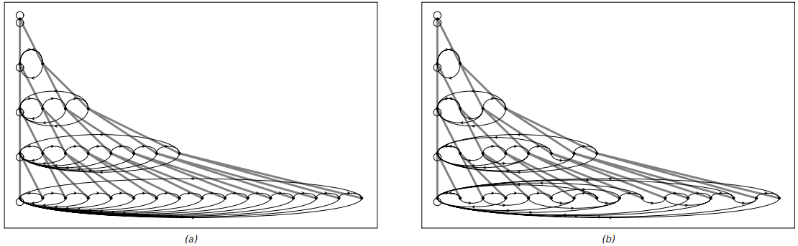
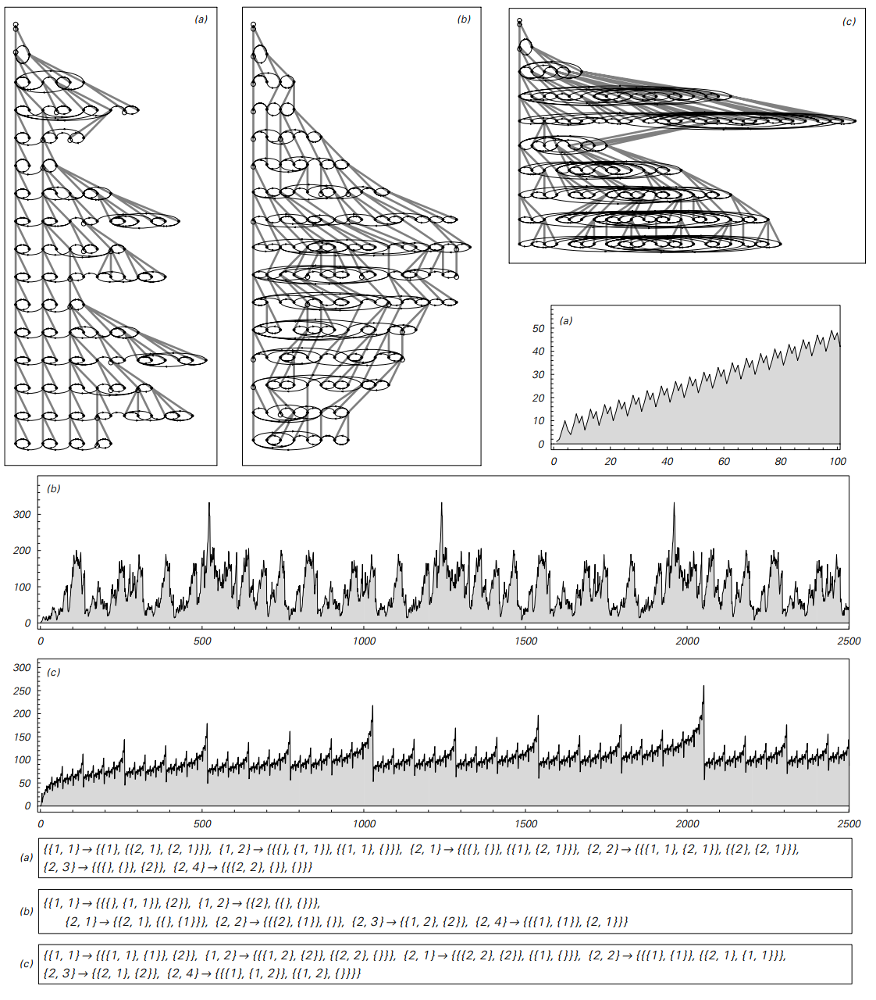
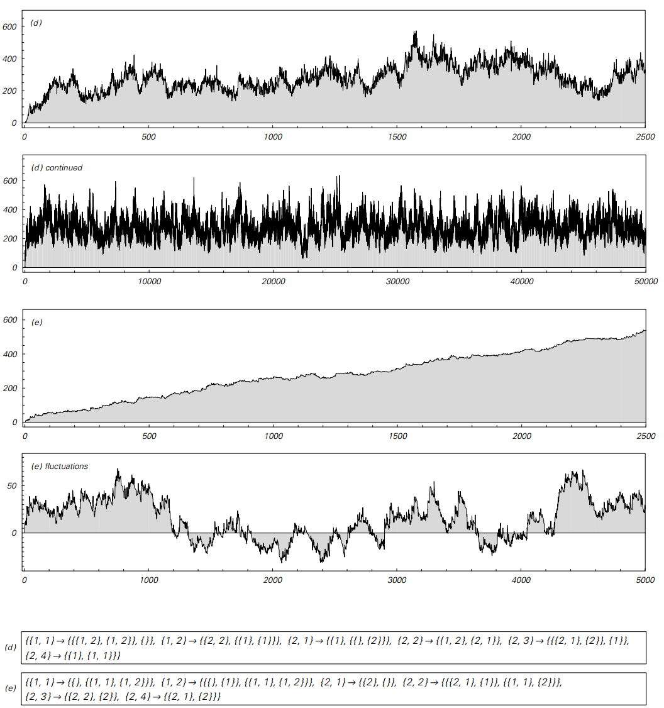

### 网络系统

元胞自动机这样的系统的一个特征是，它们的元素总是在一个规则的数组中设置，
从一个步骤到下一个数组保持不变。
在具有几何置换规则的替代系统中，稍微有更多的自由，但仍然最终限制在二维平面内的元素。

事实上，在迄今为止我们讨论的所有系统中，在整个系统的演化过程中，始终存在固定不变的几何结构。

然而，事实证明，构建基本结构中没有这种不变性的系统是可能的，
在这一节中，我将讨论一个我称为网络系统的版本。

网络系统基本上只是一些具有各种连接的节点的集合，
以及指定这些连接应该如何从一个步骤改变到下一个的规则。

在其演进的任何特定步骤中，网络系统可以被认为有点像电路，
网络的节点对应于电路中的组件，以及连接到这些组件的导线的连接。

和在电路中一样，系统的特性仅取决于节点连接在一起的方式，而不取决于可能使用的节点的任何特定布局。

当然，为了制作一个网络系统的图片，必须为每个节点选择特定的位置。
但注意关键是这些位置没有根本的意义：它们仅仅是为了视觉表现的目的而引入的。

在构建网络系统时，一般可以允许每个节点具有来自它的任意数量的连接。
但至少对于本节而言，如果每个节点都有两个输出连接，
即每个节点都可以到达另一个节点，或者可以回溯到原来的节点本身，则这个节点就没有丢失。

（p193）

通过这种设置，最简单的可能的网络仅由一个节点组成，两个节点都由节点循环返回，如下图所示。有两个节点，已经有三种可能的连接模式，如下面的第二行所示。随着节点数量的增加，可能的不同网络的数量增长非常迅速。

>由一个、两个或三个节点形成的可能的网络，每个节点都有两个连接。
图中示出了所有不等价的情况，忽略标签，但排除了网络，其中有节点不能通过其他节点的连接到达。

对于这些网络中的大多数来说，没有办法布局他们的节点，
以便得到一张看起来比任何杂乱的电线更像任何东西的图片。
但是，有可能构造许多易于识别的形式的特定网络，如在面向页面上的图片所示。

在面向页面的顶部示出的每个网络包括相同节点集合的最低级别。
但我们看到的显著事实是，仅仅通过改变这些节点之间的连接模式，
就可以得到与不同维数的阵列有效地对应的结构。

（p194）

>在一个、两个和三个维度上对应于阵列的网络的例子。
在基础层上，每个网络仅由来自每个节点的两个连接的节点集合组成。
但是，通过为这些连接建立适当的模式，人们可以得到具有非常不同的有效几何结构的网络。

示例（a）示出了有效一维的网络。该网络由一对节点组成，这些节点可以按顺序排列，
每一对在左侧连接到另一对，另一对连接在右边。

但是，网络系统的结构没有本质上的一维。正如示例（b）所演示的，
这只是重新安排连接以获得看起来像二维而不是一维数组的网络。
示例（b）中的每个单独节点仍然有两个连接从其中出来，
但是现在连接的整体模式是使得每个节点块连接到四个而不是两个相邻块，
从而网络有效地形成二维方网格。

（p195）

示例（c）也表明，通过适当的连接，也可以获得三维阵列，
并且确实使用相同的原理可以容易地获得具有任意数量的维度的阵列。

下面的图片显示了形成无限树而不是数组的网络示例。
请注意，显示的第一个和最后一个网络实际上具有相同的连接模式，
但它们在这里看起来不同，因为节点在页面上以不同的方式排列。

>对应于无限树的网络示例。
请注意，网络（a）和（c）是相同的，尽管它们看起来不同，因为节点在页面上的布局不同。
显示的所有网络都在每棵树的叶子处截断。

（p196）

一般来说，可以在网络系统中建立的可能结构有很多种类，下面的图片展示了一个形成嵌套模式的网络。

>形成嵌套几何结构的网络示例。
如同在所示的其他网络中一样，这里的每个节点都是相同的，并且只有两个连接出来。

在上面的图片中，我们已经看到了网络系统演进中特定步骤中可能存在的各个网络的各种示例。
但是现在我们必须考虑这些网络是如何从进化的一个步骤转变为另一个步骤的。

基本思想是规定如何根据节点周围网络的局部结构重新路由每个节点出来的连接。

但要看到这些规则的影响，首先必须找到一种统一的方式来展示可以制作的网络。
下一页顶部的图片展示了一种基于始终将每个网络中的节点排列在页面上的一种可能的方法。
虽然这种表示可能会掩盖特定网络的几何结构，但在上述第二种和第三种情况下，
它更容易让不同网络之间进行比较。

（p197）

>以往图片的网络以统一的方式布置。
网络（a）对应于一维数组，（b）对应于二维数组，以及（c）对应于树。
在此处显示的布局中，所有网络的节点都沿着一条线排列。
请注意，在情况（a）和（b）中，连接的排列方式使阵列有效环绕;
在（c）情况下，树的树叶会被带回自己的连接。

在为网络系统设置规则时，区分每个节点出现的两个连接是很方便的。
在上面的图片中，一个连接总是显示在节点的上方，而另一个总是显示在下面。

面对页面上的图片显示了四种不同的基本规则选择所获得的演变的例子。
在第一种情况下，规则指定应该重新路由来自每个节点的“上面”连接，
以便通过遵循“下面”连接获得节点，然后从该节点连接“上面”连接。
“下方”连接保持不变。

除了在情况（c）和（d）中，
来自每个节点的“上面”连接被重新路由以便它简单地循环回到节点本身之外，
所示的其他规则在结构上是相似的。

在情况（d）中，这样的结果是网络分裂成几个断开的部分。
事实证明，我在这里考虑的规则中没有一个可以重新连接这些作品。
因此，我在本节的其余部分所做的只是跟踪包含上面图片中显示的第一个节点的片段。
实际上，这意味着其他节点将从网络中丢弃，从而减少网络的总大小。

（p198）

>网络系统的演变有四种不同的基本规则选择。
演变过程中的连续步骤在页面的下一行显示。
在情况（a）中，
每个节点的“上面”连接在每个步骤重新路由以通过首先跟随下面的连接并且然后从该节点连接到达到节点;
下面的连接保持不变。
在情况（b）中，
每个节点的上述连接重新路由到通过上述连接到达的节点，然后重新连接上述连接;
下面的连接保持不变。
在情况（c）中，
每个节点的上述连接被重新路由以便循环回到节点本身，而下面的连接保持不变。
在（d）的情况下，
上述连接被重新路由以回送，下面的连接被重新路由以通过上述连接到达的节点。
通过将“上方”连接标记为1，将“下方”连接标记为2，这些规则对应于符合替换连接{{1},{2}}的每个节点：
a){{2,1},{2}},
b){{1,1},{2}},
c){{},{2}},
d){{},{1}},

然而，通过改变基本规则，网络中的节点数量也可以增加。
这种做法的基本方法是通过插入一个新节点，然后将该新节点连接到通过跟随来自原始节点的连接获得的节点，
从而破坏来自特定节点的连接。

下一页上的图片显示了由使用此机制的两条规则产生的行为示例。 
在这两种情况下，都会在网络中每个现有节点的“上面”连接中插入一个新节点。
在第一种情况下，来自新节点的连接与来自现有节点的连接完全相同，而在第二种情况下，“上”和“下”连接相反。

（p199）

>其规则涉及添加新节点的网络系统的演变。
在这两种情况下，新节点都插入到每个节点的“上方”连接中。
在情况（a）中，来自新节点的连接导致与来自原节点的连接相同的节点。
在情况（b）中，新节点的上面和下面的连接是相反的。
在上面的图片中，新节点紧接在产生它们的节点之后，灰线用于指示每个节点的原点。
请注意，初始条件由仅包含单个节点的网络组成。

但在这两种情况下，获得的行为都非常简单。
然而，很像独立于邻居的替换系统，这些网络系统具有在每个步骤的每个节点上始终执行完全相同的操作的特性。

然而，一般来说，可以根据每个节点附近的网络本地结构来建立具有在不同节点处执行不同操作的规则的网络系统。

一个简单的方案是基于查看每个节点出现的两个连接，
然后在这两个连接导向同一个节点时执行一个操作，如果连接导致不同节点，则执行另一个操作。

下一页的图片显示了该方案可能发生的一些示例。
事实证明，这种行为总是非常简单——网络具有不可避免地以基本上重复的方式增长的结构。

（p200）

>具有导致在不同节点处执行不同操作的规则的网络系统的示例。
每个规则包含两种情况，如上所示。
第一种情况指定如果来自特定节点的两个连接都通向同一节点，该怎么办;
第二种情况指定当它们导致不同的节点时该怎么做。
在所显示的规则中，来自特定节点（用实心圆圈表示）和从该节点创建的新节点的连接始终转到由空心圆圈表示的节点，
这些节点通过从原始连接的上方或下方连接到达节点。
即使这个限制被删除，但是，更复杂的行为似乎并没有被看到。

但只要人们依赖网络稍微更长的距离特征，就会立即变得复杂得多。
事实上，下两页上的图片显示了如果允许规则取决于通过遵循来自每个节点的不仅一个而是最多两个连续的连接而达到的不同节点的数量会发生什么的示例。

通过这样的规则，获得的网络序列不再需要形成任何一种简单的进展，
并且事实上人们发现即使每个步骤的节点总数也可以以许多方面完全随机的方式变化。

当我们在第9章中讨论基础物理的问题时，我们会遇到各种其他类型的网络系统——
我怀疑其中的一些系统最终会与我们宇宙中的空间和时空的基本结构密切相关。

（p201）

>规则取决于距离每个节点两个距离而达到的不同节点的数量的网络系统。
图表显示了每一步获得的节点总数。
在情况（a）和（b）中，系统的行为最终是重复的。
在情况（c）中，它是嵌套的——步骤中网络的大小与t的基数2位数的1的数目有关。

（p202）

>在连续步骤中获得的节点总数似乎永远以随机的方式变化的网络系统。
大约每10,000个随机选择的网络系统中就有一个表现出这种行为。

（p203）

