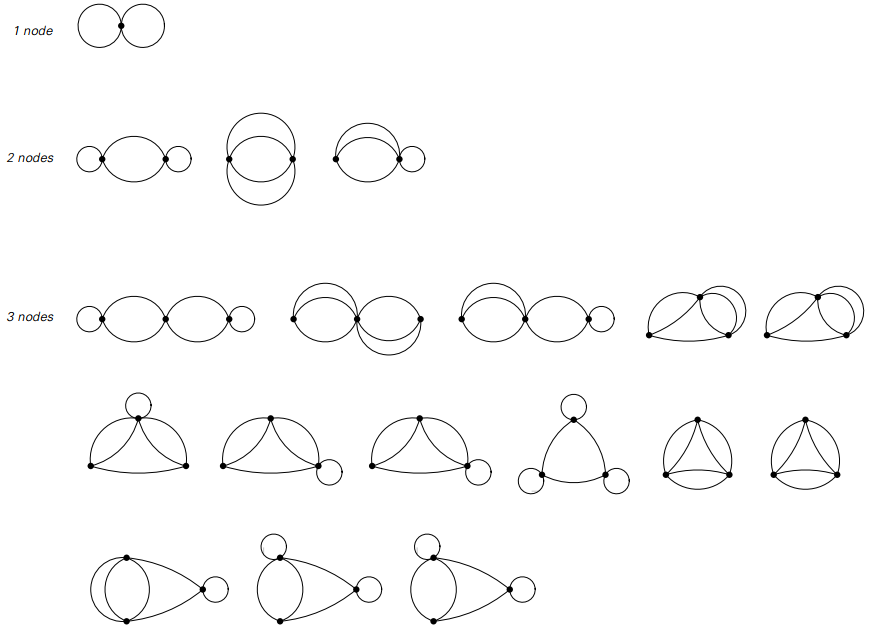

### 网络系统

元胞自动机这样的系统的一个特征是，它们的元素总是在一个规则的数组中设置，
从一个步骤到下一个数组保持不变。
在具有几何置换规则的替代系统中，稍微有更多的自由，但仍然最终限制在二维平面内的元素。

事实上，在迄今为止我们讨论的所有系统中，在整个系统的演化过程中，始终存在固定不变的几何结构。

然而，事实证明，构建基本结构中没有这种不变性的系统是可能的，
在这一节中，我将讨论一个我称为网络系统的版本。

网络系统基本上只是一些具有各种连接的节点的集合，
以及指定这些连接应该如何从一个步骤改变到下一个的规则。

在其演进的任何特定步骤中，网络系统可以被认为有点像电路，
网络的节点对应于电路中的组件，以及连接到这些组件的导线的连接。

和在电路中一样，系统的特性仅取决于节点连接在一起的方式，而不取决于可能使用的节点的任何特定布局。

当然，为了制作一个网络系统的图片，必须为每个节点选择特定的位置。
但注意关键是这些位置没有根本的意义：它们仅仅是为了视觉表现的目的而引入的。

在构建网络系统时，一般可以允许每个节点具有来自它的任意数量的连接。
但至少对于本节而言，如果每个节点都有两个输出连接，
即每个节点都可以到达另一个节点，或者可以回溯到原来的节点本身，则这个节点就没有丢失。

（p193）

通过这种设置，最简单的可能的网络仅由一个节点组成，两个节点都由节点循环返回，如下图所示。有两个节点，已经有三种可能的连接模式，如下面的第二行所示。随着节点数量的增加，可能的不同网络的数量增长非常迅速。

>由一个、两个或三个节点形成的可能的网络，每个节点都有两个连接。
图中示出了所有不等价的情况，忽略标签，但排除了网络，其中有节点不能通过其他节点的连接到达。

对于这些网络中的大多数来说，没有办法布局他们的节点，
以便得到一张看起来比任何杂乱的电线更像任何东西的图片。
但是，有可能构造许多易于识别的形式的特定网络，如在面向页面上的图片所示。

在面向页面的顶部示出的每个网络包括相同节点集合的最低级别。
但我们看到的显著事实是，仅仅通过改变这些节点之间的连接模式，
就可以得到与不同维数的阵列有效地对应的结构。

（p194）

>在一个、两个和三个维度上对应于阵列的网络的例子。
在基础层上，每个网络仅由来自每个节点的两个连接的节点集合组成。
但是，通过为这些连接建立适当的模式，人们可以得到具有非常不同的有效几何结构的网络。

示例（a）示出了有效一维的网络。该网络由一对节点组成，这些节点可以按顺序排列，
每一对在左侧连接到另一对，另一对连接在右边。

但是，网络系统的结构没有本质上的一维。正如示例（b）所演示的，
这只是重新安排连接以获得看起来像二维而不是一维数组的网络。
示例（b）中的每个单独节点仍然有两个连接从其中出来，
但是现在连接的整体模式是使得每个节点块连接到四个而不是两个相邻块，
从而网络有效地形成二维方网格。

（p195）

